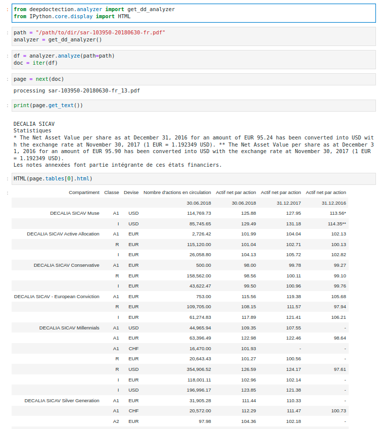

<p align="center">
  
  <h3 align="center">
  A Document AI Package
  </h3>
</p>


**deep**doctection is a Python library that orchestrates document extraction tasks using deep learning models. It does 
not implement models but enables you to build pipelines using highly acknowledged libraries for object detection, OCR 
and selected NLP tasks and provides an integrated frameworks for fine-tuning, evaluating and running models. For more
 specific text processing tasks use one of the many other great NLP libraries.

**deep**doctection focuses on applications and is made for those who want to solve real world problems related to 
document extraction from PDFs or scans in various image formats.

# Overview

**deep**doctection provides model wrappers of supported libraries for various tasks to be integrated into 
pipelines. Its core function does not depend on any specific deep learning library. Selected models for the following 
 tasks are currently supported:       

 - Document layout analysis including table recognition in Tensorflow with [**Tensorpack**](https://github.com/tensorpack), 
   or PyTorch with [**Detectron2**](https://github.com/facebookresearch/detectron2/tree/main/detectron2),
 - OCR with support of [**Tesseract**](https://github.com/tesseract-ocr/tesseract), [**DocTr**](https://github.com/mindee/doctr)
   (Tensorflow and PyTorch implementations available) and a wrapper to an API for a commercial solution, 
 - Text mining for native PDFs with  [**pdfplumber**](https://github.com/jsvine/pdfplumber), 
 - Language detection with [**fastText**](https://github.com/facebookresearch/fastText),
 - [**new!**] Document and token classification with [LayoutLM](https://github.com/microsoft/unilm) provided by the 
   [**Transformer**](https://github.com/huggingface/transformers) library. (Yes, you can use LayoutLM with any one of
    the provided OCR-or pdfplumber tools straight away!)
   
**deep**doctection provides on top of that methods for pre-processing inputs to models like cropping or resizing and to 
post-process results, like validating duplicate outputs, relating words to detected layout segments or ordering words 
into contiguous text. You will get an output in JSON format that you can customize even further by yourself. 
     
Check the demo of a document layout analysis pipeline with OCR on 
:hugs: [**Hugging Face spaces**](https://huggingface.co/spaces/deepdoctection/deepdoctection) or have a look at the 
[**introduction notebook**](./notebooks/Get_Started.ipynb) for an easy start.


## Models    

**deep**doctection or its support libraries provide pre-trained models that are in most of the cases available at the 
[**Hugging Face Model Hub**](https://huggingface.co/deepdoctection) or that will be automatically downloaded once 
requested. For instance, you can find pre-trained object detection models from the Tensorpack or Detectron2 framework
 for coarse layout analysis, table cell detection and table recognition. 

## Datasets and training scripts

Training is a substantial part to get pipelines ready on some specific domain, let it be document layout analysis, 
document classification or NER. **deep**doctection provides scripts for models that are based on trainers
developed from the library that hosts the model code. Moreover, **deep**doctection hosts code to some well established 
datasets like **Publaynet** that makes it easy to experiment. It also contains mappings from widely used data 
formats like COCO and it has a dataset framework (akin to [**datasets](https://github.com/huggingface/datasets) so that
 setting up training on a custom dataset becomes very easy. Check this  [**notebook**](./notebooks/Fine_Tune.ipynb) to
  see, how you can easily train a model on a different domain.
   
## Evaluation

**deep**doctection comes equipped with a framework that allows you evaluating prediction of a single or multiple 
chained models in a pipeline against some ground truth. Check [**here**](notebooks/Datasets_and_Eval.ipynb) how it is 
done.  

## Inference

Having setup a pipeline it takes you two lines of code to instantiate the pipeline, one line to specify the path to your
document or page folder and after a for loop all pages will be processed through the pipeline. 

This excerpt shows how to instantiate the built-in **deep**doctection analyzer as deployed on the Hugging Face space 
and how to get parsed result from a PDF document page by page. 



## Documentation

There is an extensive [**documentation**](https://deepdoctection.readthedocs.io/en/latest/index.html#) available 
containing tutorials, design concepts and the API. We want to present things as comprehensively and understandably 
as possible. However, we are aware that there are still many areas where significant improvements can be made in terms 
of clarity, grammar and correctness. We look forward to every hint and comment that increases the quality of the 
documentation.


## Requirements

### Platform and Python

Before you start, please ensure your installation fulfills the following requirements:

- Linux **or** macOS
- Python >=  3.8 
- PyTorch >= 1.8 and torchvision **or** Tensorflow >=2.4.1 and CUDA

Windows is not supported.

You can run on PyTorch with a CPU only. For Tensorflow a GPU is required.

### Other

**deep**doctection uses Python wrappers for [Poppler](https://poppler.freedesktop.org/) to convert PDF documents into 
images and for calling [Tesseract](https://github.com/tesseract-ocr/tesseract) OCR engine. 
If you get started and want to run the notebooks for the first time it is required to have them installed as well.

## Installation

We recommend using a virtual environment. You can install the package via pip or from source. Bug fixes or enhancements
will be deployed to PyPi every 4 to 6 weeks.

### Install with pip from PyPi

[Dataflow](https://github.com/tensorpack/dataflow) is not available on the PyPi server and must be installed separately.

```
pip install  "dataflow @ git+https://github.com/tensorpack/dataflow.git"
```

Depending on which Deep Learning library is available, use the following installation option:

For **Tensorflow**, run

```
pip install deepdoctection[tf]
```

For **PyTorch**, first install **Detectron2** separately as it is not on the PyPi, either. Check the instruction 
[here](https://detectron2.readthedocs.io/en/latest/tutorials/install.html). Then run

```
pip install deepdoctection[pt]
```

This will install the basic setup which is needed to run the first two notebooks and do some inference with pipelines.

Some libraries are not added to the requirements in order to keep the dependencies as small as possible (e.g. DocTr,
pdfplumber, fastText, ...). If you want to use them, you have to pip install them individually by yourself. 
Alternatively, consult the 
[**full installation instructions**](https://deepdoctection.readthedocs.io/en/latest/manual/install.html).


### Installation from source

Download the repository or clone via

```
git clone https://github.com/deepdoctection/deepdoctection.git
```

To get started with **Tensorflow**, run:

```
cd deepdoctection
pip install ".[source-tf]"
```

or with **PyTorch**:
 
```
cd deepdoctection
pip install ".[source-pt]"
```

This will install the basic dependencies to get started with the first notebooks. To get all package extensions,

```
cd deepdoctection
pip install ".[source-all-tf]"
```

or 

```
cd deepdoctection
pip install ".[source-all-pt]"
```

will install all available external libraries that can be used for inference (e.g. DocTr, pdfplumber, fastText, ...).

Again, for other installation options check 
[**this**](https://deepdoctection.readthedocs.io/en/latest/manual/install.html) site.


## Credits

We thank all libraries that provide high quality code and pre-trained models. Without them it would be impossible for a 
single person to develop this framework.

## Problems

We try hard to eliminate bugs. We also know that the code is not free of issues. We welcome all issues relevant to this
repo and try to address them as quickly as possible.

## If you like **deep**doctection ...
 
 ...you can easily support the project by making it more visible. Leaving a star or a recommendation will help. 


## License

Distributed under the Apache 2.0 License. Check [LICENSE](https://github.com/deepdoctection/deepdoctection/blob/master/LICENSE) 
for additional information.
