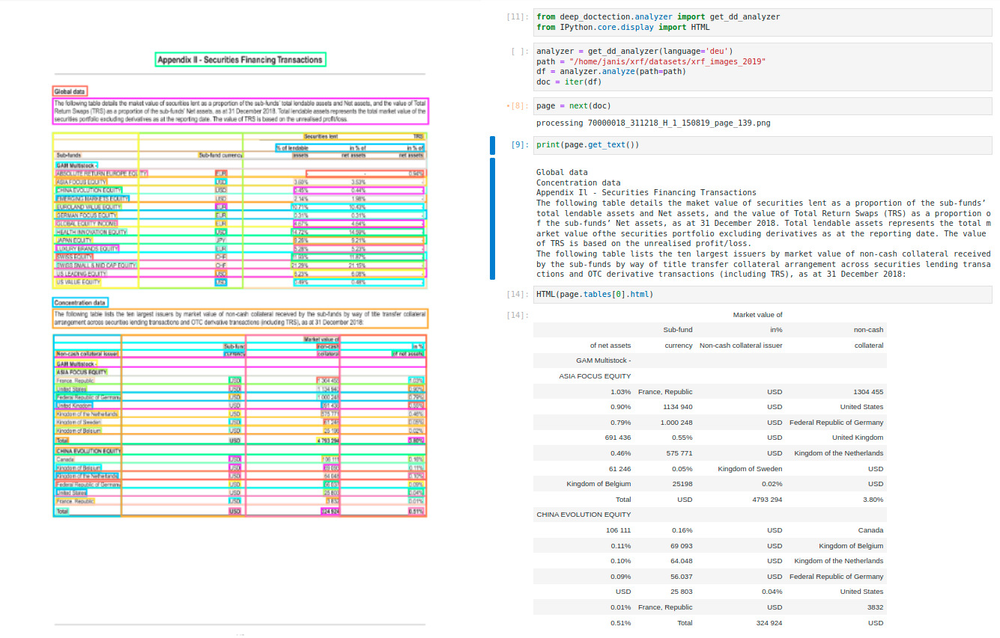

<p align="center">
  
  <h3 align="center">
  A Document AI Package
  </h3>
</p>


**deep**doctection is a Python package that enables document analysis pipelines to be built using deep learning models.

Extracting information from documents is difficult. Documents often have a complex visual structure and the information 
they contain is not tagged. **deep**doctection is a tool box that is intended to facilitate entry into this topic.

The focus should be on application. **deep**doctection is made for data scientists who are tasked with supporting
departments in process optimization. For analysts who have to investigate into large sets of documents. And also maybe 
for researchers who would like to see how well their new model fits into an extraction pipeline.



## Characteristics

1. Use an **off the shelf analyzer** for restructuring your **PDF** or **scanned documents**:
         
   - layout recognition with deep neural networks (Mask-RCNN and more)
   - table extraction with full table semantics (rows, columns, multi line cell spans), again with DNN
   - OCR and word assignment to detected layouts components
   - reading order 

2. **Fine-tune pre-trained DNN** on your own labeled dataset. Use generally acknowledged metrics for evaluating training
    improvements.

3. **Compose your document analyzer** by choosing a model and plug it into your own pipeline.

4. Wrap DNNs from open source projects into the **deep**doctections API and **enrich your pipeline easily with SOTA 
   models**.  
   
Check [**this notebook**](./notebooks/Get_Started.ipynb) for an easy start, as  well as the full 
[**documentation**](https://deepdoctection.readthedocs.io/en/latest/index.html#). 


## Requirements

You will need a GPU to run the **dd**-Analyzer or to train a pipeline component.

- Python 3.8 or higher
- Tensorflow 2.4.1 or higher

If you do not work on Linux, one easy way to fulfill the requirements is to use the Docker image. A 
[Dockerfile](./docker/Dockerfile) is provided, please follow the official instructions on how to use it. 


Depending on the pipeline you want to use, you will be notified if further installations are necessary, e.g.

- [Tesseract](https://github.com/tesseract-ocr/tesseract) 
- [Poppler](https://poppler.freedesktop.org/)


## Installation

Download the repository or clone via

```
git clone https://github.com/deepdoctection/deepdoctection.git
```

We recommend using a virtual environment. There is a **Makefile** that guides you though the installation process. To get 
started, try:

```
cd deepdoctection
make clean
make venv
source venv/bin/activate
make install-dd-tf
```

If you want to access the **deep**doctection package through jupyter, create an IPkernel in your venv. 

```
make install-kernel-dd
```

For more installation options check [**this**](https://deepdoctection.readthedocs.io/en/latest/manual/install.html) site.

## Credits

Many utils, concepts and some models are inspired and taken from [**Tensorpack**](https://github.com/tensorpack) . 
We heavily make use of [Dataflow](https://github.com/tensorpack/dataflow) for loading and streaming data.  


## Problems

We try hard to eliminate bugs. We also know that the code is not free of issues. We welcome all issues relevant to this
repo and try to address them as quickly as possible.


## Citing **deep**doctection

If you use **deep**doctection in your research or in your project, please cite:

```
@misc{jmdeepdoctection,
  title={deepdoctection},
  author={Meyer, Dr. Janis and others},
  howpublished={\url{https://github.com/deepdoctection/deepdoctection}},
  year={2021}
}
```


## License

Distributed under the Apache 2.0 License. Check [LICENSE](https://github.com/deepdoctection/deepdoctection/blob/master/LICENSE) 
for additional information.
