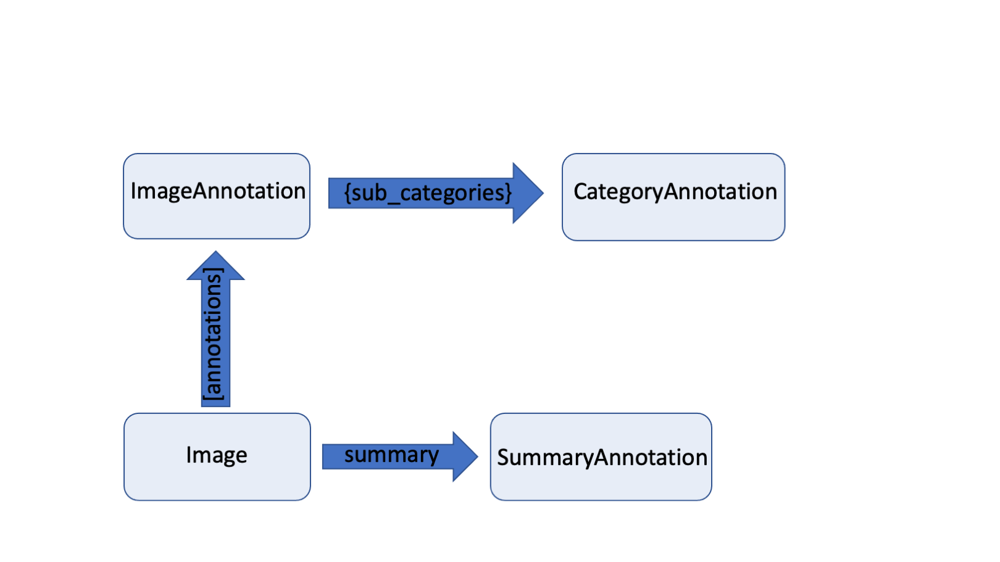

<p align="center">
  
  <h3 align="center">
  </h3>
</p>


# Data structure
 
**deep**doctection has a very generic data model that consists of in total four sub classes of Pydantic's `BaseModel`: 
`CategoryAnnotation`, `ImageAnnotation`, `ContainerAnnotation` and `Image`.  

The first three classes are used to store all information collected from a pipeline and can be combined to model an 
object. They all have two attributes in common: `category_name` and `category_id`.


## `ObjectTypes`

 [`ObjectTypes`][dd_core.utils.object_types.ObjectTypes] is a string based enum and is the base class for naming 
 categories. You can group categories that belong together in a subclass. Use upper-case for the enum member and 
 lower case for their string representation. To register and use the categories in your code, decorate them with 
 `@object_types_registry.register`.

```python
import deepdoctection as dd

@dd.object_types_registry.register
class MyObjectType(dd.ObjectTypes):
    MY_CATEGORY = "my_first_category"
    MY_SECOND_CATEGORY = "my_second_category"
```

The enum member and its string representation must be unique. Unregistered `ObjectTypes` cannot be used without errors.


```python
ann.category_name="unregistered_category"
```

??? Info "Output"

    ---------------------------------------------------------------------------

    KeyError                                  Traceback (most recent call last)

    Cell In[16], line 1
    ----> 1 ann.category_name="unregistered_category"


    File ~/Documents/Repos/deepdoctection_pt/deepdoctection/deepdoctection/datapoint/annotation.py:293, in 
    CategoryAnnotation.category_name(self, category_name)
        291 """category name setter"""
        292 if not isinstance(category_name, property):
    --> 293     self._category_name = get_type(category_name)


    File ~/Documents/Repos/deepdoctection_pt/deepdoctection/deepdoctection/utils/settings.py:414, in get_type(obj_type)
        412 return_value = _ALL_TYPES_DICT.get(obj_type)
        413 if return_value is None:
    --> 414     raise KeyError(f"String {obj_type} does not correspond to a registered ObjectType")
        415 return return_value


    KeyError: 'String unregistered_category does not correspond to a registered ObjectType'


The `object_types_registry` is responsible for cataloging the `ObjectTypes`.


```python
dd.object_types_registry.get_all()
```

??? info "Output"

     <pre>
    {'DefaultType': <enum 'DefaultType'>,
     'PageType': <enum 'PageType'>,
     'SummaryType': <enum 'SummaryType'>,
     'DocumentType': <enum 'DocumentType'>,
     'LayoutType': <enum 'LayoutType'>,
     'TableType': <enum 'TableType'>,
     'CellType': <enum 'CellType'>,
     'WordType': <enum 'WordType'>,
     'TokenClasses': <enum 'TokenClasses'>,
     'BioTag': <enum 'BioTag'>,
     'TokenClassWithTag': <enum 'TokenClassWithTag'>,
     'Relationships': <enum 'Relationships'>,
     'Languages': <enum 'Languages'>,
     'DatasetType': <enum 'DatasetType'>}
     </pre>


```python
word = dd.object_types_registry.get("WordType")
for word_type in word:
    print(word_type)
```

??? info "Output"

    <pre>
    WordType.CHARACTERS
    WordType.BLOCK
    WordType.TOKEN_CLASS
    WordType.TAG
    WordType.TOKEN_TAG
    WordType.TEXT_LINE
    WordType.CHARACTER_TYPE
    WordType.PRINTED
    WordType.HANDWRITTEN
    </pre>

You can either use the `ObjectTypes` directly or use the `get_type` function to convert a string representation 
to an `ObjectTypes` member.

```python

dd.get_type("characters") # will return WordType.CHARACTERS
```

??? info "Registering a module with ObjectTypes"

    For projects it is convenient to define ObjectTypes in one module. Define a module my_types.py

    ```python
    import deepdoctection as dd
 
    @dd.object_types_registry.register
    class MyObjectType(dd.ObjectTypes):
    MY_CATEGORY = "my_first_category"
    MY_SECOND_CATEGORY = "my_second_category"
    ```

    and add the absolute path of my_types.py to the `.env` file as follows:

    ```
    CUSTOM_OBJECT_TYPES_MODULES=["path/to/dir/my_types.py"]
    ```

    This will make `MyObjectType` available throughout the project and `get_type` will be able to convert strings to 
    `MyObjectType` members.


## `ImageAnnotation`, `CategoryAnnotation` and `ContainerAnnotation`

`ImageAnnotation`s are the most important class in the data model. They represent a detected object on a document page.
They have a `category_name` and a `category_id` for naming, a `bouding_box` for locating and `sub_categories` for storing 
properties.

.
```python
box = dd.BoundingBox(absolute_coords=False, 
                     ulx=0.5, uly=0.7, lrx=0.6, lry=0.9)
new_ann = dd.ImageAnnotation(category_name="word", category_id=2, bounding_box=box)
new_ann.as_dict()  # (1) 
```

1. No annotation_id has been assigned yet. This will happen once we dump the ImageAnnotation to the image.

??? Info "Output"

    ```python
    {'active': True,
     'external_id': None,
     'service_id': None,
     'model_id': None,
     'session_id': None,
     'category_name': <LayoutType.WORD>,
     'category_id': 2,
     'score': None,
     'sub_categories': {},
     'relationships': {},
     'bounding_box': {'absolute_coords': False,
      'ulx': 0.5,
      'uly': 0.7,
      'lrx': 0.6,
      'lry': 0.9},
     'image': None}
    ```


### Adding sub categories to an `ImageAnnotation`



To add properties to an `ImageAnnotation` we use sub categories. These are either `CategoryAnnotation`s or 
`ContainerAnnotation`s. `CategoryAnnotation`s is a simple class for storing a `category_name`, a `category_id`,
a `score`, maybe sub categories and relationships also.

```python

category_ann = dd.CategoryAnnotation(category_name="handwritten")
new_ann.dump_sub_category("handwritten", category_ann)
new_ann.as_dict()
```

??? Info "Output"

    ```python
    {'active': True,
     'external_id': None,
     'service_id': None,
     'model_id': None,
     'session_id': None,
     'category_name': <LayoutType.WORD>,
     'category_id': 2,
     'score': None,
     'sub_categories': {<WordType.HANDWRITTEN>: {'active': True,
       'external_id': None,
       'service_id': None,
       'model_id': None,
       'session_id': None,
       'category_name': <WordType.HANDWRITTEN>,
       'category_id': -1,
       'score': None,
       'sub_categories': {},
       'relationships': {}}},
     'relationships': {},
     'bounding_box': {'absolute_coords': False,
      'ulx': 0.5,
      'uly': 0.7,
      'lrx': 0.6,
      'lry': 0.9},
     'image': None}
    ``


`ContainerAnnotation`s are used to store values that are not a simple `category_name`. You can set a type (limited
to `str, int, float` ) and store the value in the `value` attribute.


```python
container = dd.ContainerAnnotation(category_name="characters")
container.set_type("str")
container.value="Some value"
```

It is also possible to reset the type, but will result in a `TypeError` if not possible.

## `Image`

Each page, either stand alone or part of a document is represented by an `Image` object. 

```python
image = dd.Image(location="my_loc",file_name="img.png")
image.image = dd.load_image_from_file("my_loc/img.png") # (1)
```

1. This will load the image from the given location and save it in the `image` attribute as numpy array.

One can add `ImageAnnotation`s to the `Image` object.

```python
image.dump(new_ann) # (1)
new_ann.annotation_id  # (2)
```

1. Dump the annotation to the image
2. There is an annotation_id available right now


Adding an `ImageAnnotation` to an `Image` object will result in assigning an `annotation_id` to the `ImageAnnotation` 
and all sub categories.

You can view an `ImageAnnotation` as a sub image and create an `Image` object from it.

```python
new_ann.image_ann_to_image()
assert new_ann.image is not None  
```

There are also embedding bounding boxes that describe the relative position to the full image. 


```python
ann.image.get_embedding(image.image_id)
```

??? Info "Output"

    BoundingBox(absolute_coords=True, ulx=146, uly=1481, lrx=277, lry=1496, height=15, width=131)


There is a second bounding box that describes the position of the image in terms of its own coordinates. 


```python
ann.image.get_embedding(ann.annotation_id)
```

??? Info "Output"

    BoundingBox(absolute_coords=True, ulx=0, uly=0, lrx=131, lry=15, height=15, width=131)


Setting `crop_image=True` will even store the pixel values of the sub image.


```python
image.image_ann_to_image(annotation_id='844631a5-5ddb-3ba8-b81a-bb9f05604d58',crop_image=True)
```


```python
plt.figure(figsize = (25,17))
plt.axis('off')
plt.imshow(ann.image.image)
```
    


`Image` has an attribute for saving a `summary`. In a `summary` one can store top level information of a document 
page (e.g. `document_type`).

```python
lang_cat = dd.CategoryAnnotation(category_name="deu")
image.summary.dump_sub_category("language",lang_cat)
```

The `Image` object has an `image_id`, which is a uuid that depends on the location where the original image has been 
loaded.

!!! info

    On the other hand there is a `state_id` that changes on every occasion the `image` instance changes.


```python
print(f"image_id: {image.image_id}, state_id: {image.state_id}")
```

??? info "Output"

    image_id: 2aa98b36-196e-3cdf-af09-8f2d885d5f88, state_id: 98eebb5d-f319-3094-94af-fb0f02229dad


## `Page`


We have already covered the `Page` class on several tutorials. It be viewed as a consumer layer on top of an `Image` 
instance that stores all parsed information from a document page. The `Page` object simplifies the generic 
`Image` data class concept and represents a more content-driven view of the extracted data. We have a 1:1 correspondence 
between a `Layout`, `Table`, `Cell`, `List` and `Word`  on the `Page` level and `ImageAnnotation` on 
the `Image` level:

```python

layout = page.layouts[0]
layout.image_annotation
```

You can create a `Page` object from an `Image` instance:

```python
page = dd.Page.from_image(image)
```

or directly from a json file, that has been created from the `Image` instance:

```python
image.save("path/to/dir/parsed_image.json")

page = dd.Page.from_file(file_path="path/to/dir/parsed_image.json")
image_reloaded = page.base_image

assert image_reloaded.as_dict() == image.as_dict()
```
