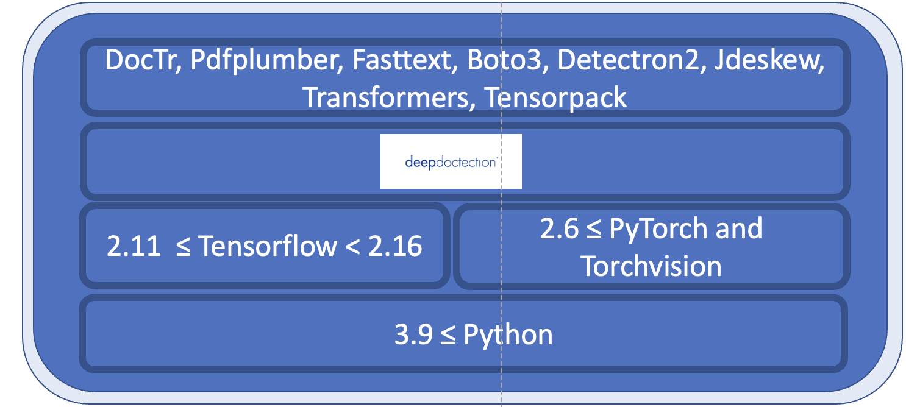

# 


## Requirements



Everything in the overview listed below the **deep**doctection layer are necessary requirements and have to be installed 
by the user.

- Linux or macOS. Windows is not supported but there is a [Dockerfile](https://github.com/deepdoctection/deepdoctection/tree/master/docker/pytorch-cpu-jupyter) available.
- Python >= 3.9
- 2.2 <= PyTorch  **or** 2.11 <= Tensorflow < 2.16. For lower Tensorflow versions the code will only run on a GPU. 
  Tensorflow support will be stopped from Python 3.11 onwards.
- To fine-tune models, a GPU is recommended.

??? info "Poppler vs. PDFium"

    The package **deep**doctection supports two different libraries for PDF processing:
    For release `v.0.34.0` and below [Poppler](https://poppler.freedesktop.org/) is required for PDF processing. Starting 
    from release `v.0.35.0`, [`pypdfmium2`](https://github.com/pypdfium2-team/pypdfium2) is used for PDF processing and 
    the default choice. If both are available you can choose which one to use by setting environment variables, e.g. 
    `USE_DD_POPPLER=True` and `USE_DD_PDFIUM=False`.

??? info "PIL vs. OpenCV"

    We use [Pillow](https://pillow.readthedocs.io/en/stable/) or [OpenCV](https://github.com/opencv/opencv-python) for 
    image processing tasks. Pillow is more lightweight, easier to install and the default choice. 
    OpenCV is faster when loading images and can be beneficial especially when training. If you want to use OpenCV, please
    install this framework separately and set the environment variables `USE_DD_OPENCV=True` and `USE_DD_PILLOW=False`. 


??? info "Tesseract"

    Tesseract must be [installed](https://github.com/tesseract-ocr/tesseract) separately. For using Tesseract, a 
    configuration file is available at `~/.cache/deepdoctection/configs/dd/conf_tesseract.yaml`. In addition to the 
    `LANGUAGES` and `LINES` arguments, all other configuration parameters provided by Tesseract can also be used.


The following overview shows the availability of the models in conjunction with the DL framework.

| Task                                        | PyTorch | Torchscript    |  Tensorflow  |
|---------------------------------------------|:-------:|----------------|:------------:|
| Layout detection via Detectron2/Tensorpack  |    ✅    | ✅ (CPU only)   | ✅ (GPU only) |
| Table recognition via Detectron2/Tensorpack |    ✅    | ✅ (CPU only)   | ✅ (GPU only) |
| Table transformer via Transformers          |    ✅    | ❌              |      ❌       |
| Deformable-Detr                             |    ✅    | ❌              |      ❌       |
| DocTr                                       |    ✅    | ❌              |      ✅       |
| LayoutLM (v1, v2, v3, XLM) via Transformers |    ✅    | ❌              |      ❌       |


## Install with package manager

We recommend using a virtual environment. You can install **deep**doctection from PyPi or from source. 

### Minimal setup

#### PyTorch

```
pip install transformers
pip install python-doctr==0.9.0
pip install deepdoctection
```

#### Tensorflow

```
pip install tensorpack
pip install python-doctr==0.9.0
pip install deepdoctection
```

Both setups are sufficient to run the [**introduction notebook**](https://github.com/deepdoctection/notebooks/blob/main/Get_Started.ipynb). 

### Full setup

This will give you ALL models available within the Deep Learning framework as well as all models
that are independent of Tensorflow/PyTorch.

#### PyTorch 

First install [**Detectron2**](https://detectron2.readthedocs.io/en/latest/tutorials/install.html) separately as it 
is not distributed via PyPi.

You can use our fork:

```
pip install detectron2@git+https://github.com/deepdoctection/detectron2.git
```

Then install all remaining dependencies with:

```
pip install deepdoctection[pt]
```

#### Tensorflow

```
pip install deepdoctection[tf]
```

!!! info 

    This will install **deep**doctection with all dependencies listed in the dependency diagram above the **deep**doctection 
    layer. This includes:

    - **Boto3**, the AWS SDK for Python to provide an API to AWS Textract (only OCR service). This is a paid service and 
      requires an AWS account.
    - **Pdfplumber**, a PDF text miner based on Pdfminer.six
    - **Fasttext**, a library for efficient learning of word representations and sentence classification. Used for language
      recognition only.
    - **Jdeskew**, a library for automatic deskewing of images.
    - **Transformers**, a library for state-of-the-art NLP models. 
    - **DocTr**, an OCR library as alternative to Tesseract
    - **Tensorpack**, if the Tensorflow setting has been installed. Tensorpack is a library for training models and also 
      provides many examples. We only use the object detection model.


If you want to have more control with your installation and are looking for fewer dependencies then 
install **deep**doctection with the basic setup only and add the dependencies you need manually.


### Install from source

If you want all files and latest additions etc. then download the repository or clone via

```
git clone https://github.com/deepdoctection/deepdoctection.git
```

Install the package in a virtual environment. Learn more about [`virtualenv`](https://docs.python.org/3/tutorial/venv.html). 


#### PyTorch

Again, install [**Detectron2**](https://detectron2.readthedocs.io/en/latest/tutorials/install.html) separately.

```
cd deepdoctection
pip install ".[source-pt]"
```

#### Tensorflow

```
cd deepdoctection 
pip install ".[tf]"
```


### Running a Docker container from Docker hub

Starting from release `v.0.27.0`, pre-existing Docker images can be downloaded from the [Docker hub](https://hub.docker.com/r/deepdoctection/deepdoctection).

```
docker pull deepdoctection/deepdoctection:<release_tag> 
```

To start the container, you can use the Docker compose file `./docker/pytorch-gpu/docker-compose.yaml`. 
In the `.env` file provided, specify the host directory where **deep**doctection's cache should be stored. 
This directory will be mounted. Additionally, specify a working directory to mount files to be processed into the 
container.

```
docker compose up -d
```

will start the container.

We provide a few more [Dockerfiles](https://github.com/deepdoctection/deepdoctection/tree/master/docker).


## Developing and testing

To make a full dev installation with an additional update of all requirements, run 


```
make install-dd-dev-pt
```

or 

```
make install-dd-dev-tf
```

To run the test cases use `make` and check the Makefile for the available targets.


### Formatting, linting and type checking

```
make format-and-qa
```
