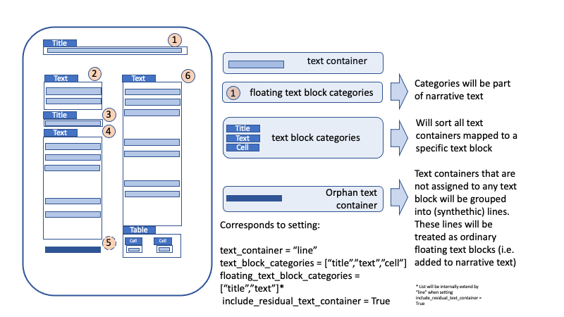

<p align="center">
  
  <h3 align="center">
  </h3>
</p>

# Analyzer Configuration

In this overview, we aim to take a closer look at the configuration and show how components can be activated and models 
can be exchanged. The configuration options are extensive, and changes in some areas often require adjustments in others. 
It is not possible to cover all configuration options in this context. For further details, we refer to the comments 
in the source code.

## How to change configuration

There are essentially two ways to adjust the configuration: 

- by modifying the configuration file or 
- by explicitly setting parameters.

### Explicit parameter adjustment

Pass the adjustments in a list:

```python
import deepdoctection as dd

config_overwrite = ["USE_TABLE_SEGMENTATION=False",
                    "USE_OCR=False",
                    "TEXT_ORDERING.BROKEN_LINE_TOLERANCE=0.01",
                    "PT.LAYOUT.FILTER=['title']"]  # (1) 

analyzer = dd.get_dd_analyzer(config_overwrite=config_overwrite)
```

1. Ensure to include quotation marks around the string values (e.g., ['title']), as omitting them may cause parsing 
   errors.

### Configuration file

There is a configuration file that can be used to set the default parameters. The configuration file is located at 
`~/.cache/deepdoctection/configs/dd/conf_dd_one.yaml`.

!!! info "Cache directory"
    **deep**doctection creates a cache directory the first time `dd.get_dd_analyzer()` is called. This cache directory 
    stores all models and configurations that are used at any point in time.  The configuration file is located at 
    `~/.cache/deepdoctection`.

The config file will be used once we set `dd.get_dd_analyzer(load_default_config_file=True)`.  

!!! info 

   We can use the configuration file or the `config_overwrite` argument to overwrite the default setting
   Note, that `config_overwrite` has higher priority. 

## High level Configuration

The analyzer consists of various steps that can be switched on and off. 

```yaml
USE_ROTATOR: False, # (1) 
USE_LAYOUT: True, # (2)
USE_LAYOUT_NMS: True, # (3) 
USE_TABLE_SEGMENTATION: True, # (4) 
USE_TABLE_REFINEMENT: False, # (5)
USE_PDF_MINER: False, # (6)
USE_OCR: True, # (7) 
USE_LAYOUT_LINK: False, # (8)
USE_LINE_MATCHER: False, # (9)
```

1. Determining the orientation of a page and rotating the page accordingly (requires Tesseract)
2. Segmenting a page into layout sections. We can choose various object detection models
3. Layout NMS by pairs of layout sections (e.g. 'table' and 'title'). Reduces significantly false positives.
4. This will determine cells and rows/column of a detected table
5. A particular component for a very specific table recognition model
6. When processing a PDF file, it will first try to extract words using pdfplumber
7. Whether to use an OCR engine
8. Whether to link layout sections, e.g. figure and caption
9. Only relevant for very specific layout models

## Layout models

Once `USE_LAYOUT=True` we can configure the layout pipeline component further.

!!! info "Layout models"

    Layout detection uses either Tensorpack's Cascade-RCNN, Deformable-Detr, Detectron2 Cascade-RCNN or Table-Transformer, 
    depending on which DL framework PyTorch or Tensorflow has been installed. Models have been trained on different datasets 
    and therefore return different layout sections. 

We can choose between `layout/d2_model_0829999_layout_inf_only.pt`, 
`microsoft/table-transformer-detection/pytorch_model.bin`, 
`Aryn/deformable-detr-DocLayNet/model.safetensors`. What works best on your use-case is up to you to check. For 
instance, we can switch between Pytorch models like this:

```yaml
PT:
   LAYOUT:
      FILTER:
         - figure
      PAD:
         BOTTOM: 0
         LEFT: 0
         RIGHT: 0
         TOP: 0
       PADDING: false
       WEIGHTS: layout/d2_model_0829999_layout_inf_only.pt
       WEIGHTS_TS: layout/d2_model_0829999_layout_inf_only.ts
```

Here, we are using the `model layout/d2_model_0829999_layout_inf_only.pt` for PyTorch. With

```yaml
FILTER:
  - figure
```

we instruct the system to filter out all figure objects. 


!!! info "ModelCatalog"
    
    In general, the `ModelCatalog` can be used to obtain information about registered models. Each model has a `Profile` 
    that includes information about its origin, the categories it can detect, and the framework that must be used to run 
    the model.

    ```python
    from dataclasses import asdict

    asdict(dd.ModelCatalog.get_profile("layout/d2_model_0829999_layout_inf_only.pt"))
    ```

    !!! info "Output"
     
        {'name': 'layout/d2_model_0829999_layout_inf_only.pt',
        'description': 'Detectron2 layout detection model trained on Publaynet',
        'size': [274632215],
        'tp_model': False,
        'config': 'dd/d2/layout/CASCADE_RCNN_R_50_FPN_GN.yaml',
        'preprocessor_config': None,
        'hf_repo_id': 'deepdoctection/d2_casc_rcnn_X_32xd4_50_FPN_GN_2FC_publaynet_inference_only',
        'hf_model_name': 'd2_model_0829999_layout_inf_only.pt',
        'hf_config_file': ['Base-RCNN-FPN.yaml', 'CASCADE_RCNN_R_50_FPN_GN.yaml'],
        'urls': None,
        'categories': {1: <LayoutType.TEXT>,
         2: <LayoutType.TITLE>,
         3: <LayoutType.LIST>,
         4: <LayoutType.TABLE>,
         5: <LayoutType.FIGURE>},
        'categories_orig': None,
        'dl_library': 'PT',
        'model_wrapper': 'D2FrcnnDetector',
        'architecture': None,
        'padding': None}


### Table transformer

We can use the [table transformer model](https://github.com/microsoft/table-transformer) for table detection. 


```python
asdict(dd.ModelCatalog.get_profile("microsoft/table-transformer-detection/pytorch_model.bin"))
```


!!! info "Output"

    {'name': 'microsoft/table-transformer-detection/pytorch_model.bin',
     'description': 'Table Transformer (DETR) model trained on PubTables1M. It was introduced in the paper PubTables-1M: Towards Comprehensive Table Extraction From Unstructured Documents by Smock et al. This model is devoted to table detection',
     'size': [115393245],
     'tp_model': False,
     'config': 'microsoft/table-transformer-detection/config.json',
     'preprocessor_config': 'microsoft/table-transformer-detection/preprocessor_config.json',
     'hf_repo_id': 'microsoft/table-transformer-detection',
     'hf_model_name': 'pytorch_model.bin',
     'hf_config_file': ['config.json', 'preprocessor_config.json'],
     'urls': None,
     'categories': {1: <LayoutType.TABLE>, 2: <LayoutType.TABLE_ROTATED>},
     'categories_orig': None,
     'dl_library': 'PT',
     'model_wrapper': 'HFDetrDerivedDetector',
     'architecture': None,
     'padding': None}


```yaml
PT:
   LAYOUT:
      WEIGHTS: microsoft/table-transformer-detection/pytorch_model.bin
   PAD:
      TOP: 60
      RIGHT: 60
      BOTTOM: 60
      LEFT: 60
```

Table transformer requires image padding for more accurate results. The default padding provided might not be optimal. 
We can tweak and change it according to our needs.


### Custom model

!!! info "Custom model"

    A custom model can be added as well, but it needs to be registered. The same holds true for some special categories. 
    We refer to [this notebook](Analyzer_Model_Registry_And_New_Models.md) for adding your own or third party models.

## Layout Non-Maximum-Supression

This is relevant if `USE_LAYOUT_NMS=True`.


!!! info 
    
    Layout models often produce overlapping layout sections. These can be removed using Non-Maximum Suppression (NMS). 
    However, experience has shown that NMS often needs to be fine-tuned. For example, it can be useful to exclude tables 
    from the NMS process.

    Suppose a large and complex table is detected — it's not uncommon for a text block or a title to be mistakenly 
    recognized within the table as well, potentially even with a high confidence score. In such cases, you may still want 
    to retain the table at all costs.

Using the `LAYOUT_NMS_PAIRS` configuration, we can define pairs of layout sections that should be subject to NMS 
once a certain overlap threshold is exceeded. Additionally, we can set a priority to specify which category should 
be favored when overlaps occur.

The configuration consists of three parts:

```yaml
LAYOUT_NMS_PAIRS:
  COMBINATIONS:  # Pairs of layout categories to be checked for NMS
    - - table
      - title
  PRIORITY:  # Preferred category when overlap occurs. If set to `None`, NMS uses the confidence score.
    - table
  THRESHOLDS:  # IoU overlap threshold. Pairs with lower IoU will be ignored.
    - 0.001
```


## Table Segmentation in **deep**doctection

Table segmentation — i.e., the detection of cells, rows, columns, and multi-spanning cells — can be performed using two 
different approaches in **deep**doctection.


### Original deepdoctection approach

In the original method, table structure is constructed using two separate models: one for detecting cells and another 
for detecting rows and columns. Once these components are detected, the row and column indices of each cell are 
assigned based on how cells spatially overlap with the detected rows and columns.

!!! info
    
    While this description may sound straightforward, the underlying logic involves several intermediate steps:

        * Row and column regions must be “stretched” to fully cover the table.
        * Overlapping rows or columns that create ambiguity must be removed.
        * Specific rules for assigning cells to rows and columns must be applied, based on overlap criteria.


### Table Transformer Process

Starting from release **v0.34**, the default method for table segmentation is the **Table Transformer** approach. 
This model handles the detection of rows, columns, and multi-spanning cells in a single step. Moreover, the model is 
able to detect column header, projected row header and projected column headers. Cells are formed by intersecting the 
detected rows and columns. In a subsequent refinement step, simple (non-spanning) cells may be replaced with 
multi-spanning cells where appropriate.

Finally, each cell is assigned its row and column number.

!!! note
    
    Table Transformer is only available with **PyTorch**.

!!! info
    In practice, we have observed that the recognition of multi-spanning cells is **less reliable** for non-scientific 
    tables (e.g., tables not originating from medical articles). If multi-spanning headers are not essential, we 
    recommend filtering them out. The result is a table structure consisting only of simple cells, i.e., cells 
    with `row_span = 1` and `column_span = 1`.


### Configuration

The segmentation configuration is extensive, and we cannot cover every setting in detail. For a comprehensive 
description of all parameters, we refer to the source code. We will focus on the parameters that have the most 
significant impact on the segmentation results.

```yaml
SEGMENTATION:
  ASSIGNMENT_RULE: ioa  # (1) 
  FULL_TABLE_TILING: true  # (2) 
  REMOVE_IOU_THRESHOLD_COLS: 0.2 # (3) 
  REMOVE_IOU_THRESHOLD_ROWS: 0.2
  STRETCH_RULE: equal  # (4) 
  THRESHOLD_COLS: 0.4 # (5)
  THRESHOLD_ROWS: 0.4
```

1. IoU is another cell/row/column overlapping rule
2. In order to guarantee that the table is completely covered with rows and columns
3. Removes overlapping rows based on an IoU threshold. Helps prevent multiple row spans caused by overlapping detections.
   Note: for better alignment, SEGMENTATION.FULL_TABLE_TILING can be enabled. Using a low threshold here may result in 
   a very coarse grid.
4. How to stretch row/columns: left is another choice
5. Threshold for assigning a (special) cell to a row based on the chosen rule (IoU or IoA). The row assignment is based 
   on the highest-overlapping row. Multiple overlaps can lead to increased rowspan.

!!! note

    The more accurate the underlying detectors are for your specific use case, the higher the thresholds (e.g., 
    `THRESHOLD_ROWS`, `THRESHOLD_COLS`) should be set to take full advantage of the predictions.

### Filtering Redundant Detections

The Table Transformer may detect redundant table structures and headers. To filter those out, apply the following:

```yaml
PT:
  ITEM:
    WEIGHTS: microsoft/table-transformer-structure-recognition/pytorch_model.bin
    FILTER:
      - table
      - column_header
      - projected_row_header
      - spanning
```

!!! note

    This ensures that only relevant cell structures are retained, improving clarity and reducing noise in the 
    segmentation output.


## Text extraction

There are four different options for text extraction.

### PDFPlumber

Extraction with pdfplumber. This requires native PDF documents where the text can be extracted from the byte encoding. 
If we try to pass images through this pipeline, we will run into an error.

```yaml
USE_PDF_MINER: True
```

The remaining three are all OCR methods. If we want to use an OCR engine, we need to set `USE_OCR=True`.

!!! info

    It is possible to select PdfPlumber in combination with an OCR. If no text was extracted with PdfPlumber, the OCR 
    service will be called, otherwise it will be omitted. 

!!! info

    There is currently no option to grap everything with OCR that cannot be extracted with PdfPlumber. It is all or 
    nothing.  


```yaml
USE_OCR: True
OCR:
  USE_TESSERACT: False
  USE_DOCTR: True
  USE_TEXTRACT: False
```

### DocTr

DocTr is a powerful library that provides models for both TensorFlow and PyTorch. What makes it particularly valuable 
is that it includes training scripts and allows models to be trained with custom vocabularies. This makes it possible 
to build OCR models for highly specialized scripts where standard OCR solutions fail.

A DocTr OCR pipeline consists of two steps: spatial word detection and character recognition within the region of 
interest.

!!! info

    For **DOCTR_WORD**, the following models are registered in the ModelCatalog:

    * For PyTorch: `doctr/db_resnet50/pt/db_resnet50-ac60cadc.pt`
    * For TensorFlow: `doctr/db_resnet50/tf/db_resnet50-adcafc63.zip`

    For **DOCTR_RECOGNITION**, you can choose from the following PyTorch models:

     * `doctr/crnn_vgg16_bn/pt/crnn_vgg16_bn-9762b0b0.pt`
     * `Felix92/doctr-torch-parseq-multilingual-v1/pytorch_model.bin`
     * `doctr/crnn_vgg16_bn/pt/master-fde31e4a.pt`

     For TensorFlow, only one model is currently registered:

     * `doctr/crnn_vgg16_bn/tf/crnn_vgg16_bn-76b7f2c6.zip`
 
To use DocTr set `OCR.USE_OCR=True` and select the model for word detection and text recognition.

```yaml
OCR:
  WEIGHTS:
    DOCTR_WORD:
      TF: doctr/db_resnet50/tf/db_resnet50-adcafc63.zip
      PT: doctr/db_resnet50/pt/db_resnet50-ac60cadc.pt
    DOCTR_RECOGNITION:
      TF: doctr/crnn_vgg16_bn/tf/crnn_vgg16_bn-76b7f2c6.zip
      PT: doctr/crnn_vgg16_bn/pt/crnn_vgg16_bn-9762b0b0.pt
```

### Tesseract

In addition to DocTr, Tesseract is arguably the most widely known open-source OCR solution and provides pre-trained 
models for a large number of languages. However, Tesseract must be installed separately. We refer to the official 
Tesseract documentation.

!!!info

    Tesseract comes with its own configuration file, which is located alongside other configuration files under 
    `~/.cache/deepdoctection/configs/dd/conf_dd_one.yaml`. 

To use Tesseract within the analyzer, configure it as follows:

```yaml
USE_OCR: True
OCR:
  USE_TESSERACT: True
  USE_DOCTR: False
  USE_TEXTRACT: False
```

### AWS Textract

Textract is the AWS OCR solution that can be accessed via an API. It is superior to the Open Source solutions. This 
is a paid service and requires an AWS account. You also need to install `boto3`. We refer to the official documentation 
to access the service via API.

To use the API, credentials must be provided. We can either use the AWS CLI with its built-in secret management, or 
set the environment variables at the beginning: `AWS_ACCESS_KEY`, `AWS_SECRET_KEY`, and `AWS_REGION`.

To use Textract within the analyzer, configure as follows:

```yaml
USE_OCR: True
OCR:
  USE_TESSERACT: False
  USE_DOCTR: False
  USE_TEXTRACT: True
```

The following two pipeline configuration will automatically be effective once you set `USE_OCR=True` or `USE_PDF_MINER=True`.


## Word matching


Word matching serves to merge the results of layout analysis (including table structure) with those of OCR. Up to this 
point, all layout segments and words are independent elements of a page, with no established relationships between them. 
Word matching creates a link between each word and the appropriate layout segment.

!!! info

    The most effective way to establish this link is by evaluating the spatial overlap between a word and layout 
    segments. 
    It must be clearly defined which layout segments are eligible for such associations — not all segments are 
    suitable. 
    For example, words that are part of a table should not be linked to the table's outer frame, but rather to the 
    individual cell identified during table segmentation.

    The configuration below defines the layout segments that can be directly linked to words. Using the `RULE` 
    parameter — 
    either *intersection-over-area* (`ioa`) or *intersection-over-union* (`iou`) — you can specify the logic for 
    determining 
    whether a relationship should be established. If the overlap exceeds the given `THRESHOLD`, a connection is made.

It is also possible for a word to overlap with multiple layout segments. In such cases, setting `MAX_PARENT_ONLY = True` 
ensures that the word is only assigned to the segment with the highest overlap score.

```yaml
WORD_MATCHING:
  PARENTAL_CATEGORIES: # This configuration is not equal to the default configuration
    - text
    - title
    - list
    - cell
  RULE: ioa
  THRESHOLD: 0.6
  MAX_PARENT_ONLY: True
```


## Reading Order

In the final step of the pipeline, words and layout segments must be arranged to form coherent, continuous text. This 
task is handled by the `TextOrderService` component.

!!! info

    Words that have been assigned to layout segments are grouped into lines, which are then read from top to bottom. To 
    sort layout segments effectively, auxiliary columns are constructed. These columns are further grouped into 
    **contiguous blocks** that vertically span the page. The reading order is then determined by traversing:

    * columns within a block from **left to right**, and
    * contiguous blocks from **top to bottom**.

    

It’s important to note that this method imposes an **artificial reading order**, which may not align with the true 
semantic structure of more complex or unconventional layouts.

Additionally, if layout detection is imprecise, the resulting reading order may be flawed. This is a known limitation 
and should always be kept in mind.

The `TextOrderService` can be configured using four key parameters:

* `TEXT_CONTAINER`: defines the category containing textual elements, such as `word`. Technically speaking, a text 
* container is an `ImageAnnotation` with the subcategory `WordType.CHARACTERS`. In most cases, this refers to 
* individual words. However, there are also OCR systems that return their results line by line, using the layout 
* type `LayoutType.LINE`.
* `TEXT_ORDERING.TEXT_BLOCK_CATEGORIES`: lists the layout segments to which words have been assigned and which should 
   be ordered. In general you should list layout segments that have been added to 
   `TEXT_ORDERING.WORD_MATCHING.PARENTAL_CATEGORIES`.  
* `TEXT_ORDERING.FLOATING_TEXT_BLOCK_CATEGORIES`: defines segments that are not part of the main document flow but 
   should still be considered (e.g., footnotes or side notes). A common question is whether tables should be part of 
   the main body text—by default, they are excluded.
* `TEXT_ORDERING.INCLUDE_RESIDUAL_TEXT_CONTAINER`: controls whether *orphan words* (those not assigned to any layout 
   segment) should be included in the output.

!!! note

    Let’s revisit the topic of **orphan words**:

    In the word matching process it is possible that some words do not overlap with any layout segment. 
    If `INCLUDE_RESIDUAL_TEXT_CONTAINER` is set to `False`, these words will not receive a `reading_order` and will be 
    excluded from the text output.
    If set to `True`, orphan words are grouped into `line`s and included in the output, ensuring no text is lost. This 
    setting is often crucial and may need to be adjusted depending on your use case. We already covered this topic in 
    the [**More_on_parsing notebook**](Analyzer_More_On_Parsing.md)

    For further details on layout parsing and text ordering, please refer to this [**section**]
    (layout_parsing_structure.md).

