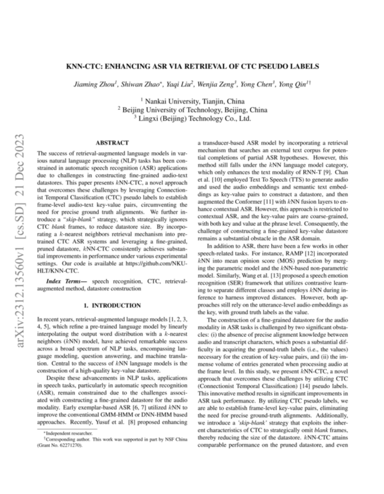
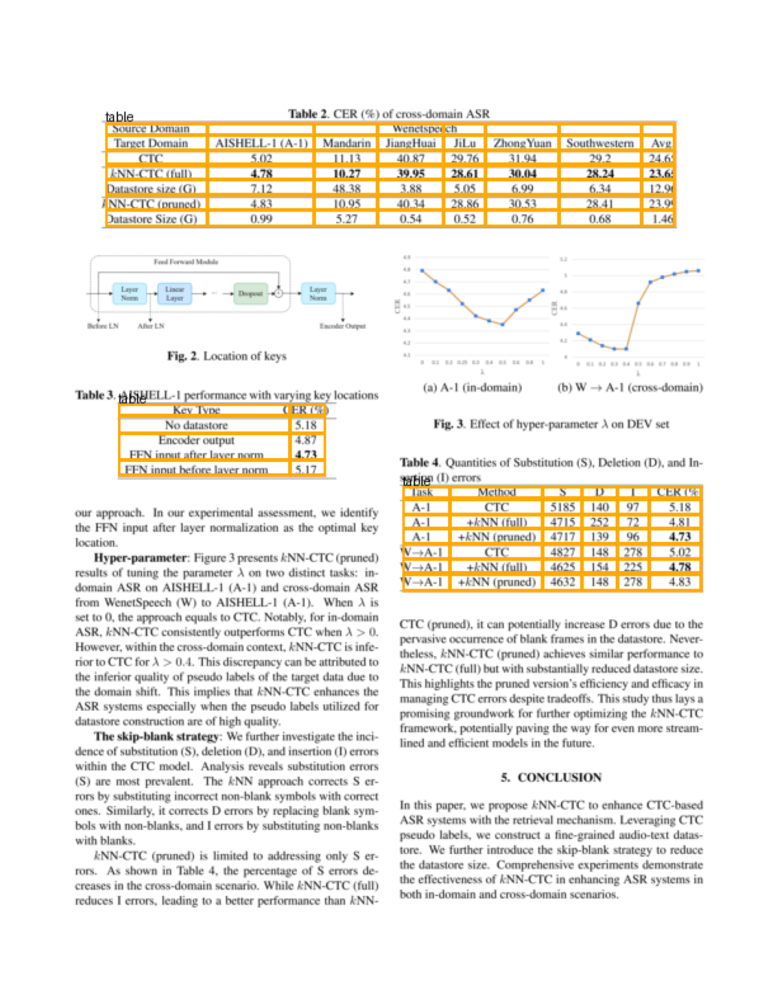

 

# Analyzer Configuration Samples

We present two configurations of the Analyzer that differ from the default configuration.

## Table Transformer

**Works best on:** Research papers (esp. in medical domain)

In this notebook, we demonstrate how the [Table Transformer](https://github.com/microsoft/table-transformer) models can be utilized for table detection and table segmentation by adjusting the analyzer's default configuration. 

Table Transformer consists of a table detection model and a table segmentation model. Table segmentation is already used in the default configuration. This configuration is interesting if you only need the table content.

## General configuration


```python
import os

# Choose PILLOW as image processing library
os.environ["USE_DD_PILLOW"]="True"
os.environ["USE_DD_OPENCV"]="False"

import deepdoctection as dd

from matplotlib import pyplot as plt
from IPython.core.display import HTML
```


```python
analyzer =dd.get_dd_analyzer(config_overwrite=
   ["PT.LAYOUT.WEIGHTS=microsoft/table-transformer-detection/pytorch_model.bin",
    "TEXT_ORDERING.INCLUDE_RESIDUAL_TEXT_CONTAINER=False", # Deactivating line detection. Only table content
    "TEXT_ORDERING.PARAGRAPH_BREAK=0.01",]) # TATR table detection model

analyzer.pipe_component_list[0].predictor.config.threshold = 0.8  # default threshold is at 0.1
```


```python
path="/path/to/dir/sample/2312.13560.pdf" # Use the PDF in the sample folder

df = analyzer.analyze(path=path)
df.reset_state()
df_iter = iter(df)

dp = next(df_iter)
np_image = dp.viz()

plt.figure(figsize = (25,17))
plt.axis('off')
plt.imshow(np_image)
```

    

    


```python
dp.text  # because of TEXT_ORDERING.INCLUDE_RESIDUAL_TEXT_CONTAINER=False, we do not generate text
```


    ''


```python
_ = next(df_iter)
dp = next(df_iter)
np_image = dp.viz()


plt.figure(figsize = (25,17))
plt.axis('off')
plt.imshow(np_image)
```


    

    


```python
dp.tables[0].csv
```


    [['Dataset ', 'A-1 ', 'A-2 ', 'Libri-Adapt ', 'Avg. '],
     ['CTC ', '5.18 ', '6.18 ', '12.81 ', '8.06 '],
     ['KNN-CTC (full) ', '4.81 ', '5.53 ', '12.42 ', '7.59 '],
     ['Datastore size (G) ', '7.12 ', '47.12 ', '4.82 ', '19.69 '],
     ['KNN-CTC (pruned) ', '4.73 ', '5.46 ', '12.66 ', '7.62 '],
     ['Datastore size (G) ', '0.99 ', '6.65 ', '1.49 ', '3.04 ']]


```python
dp.tables[0].number_of_rows, dp.tables[0].row_header_cells # does not detect row headers
```


    (6, [])


```python
dp = next(df_iter)
np_image = dp.viz()

plt.figure(figsize = (25,17))
plt.axis('off')
plt.imshow(np_image)
```


    

    


```python
from IPython.core.display import HTML

HTML(dp.tables[0].html)
```


<table><tr><td>Task</td><td>Method</td><td>S</td><td>D</td><td>I</td><td>CER (%)</td></tr><tr><td>A-1</td><td>CTC</td><td>5185</td><td>140</td><td>97</td><td>5.18</td></tr><tr><td>A-1</td><td>+KNN (full)</td><td>4715</td><td>252</td><td>72</td><td>4.81</td></tr><tr><td>A-1</td><td>+KNN (pruned)</td><td>4717</td><td>139</td><td>96</td><td>4.73</td></tr><tr><td>W-A-1</td><td>CTC</td><td>4827</td><td>148</td><td>278</td><td>5.02</td></tr><tr><td>W-A-1</td><td>+KNN (full)</td><td>4625</td><td>154</td><td>225</td><td>4.78</td></tr><tr><td>W-A-1</td><td>+KNN (pruned)</td><td>4632</td><td>148</td><td>278</td><td>4.83</td></tr></table>


```python
HTML(dp.tables[1].html)
```


<table><tr><td rowspan=2>Source Domain Target Domain</td><td colspan=7>Wenetspeech</td></tr><tr><td>AISHELL-1 (A-1)</td><td>Mandarin</td><td>JiangHuai</td><td>JiLu</td><td>ZhongYuan</td><td>Southwestern</td><td>Avg.</td></tr><tr><td>CTC</td><td>5.02</td><td>11.13</td><td>40.87</td><td>29.76</td><td>31.94</td><td>29.2</td><td>24.65</td></tr><tr><td>KNN-CTC (full)</td><td>4.78</td><td>10.27</td><td>39.95</td><td>28.61</td><td>30.04</td><td>28.24</td><td>23.65</td></tr><tr><td>Datastore size (G)</td><td>7.12</td><td>48.38</td><td>3.88</td><td>5.05</td><td>6.99</td><td>6.34</td><td>12.96</td></tr><tr><td>KNN-CTC (pruned)</td><td>4.83</td><td>10.95</td><td>40.34</td><td>28.86</td><td>30.53</td><td>28.41</td><td>23.99</td></tr><tr><td>Datastore Size (G)</td><td>0.99</td><td>5.27</td><td>0.54</td><td>0.52</td><td>0.76</td><td>0.68</td><td>1.46</td></tr></table>


```python
HTML(dp.tables[2].html)
```


<table><tr><td>Key Type</td><td>CER (%)</td></tr><tr><td>No datastore</td><td>5.18</td></tr><tr><td>Encoder output FFN input after layer norm</td><td>4.87 4.73</td></tr><tr><td>FFN input before layer norm</td><td>5.17</td></tr></table>


## Legacy Default Setting

Until release `v.0.42`, this configuration was the default setting. Please note the dependencies on Tesseract and Detectron2 (for PyTorch) and on Tensorpack (on Tensorflow).

It works well on scientific papers.


```python
analyzer = dd.get_dd_analyzer(config_overwrite=
        ["PT.LAYOUT.WEIGHTS=layout/d2_model_0829999_layout_inf_only.pt",
         "PT.ITEM.WEIGHTS=item/d2_model_1639999_item_inf_only.pt",
         "PT.ITEM.FILTER=None",
         "SEGMENTATION.REMOVE_IOU_THRESHOLD_ROWS=0.001",
         "SEGMENTATION.REMOVE_IOU_THRESHOLD_COLS=0.001",
         "WORD_MATCHING.THRESHOLD=0.6",
         "WORD_MATCHING.PARENTAL_CATEGORIES=['text','title','list','figure','cell','spanning']",
         "TEXT_ORDERING.TEXT_BLOCK_CATEGORIES=['text','title','list','figure','cell','spanning']",
         "TEXT_ORDERING.FLOATING_TEXT_BLOCK_CATEGORIES=['text','title','list','figure']",
         "TEXT_ORDERING.INCLUDE_RESIDUAL_TEXT_CONTAINER=False",
         "USE_LAYOUT_LINK=False",
         "LAYOUT_LINK.PARENTAL_CATEGORIES=[]",
         "LAYOUT_LINK.CHILD_CATEGORIES=[]",
         "OCR.USE_DOCTR=False",
         "OCR.USE_TESSERACT=True",
         "USE_LAYOUT_NMS=False",
         "USE_TABLE_REFINEMENT=True",
         "USE_LINE_MATCHER=False",
         "LAYOUT_NMS_PAIRS.COMBINATIONS=None",
         "LAYOUT_NMS_PAIRS.THRESHOLDS=None",
         "LAYOUT_NMS_PAIRS.PRIORITY=None"])
```


```python
df = analyzer.analyze(path=path)
df.reset_state()
df_iter = iter(df)

dp = next(df_iter)
np_image = dp.viz()

plt.figure(figsize=(25, 17))
plt.axis('off')
plt.imshow(np_image)
```


    

    


```python
print(dp.text)
```

    KNN-CTC: ENHANCING ASR VIA RETRIEVAL OF CTC PSEUDO LABELS
    Jiaming Zhou', Shiwan Zhao*, Yagi Liu?, Wenjia Zeng’, Yong Chen’, Yong Qin'*
    ' Nankai University, Tianjin, China ? Beijing University of Technology, Beijing, China 3 Lingxi (Beijing) Technology Co., Ltd.
    ABSTRACT
    The success of retrieval-augmented language models in var- ious natural language processing (NLP) tasks has been con- strained in automatic speech recognition (ASR) applications due to challenges in constructing fine-grained audio-text datastores. This paper presents KNN-CTC, a novel approach that overcomes these challenges by leveraging Connection- ist Temporal Classification (CTC) pseudo labels to establish frame-level audio-text key-value pairs, circumventing the need for precise ground truth alignments. We further in- troduce a “skip-blank” strategy, which strategically ignores CTC blank frames, to reduce datastore size. By incorpo- rating a k-nearest neighbors retrieval mechanism into pre- trained CTC ASR systems and leveraging a fine-grained, pruned datastore, KNN-CTC consistently achieves substan- tial improvements in performance under various experimental settings. Our code is available at https://github.com/NKU- HLT/KNN-CTC.
    Index Terms— _ speech recognition, CTC, retrieval- augmented method, datastore construction
    1. INTRODUCTION
    In recent years, retrieval-augmented language models [1, 2, 3, 4, 5], which refine a pre-trained language model by linearly interpolating the output word distribution with a k-nearest neighbors (KNN) model, have achieved remarkable success across a broad spectrum of NLP tasks, encompassing lan- guage modeling, question answering, and machine transla- tion. Central to the success of KNN language models is the construction of a high-quality key-value datastore.
    Despite these advancements in NLP tasks, applications in speech tasks, particularly in automatic speech recognition (ASR), remain constrained due to the challenges associ- ated with constructing a fine-grained datastore for the audio modality. Early exemplar-based ASR [6, 7] utilized KNN to improve the conventional GMM-HMM or DNN-HMM based approaches. Recently, Yusuf et al. [8] proposed enhancing
    + Corresponding author. This work was supported in part by NSF China (Grant No. 62271270).
    a transducer-based ASR model by incorporating a retrieval mechanism that searches an external text corpus for poten- tial completions of partial ASR hypotheses. However, this method still falls under the KNN language model category, which only enhances the text modality of RNN-T [9]. Chan et al. [10] employed Text To Speech (TTS) to generate audio and used the audio embeddings and semantic text embed- dings as key-value pairs to construct a datastore, and then augmented the Conformer [11] with KNN fusion layers to en- hance contextual ASR. However, this approach is restricted to contextual ASR, and the key-value pairs are coarse-grained, with both key and value at the phrase level. Consequently, the challenge of constructing a fine-grained key-value datastore remains a substantial obstacle in the ASR domain.
    In addition to ASR, there have been a few works in other speech-related tasks. For instance, RAMP [12] incorporated kKNN into mean opinion score (MOS) prediction by merg- ing the parametric model and the KNN-based non-parametric model. Similarly, Wang et al. [13] proposed a speech emotion recognition (SER) framework that utilizes contrastive learn- ing to separate different classes and employs KNN during in- ference to harness improved distances. However, both ap- proaches still rely on the utterance-level audio embeddings as the key, with ground truth labels as the value.
    The construction of a fine-grained datastore for the audio modality in ASR tasks is challenged by two significant obsta- cles: (i) the absence of precise alignment knowledge between audio and transcript characters, which poses a substantial dif- ficulty in acquiring the ground-truth labels (i.e., the values) necessary for the creation of key-value pairs, and (ii) the im- mense volume of entries generated when processing audio at the frame level. In this study, we present KNN-CTC, a novel approach that overcomes these challenges by utilizing CTC (Connectionist Temporal Classification) [14] pseudo labels. This innovative method results in significant improvements in ASR task performance. By utilizing CTC pseudo labels, we are able to establish frame-level key-value pairs, eliminating the need for precise ground-truth alignments. Additionally, we introduce a ’skip-blank’ strategy that exploits the inher- ent characteristics of CTC to strategically omit blank frames, thereby reducing the size of the datastore. KNN-CTC attains comparable performance on the pruned datastore, and even
