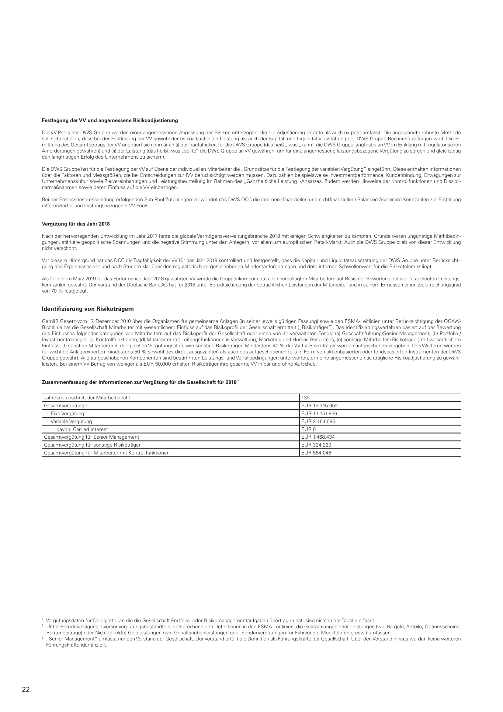

 


# Getting started

**deep**doctection is a package that can be used to extract text from complex structured documents. It also allows you
to run vision/text and multi-modal models in an end-to-end pipeline. Inputs can be native PDFs or images. It is very
versatile.

Compared to most other parsers, **deep**doctection offers extensive configurability. We will explore these capabilities
in more detail in other notebooks.

This notebook will introduce you to the essential basics of document parsing with **deep**doctection.

We assume that, in addition to **deep**doctection, the transformers and python-doctr packages are installed if you are
using PyTorch as your deep learning framework. 

If you are using TensorFlow, tensorpack must be installed instead.

Please note that TensorFlow is no longer supported from Python 3.11 onward, and its functionality within
**deep**doctection is significantly more limited.

We recommend not using the TensorFlow setup anymore.

You will also need matplotlib that you can install with 

```
pip install matplotlib
```


```python
from pathlib import Path
from matplotlib import pyplot as plt
from IPython.core.display import HTML

import deepdoctection as dd
```

## Sample

Take an image (e.g. .png, .jpg, ...). If you take the example below you'll maybe need to change ```image_path```.


```python
image_path = Path.cwd() / "pics/samples/sample_2/sample_2.png"

# viz_handler is a helper class that helps you e.g. with reading or writing images
image = dd.viz_handler.read_image(image_path)
plt.figure(figsize = (25,17))
plt.axis('off')
plt.imshow(image)
```



## Analyzer

Next, we instantiate the **deep**doctection analyzer. The analyzer is an example of a pipeline that can be built
depending on the problem you want to tackle. This particular pipeline is built from various building blocks. We will
come back to this later. 

We will be using the default configuration.


```python
analyzer = dd.get_dd_analyzer()
```

## Analyze methods

Once all models have been loaded, we can process a directory with images (.png, .jpf) or multi page PDF-documents. You
can either set `path='path/to/dir'` if you have a folder of images or `path='path/to/my/doc.pdf'` if you have a pdf document. 

You will receive an error if your path points to a single image. Processing images requires to pass the path to the
base image directory.


```python
path = Path.cwd() / "pics/samples/sample_2"

df = analyzer.analyze(path=path)
```

With

```
df = analyzer.analyze(path=path)
```

nothing has actually been processed yet.

The method ```analyzer.analyze(path=path)``` does not (yet) return a JSON object, but rather a specialized subclass
of the ```DataFlow``` class. Essentially, it behaves like a [generator](https://wiki.python.org/moin/Generators). 

Before starting the iteration, we must call:  


```python
df.reset_state() 
```

Now you can traverse through all the values of the `Dataflow` simply by using a `for`-loop or the `next` function.
Let's go!  


```python
doc=iter(df)
page = next(doc)
```

    [0523 22:14.35 @doctectionpipe.py:103][Processing sample_2.png]
    [0523 22:14.37 @context.py:133][ImageLayoutService total: 2.3095 sec.]
    [0523 22:14.37 @context.py:133][AnnotationNmsService total: 0.002 sec.]
    [0523 22:14.38 @context.py:133][SubImageLayoutService total: 0.3684 sec.]
    [0523 22:14.38 @context.py:133][PubtablesSegmentationService total: 0.0066 sec.]
    [0523 22:14.38 @context.py:133][ImageLayoutService total: 0.4052 sec.]
    [0523 22:14.39 @context.py:133][TextExtractionService total: 0.9374 sec.]
    [0523 22:14.39 @context.py:133][MatchingService total: 0.0059 sec.]
    [0523 22:14.39 @context.py:133][TextOrderService total: 0.0301 sec.]


## Page

Let's see what we got back. For each iteration we receive a `Page` object. This object stores all informations that have
been collected from a page document when running through the pipeline. 


```python
type(page)
```


    deepdoctection.datapoint.view.Page


Let's also have a look on some top level information. 


```python
print(f" height: {page.height} \n width: {page.width} \n file_name: {page.file_name} \n document_id: {page.document_id} \n image_id: {page.image_id}\n")
```

     height: 2339 
     width: 1654 
     file_name: sample_2.png 
     document_id: c1776412-857f-3102-af7c-1869139a278d 
     image_id: c1776412-857f-3102-af7c-1869139a278d
    


`document_id` and `image_id` are the same. The reason is because we only process a single image. The naming convention
silently assumes that we deal with a one page document. Once we process multi page PDFs `document_id` and `image_id`
differ.

With `get_attribute_names()` you get a list of all attributes. 


```python
page.get_attribute_names()
```


    {'angle',
     'chunks',
     'document_id',
     'document_summary',
     'document_type',
     'figures',
     'file_name',
     'language',
     'layouts',
     'location',
     'pad_bottom',
     'pad_left',
     'pad_right',
     'pad_top',
     'page_number',
     'residual_layouts',
     'size',
     'tables',
     'text',
     'words'}


```python
page.document_type, page.language
```


    (None, None)


`page.document_type` and `page.language` both return None. The reason is that the analyzer has no component for
predicting a document type or a language. If you want that, you need to build a custom pipeline. Check this [notebook](Using_LayoutLM_for_sequence_classification.ipynb) for further information.

## Layout segments

We can visualize detected layout segments. If you set `interactive=True` a viewer will pop up. Use `+` and `-` to zoom
out/in. Use `q` to close the page.

Alternatively, you can visualize the output with matplotlib.

```
image = page.viz()
plt.figure(figsize = (25,17))
plt.axis('off')
plt.imshow(image)
```


Let's have a look at other attributes. We can use the `text` property to get the content of the document. You will
notice that the table is not included. You can therefore filter tables from the other content. In fact you can even
filter on every layout segment.


```python
print(page.text)
```

    Die W-Pools der DWS Gruppe werden einer angemessenen Anpassung der Risiken unterzogen, die die Adjustierung ex ante als auch ex post umfasst. Die angewandte robuste Method d soll sicherstellen, dass bei der Festlegung der W sowohl der risikoadjustierten Leistung als auch der Kapital- und Liguiditatsaustattung der DWS Gruppe Rechnung getragen wird. Die mittlung des Gesamtbetrags der W orientiert sich primàr an 0 der Tragfâhigkeit fur die DWS Gruppe (das heiBt, was kann" die DWS Gruppe langfristig an) Wi im Einklang mit regulatorisch Anforderungen gewâhren) und ( der Leistung (das heilt, was sollte" die DWS Gruppe an W gewâhren, um fur eine angemessene leistungsbezogene Vergutung zu sorgen und gleichzeit den langfristigen Erfolg des Unternehmens zu sichern).
    Die DWS Gruppe hat fûr die Festlegung der W auf Ebene der individuellen Mitarbeiter die Grundsâtze for die Festlegung der variablen Vergutung" eingefuhrt. Diese enthalten Informatione Uber die Faktoren und MessgroBen, die bei Entscheidungen: zur W berlcksichtigt werden mussen. Dazu zâhlen beispielsweise Investmentperiomance. Kundenbindung, Erwàgungen Unternehmenskutur sowie Zielvereinbarungen und Leistungsbeurteilung im Rahmen des Ganzheitliche Leistung" -Ansatzes. Zudem werden Hinweise der Kontrollfunktionen und Diszipli narmalSnahmen sowie deren Einfluss auf die W einbezogen.
    Bei per Ermessensentscherdiung erfolgenden Sub-PoolZuteilungen verwendet das DWS DCC die internen (finanziellen und nichtfinanziellen) Balanced Scorecard-Kennzahlen zur Erstellung differenzierter und leistungsbezogener W-Pools.
    Vergutung fur das Jahr 2018
    Nach der hervorragenden Entwicklung im Jahr 2017 hatte die globale easealpibande 2018 mit einigen Schwierigkeiten zu kâmpfen. Grûnde waren unguinstige Marktbedin- gungen, stârkere geopolitische Spannungen und die negative Stimmung unter den Anlegern, vor allem am europàischen Retail-Markt. Auch die DWS Gruppe blieb von dieser Entwicklung nicht verschont.
    Vor diesem Hintergrund hat das DCC die Tragfahigkeit der W fur das Jahr 2018 kontrolliert und festgestellt, dass die Kapital- und Liguditaitsausstattung der DWS Gruppe unter Berlcksichti gung des Ergebnisses vor und nach Steuern klar Uber den regulatorisch vorgeschriebenen Mindestanforderungen und dem internen Schwellenwert fur die Risikotoleranz liegt
    Als Teil der im Màrz 2019 fur das Performance-Jahr 2018 gewâhrten W wurde die Gruppenkomponente allen berechtigten Mitarbeitern auf Basis der Bewertung der vier festgelegten Leistungs kennzahlen gewàhrt. Der Vorstand der Deutsche Bank AG hat fûr 2018 unter Berlcksichtigung der betràchtlichen Leistungen der Mitarbeiter und in seinem Ermessen einen Zielerreichungsgrad von 70 % festgelegt.
    Identifizierung von Risikotràger
    GemaBs Gesetz vom 17 Dezember 2010 Uber die Organismen fûr gemeinsame Anlagen (in seiner jeweils gultigen Fassung) sowie den ESMA-Leitlinien unter Berlcksichtigung der OGAW- Richtlinie hat die Gesellschaft Mitarbeiter mit wesentlichem Einfluss auf das Risikoprofil der Gesellschaft ermittelt GRisikotrâger"). Das dentifiaerungsveriahren basiert auf der Bewertung des Einflusses folgender Kategorien von Mitarbeitern auf das Risikoprofil der Gesellschaft oder einen von ihr ver walteten Fonds: (a) GeschatstihungSenior Management, (b) Portfolio-1 Investmentmanager. (c) Kontrolfunktionen, (d) Mitarbeiter mit Leitungsfunktionen in Verwaltung, Marketing und Human Resources, (e) sonstige Mitarbeiter (Risikotràger) mit wesentlichem Einfluss, () sonstige Mitarbeiter in der gleichen Vergitungsstufe wie sonstige Risikotrâger. Mindestens 40 % der wi fur Risikotràger werden aufgeschoben vergeben. Des Weiteren werden fur wichtige Anlageexperten mindestens 50 % sowohl des direkt ausgezahlten als auch des aufgeschobenen Teils in Form von aktienbasierten oder fondsbasierten Instrumenten der DWS Gruppe gewàhrt. Alle aufgeschobenen Komponenten sind bestimmten Leistungs- und Verfalbedingungen unterworfen, um eine angemessene nachtràgliche Risikoadjustierung zu gewàhr leisten. Bei einem W-Betrag von weniger als EUR 50.000 erhalten Risikotrâger ihre gesamte w in bar und ohne Aufschub.
    
    Vergûtungsdaten fur Delegierte, an die die Gesellschaft Portfolio- oder Rskomangementaupaben Ubertragen hat, sind nicht in der Tabelle erfasst.
    Unter Berlcksichtigung diverser Vergdtungsbestandteile entsprechend den Definitionen in den ESMA-Leitinien, die Geldzahlungen oder -leistungen (wie Bargeld, Anteile, Optionsscheir Rentenbeitràge) oder Nicht-Idirekte) Geldleistungen (wie Gehaltsnebenleistungen oder Sondervergitungen fur Fahrzeuge, Mobiltelefone, usw.) umfassen.
    Senior Management" umfasst nur den Vorstand der Gesellschaft. Der Vorstand erfillt die Definition als Fuhrungskrâfte der Gesellschaft. Ober den Vorstand hinaus wurden keine weitere Fuhrungskrâfte identifiziert.


You can get the individual layout segments like `text`, `title`, `list` or `figure`. Layout segments also have
various attributes. 


```python
for layout in page.layouts:
    print("--------------")
    print(f"Layout segment: {layout.category_name}, score: {layout.score}, reading_order: {layout.reading_order}, bounding_box: {layout.bounding_box},\n annotation_id: {layout.annotation_id} \n \ntext: {layout.text} \n \n")
```

    --------------
    Layout segment: text, score: 0.9416185021400452, reading_order: 5, bounding_box: Bounding Box(absolute_coords: True,ulx: 137, uly: 768, lrx: 1518, lry: 825),
     annotation_id: 4dba19ad-12d7-346d-902c-aff8c602d724 
     
    text: Nach der hervorragenden Entwicklung im Jahr 2017 hatte die globale easealpibande 2018 mit einigen Schwierigkeiten zu kâmpfen. Grûnde waren unguinstige Marktbedin- gungen, stârkere geopolitische Spannungen und die negative Stimmung unter den Anlegern, vor allem am europàischen Retail-Markt. Auch die DWS Gruppe blieb von dieser Entwicklung nicht verschont. 
     
    
    --------------
    Layout segment: text, score: 0.9415092468261719, reading_order: 9, bounding_box: Bounding Box(absolute_coords: True,ulx: 138, uly: 1048, lrx: 1518, lry: 1206),
     annotation_id: b6addb88-ca5a-3c04-afc5-35dfba05712c 
     
    text: GemaBs Gesetz vom 17 Dezember 2010 Uber die Organismen fûr gemeinsame Anlagen (in seiner jeweils gultigen Fassung) sowie den ESMA-Leitlinien unter Berlcksichtigung der OGAW- Richtlinie hat die Gesellschaft Mitarbeiter mit wesentlichem Einfluss auf das Risikoprofil der Gesellschaft ermittelt GRisikotrâger"). Das dentifiaerungsveriahren basiert auf der Bewertung des Einflusses folgender Kategorien von Mitarbeitern auf das Risikoprofil der Gesellschaft oder einen von ihr ver walteten Fonds: (a) GeschatstihungSenior Management, (b) Portfolio-1 Investmentmanager. (c) Kontrolfunktionen, (d) Mitarbeiter mit Leitungsfunktionen in Verwaltung, Marketing und Human Resources, (e) sonstige Mitarbeiter (Risikotràger) mit wesentlichem Einfluss, () sonstige Mitarbeiter in der gleichen Vergitungsstufe wie sonstige Risikotrâger. Mindestens 40 % der wi fur Risikotràger werden aufgeschoben vergeben. Des Weiteren werden fur wichtige Anlageexperten mindestens 50 % sowohl des direkt ausgezahlten als auch des aufgeschobenen Teils in Form von aktienbasierten oder fondsbasierten Instrumenten der DWS Gruppe gewàhrt. Alle aufgeschobenen Komponenten sind bestimmten Leistungs- und Verfalbedingungen unterworfen, um eine angemessene nachtràgliche Risikoadjustierung zu gewàhr leisten. Bei einem W-Betrag von weniger als EUR 50.000 erhalten Risikotrâger ihre gesamte w in bar und ohne Aufschub. 
     
    
    --------------
    Layout segment: text, score: 0.9396670460700989, reading_order: 1, bounding_box: Bounding Box(absolute_coords: True,ulx: 138, uly: 428, lrx: 1518, lry: 525),
     annotation_id: e967096b-8c4a-3e3e-99dd-99b02ea0bff4 
     
    text: Die W-Pools der DWS Gruppe werden einer angemessenen Anpassung der Risiken unterzogen, die die Adjustierung ex ante als auch ex post umfasst. Die angewandte robuste Method d soll sicherstellen, dass bei der Festlegung der W sowohl der risikoadjustierten Leistung als auch der Kapital- und Liguiditatsaustattung der DWS Gruppe Rechnung getragen wird. Die mittlung des Gesamtbetrags der W orientiert sich primàr an 0 der Tragfâhigkeit fur die DWS Gruppe (das heiBt, was kann" die DWS Gruppe langfristig an) Wi im Einklang mit regulatorisch Anforderungen gewâhren) und ( der Leistung (das heilt, was sollte" die DWS Gruppe an W gewâhren, um fur eine angemessene leistungsbezogene Vergutung zu sorgen und gleichzeit den langfristigen Erfolg des Unternehmens zu sichern). 
     
    
    --------------
    Layout segment: text, score: 0.9393380284309387, reading_order: 2, bounding_box: Bounding Box(absolute_coords: True,ulx: 138, uly: 548, lrx: 1519, lry: 625),
     annotation_id: a511a108-f2d5-36c2-90f7-bd5046bb89db 
     
    text: Die DWS Gruppe hat fûr die Festlegung der W auf Ebene der individuellen Mitarbeiter die Grundsâtze for die Festlegung der variablen Vergutung" eingefuhrt. Diese enthalten Informatione Uber die Faktoren und MessgroBen, die bei Entscheidungen: zur W berlcksichtigt werden mussen. Dazu zâhlen beispielsweise Investmentperiomance. Kundenbindung, Erwàgungen Unternehmenskutur sowie Zielvereinbarungen und Leistungsbeurteilung im Rahmen des Ganzheitliche Leistung" -Ansatzes. Zudem werden Hinweise der Kontrollfunktionen und Diszipli narmalSnahmen sowie deren Einfluss auf die W einbezogen. 
     
    
    --------------
    Layout segment: text, score: 0.9336244463920593, reading_order: 7, bounding_box: Bounding Box(absolute_coords: True,ulx: 138, uly: 908, lrx: 1518, lry: 965),
     annotation_id: cf13d5dd-4aaf-34a3-b2d6-884bc1d3b4a9 
     
    text: Als Teil der im Màrz 2019 fur das Performance-Jahr 2018 gewâhrten W wurde die Gruppenkomponente allen berechtigten Mitarbeitern auf Basis der Bewertung der vier festgelegten Leistungs kennzahlen gewàhrt. Der Vorstand der Deutsche Bank AG hat fûr 2018 unter Berlcksichtigung der betràchtlichen Leistungen der Mitarbeiter und in seinem Ermessen einen Zielerreichungsgrad von 70 % festgelegt. 
     
    
    --------------
    Layout segment: text, score: 0.915747880935669, reading_order: 6, bounding_box: Bounding Box(absolute_coords: True,ulx: 138, uly: 848, lrx: 1517, lry: 885),
     annotation_id: a3a9ae3c-19f6-3282-b0b2-0f5cf05ba132 
     
    text: Vor diesem Hintergrund hat das DCC die Tragfahigkeit der W fur das Jahr 2018 kontrolliert und festgestellt, dass die Kapital- und Liguditaitsausstattung der DWS Gruppe unter Berlcksichti gung des Ergebnisses vor und nach Steuern klar Uber den regulatorisch vorgeschriebenen Mindestanforderungen und dem internen Schwellenwert fur die Risikotoleranz liegt 
     
    
    --------------
    Layout segment: text, score: 0.882331907749176, reading_order: 3, bounding_box: Bounding Box(absolute_coords: True,ulx: 138, uly: 648, lrx: 1518, lry: 685),
     annotation_id: ee2aebd1-c0cc-3812-8f9d-47be10ebf78b 
     
    text: Bei per Ermessensentscherdiung erfolgenden Sub-PoolZuteilungen verwendet das DWS DCC die internen (finanziellen und nichtfinanziellen) Balanced Scorecard-Kennzahlen zur Erstellung differenzierter und leistungsbezogener W-Pools. 
     
    
    --------------
    Layout segment: text, score: 0.2524787485599518, reading_order: 13, bounding_box: Bounding Box(absolute_coords: True,ulx: 139, uly: 2092, lrx: 1518, lry: 2128),
     annotation_id: 38a6c865-be66-33f7-a82a-9a92ac3a944e 
     
    text: Senior Management" umfasst nur den Vorstand der Gesellschaft. Der Vorstand erfillt die Definition als Fuhrungskrâfte der Gesellschaft. Ober den Vorstand hinaus wurden keine weitere Fuhrungskrâfte identifiziert. 
     
    
    --------------
    Layout segment: text, score: 0.2173348218202591, reading_order: 11, bounding_box: Bounding Box(absolute_coords: True,ulx: 138, uly: 2032, lrx: 1235, lry: 2048),
     annotation_id: 33fe7d61-b811-329f-bc4c-b486defc5e0f 
     
    text: Vergûtungsdaten fur Delegierte, an die die Gesellschaft Portfolio- oder Rskomangementaupaben Ubertragen hat, sind nicht in der Tabelle erfasst. 
     
    
    --------------
    Layout segment: text, score: 0.18714222311973572, reading_order: 10, bounding_box: Bounding Box(absolute_coords: True,ulx: 138, uly: 1248, lrx: 789, lry: 1265),
     annotation_id: e6b13560-60bd-3734-8817-985825db2164 
     
    text:  
     
    
    --------------
    Layout segment: text, score: 0.18349780142307281, reading_order: 12, bounding_box: Bounding Box(absolute_coords: True,ulx: 137, uly: 2051, lrx: 1516, lry: 2089),
     annotation_id: effb398e-4ca1-35b5-a688-22238e47d219 
     
    text: Unter Berlcksichtigung diverser Vergdtungsbestandteile entsprechend den Definitionen in den ESMA-Leitinien, die Geldzahlungen oder -leistungen (wie Bargeld, Anteile, Optionsscheir Rentenbeitràge) oder Nicht-Idirekte) Geldleistungen (wie Gehaltsnebenleistungen oder Sondervergitungen fur Fahrzeuge, Mobiltelefone, usw.) umfassen. 
     
    
    --------------
    Layout segment: line, score: None, reading_order: 4, bounding_box: Bounding Box(absolute_coords: False,ulx: 0.08203125, uly: 0.30859375, lrx: 0.22167969, lry: 0.32128906),
     annotation_id: 0b98bd06-d14d-3a5d-b02a-93202e9c8110 
     
    text: Vergutung fur das Jahr 2018 
     
    
    --------------
    Layout segment: line, score: None, reading_order: 8, bounding_box: Bounding Box(absolute_coords: False,ulx: 0.08203125, uly: 0.42773438, lrx: 0.26855469, lry: 0.44140625),
     annotation_id: d875a279-b3c2-321e-9e8a-3267d95da9ea 
     
    text: Identifizierung von Risikotràger 
     
    


You can also get the layout segments from the `chunks` attribute. The output is a list of tuples with the most essential
meta data for each layout segment, namely: `document_id, image_id, page_number, annotation_id, reading_order,
 category_name` and `text`.


```python
page.chunks[0]
```


    ('c1776412-857f-3102-af7c-1869139a278d',
     'c1776412-857f-3102-af7c-1869139a278d',
     0,
     'e967096b-8c4a-3e3e-99dd-99b02ea0bff4',
     1,
     <LayoutType.TEXT>,
     'Die W-Pools der DWS Gruppe werden einer angemessenen Anpassung der Risiken unterzogen, die die Adjustierung ex ante als auch ex post umfasst. Die angewandte robuste Method d soll sicherstellen, dass bei der Festlegung der W sowohl der risikoadjustierten Leistung als auch der Kapital- und Liguiditatsaustattung der DWS Gruppe Rechnung getragen wird. Die mittlung des Gesamtbetrags der W orientiert sich primàr an 0 der Tragfâhigkeit fur die DWS Gruppe (das heiBt, was kann" die DWS Gruppe langfristig an) Wi im Einklang mit regulatorisch Anforderungen gewâhren) und ( der Leistung (das heilt, was sollte" die DWS Gruppe an W gewâhren, um fur eine angemessene leistungsbezogene Vergutung zu sorgen und gleichzeit den langfristigen Erfolg des Unternehmens zu sichern).')


Tables cannot be retrieved from `page.layouts`. They have a special `page.tables` which is a python list of table
objects. In our situation, only one table has been detected. 


```python
len(page.tables)
```


    1


Let's have a closer look at the table. 


```python
table = page.tables[0]
table.get_attribute_names()
```


    {'bbox',
     'cells',
     'columns',
     'csv',
     'html',
     'item',
     'layout_link',
     'max_col_span',
     'max_row_span',
     'np_image',
     'number_of_columns',
     'number_of_rows',
     'reading_order',
     'rows',
     'text',
     'words'}


```python
print(f" number of rows: {table.number_of_rows} \n number of columns: {table.number_of_columns} \n reading order:{table.reading_order}, \n score: {table.score}")
```

     number of rows: 8 
     number of columns: 2 
     reading order: None, 
     score: 0.8250970840454102


There is no reading order. The reason is that we have excluded tables from having a specific reading order position
because we want to separate tables from the narrative text. Only layout segments with a `reading_order` not equal to
`None`  will be added to the `page.text` string. 

This is pure customizing and we can change the customizing so that tables are part of the narrative text. We will come
to this in another tutorial when talking about customization.

You can get an html, csv or text version of the table.  


```python
HTML(table.html)
```


<table><tr><td>Jahresdurchschnitt der Mitarbeiterzahl</td><td>139</td></tr><tr><td>Gesamtvergutung?</td><td>EUR 15.315. .952</td></tr><tr><td>Fixe Vergutung</td><td>EUR 13.151.856</td></tr><tr><td>Variable Vergutung</td><td>EUR 2.164.096</td></tr><tr><td>davon: Carried Interest</td><td>EURO</td></tr><tr><td>Gesamtvergutung fur Senior Management</td><td>EUR 1.468.434</td></tr><tr><td>Gesamtvergutung fûr sonstige Risikotrâger</td><td>EUR 324.229</td></tr><tr><td>Gesamtvergutung fur Mitarbeiter mit Kontrollfunktionen</td><td>EUR 554.046</td></tr></table>


Use `table.csv` to load the table into a Pandas Dataframe.


```python
table.csv  #pd.DataFrame(table.csv, columns=["Key", "Value"])
```


    [['Jahresdurchschnitt der Mitarbeiterzahl ', '139 '],
     ['Gesamtvergutung? ', 'EUR 15.315. .952 '],
     ['Fixe Vergutung ', 'EUR 13.151.856 '],
     ['Variable Vergutung ', 'EUR 2.164.096 '],
     ['davon: Carried Interest ', 'EURO '],
     ['Gesamtvergutung fur Senior Management ', 'EUR 1.468.434 '],
     ['Gesamtvergutung fûr sonstige Risikotrâger ', 'EUR 324.229 '],
     ['Gesamtvergutung fur Mitarbeiter mit Kontrollfunktionen ', 'EUR 554.046 ']]


There is also a string representation of the table.


```python
table.text
```


    'Jahresdurchschnitt der Mitarbeiterzahl  139  \n Gesamtvergutung?  EUR 15.315. .952  \n Fixe Vergutung  EUR 13.151.856  \n Variable Vergutung  EUR 2.164.096  \n davon: Carried Interest  EURO  \n Gesamtvergutung fur Senior Management  EUR 1.468.434  \n Gesamtvergutung fûr sonstige Risikotrâger  EUR 324.229  \n Gesamtvergutung fur Mitarbeiter mit Kontrollfunktionen  EUR 554.046  \n'


The method `kv_header_rows(row_number)` allows returning column headers and cell contents as key-value pairs for entire
rows. Admittedly, the example here is flawed because the table lacks column headers. In fact, the table recognition
model determines whether and where a column has a header. In this case, the prediction was incorrect.

However, the principle becomes clear: we receive a dictionary with the schema 

```{(column_number, column_header(column_number)): cell(row_number, column_number).text}```.


```python
table.kv_header_rows(2)
```


    {(1, 'Jahresdurchschnitt der Mitarbeiterzahl'): 'Gesamtvergutung?',
     (2, '139'): 'EUR 15.315. .952'}


Let's go deeper down the rabbit hole. A `Table` has cells and we can even get the text of one particular cell. Note
that the output list is not sorted by row or column. But you can quickly sort the output according to your preferences.


```python
cell = table.cells[0]
cell.get_attribute_names()
```


    {'bbox',
     'body',
     'column_header',
     'column_number',
     'column_span',
     'header',
     'layout_link',
     'np_image',
     'projected_row_header',
     'reading_order',
     'row_header',
     'row_number',
     'row_span',
     'spanning',
     'text',
     'words'}


```python
print(f"column number: {cell.column_number} \n row_number: {cell.row_number}  \n bounding_box: {cell.bounding_box}\n text: {cell.text} \n annotation_id: {cell.annotation_id}")
```

    column number: 1 
     row_number: 8  
     bounding_box: Bounding Box(absolute_coords: True,ulx: 1, uly: 183, lrx: 640, lry: 210) 
     text: Gesamtvergutung fur Mitarbeiter mit Kontrollfunktionen 
     annotation_id: ad4eba10-411c-357f-941e-8084685e8bf8


Still not down yet, we have a list of `Word`s.  


```python
for word in cell.words:
    print(f"score: {word.score} \n characters: {word.characters} \n reading_order: {word.reading_order} \n bounding_box: {word.bounding_box}")
```

    score: 0.6492854952812195 
     characters: Kontrollfunktionen 
     reading_order: 5 
     bounding_box: Bounding Box(absolute_coords: False,ulx: 0.25488281, uly: 0.63085938, lrx: 0.33984375, lry: 0.64160156)
    score: 0.6608988046646118 
     characters: Mitarbeiter 
     reading_order: 3 
     bounding_box: Bounding Box(absolute_coords: False,ulx: 0.18457031, uly: 0.63085938, lrx: 0.23632812, lry: 0.64160156)
    score: 0.5716732740402222 
     characters: Gesamtvergutung 
     reading_order: 1 
     bounding_box: Bounding Box(absolute_coords: False,ulx: 0.08398438, uly: 0.62988281, lrx: 0.17089844, lry: 0.64355469)
    score: 0.5945571064949036 
     characters: mit 
     reading_order: 4 
     bounding_box: Bounding Box(absolute_coords: False,ulx: 0.23535156, uly: 0.62988281, lrx: 0.25585938, lry: 0.64257812)
    score: 0.6204714775085449 
     characters: fur 
     reading_order: 2 
     bounding_box: Bounding Box(absolute_coords: False,ulx: 0.16796875, uly: 0.62988281, lrx: 0.18652344, lry: 0.64257812)


You can see that `Word`s have a `reading_order`, which refers only to the order of the words contained within the
`cell`. The `reading_order` applies on two levels: to layout segments within a page and to words within a layout segment.

There are additional reserved attributes, but most of them are not determined by this pipeline.


```python
word.get_attribute_names()
```


    {'bbox',
     'block',
     'character_type',
     'characters',
     'handwritten',
     'layout_link',
     'np_image',
     'printed',
     'reading_order',
     'tag',
     'text_line',
     'token_class',
     'token_tag'}


## Saving and reading

You can use the `save` method to save the result of the analyzer in a `.json` file. Setting `image_to_json=True` you
will also save image as b64 encoding in the file. Beware, the files can be quite large then. 


```python
page.save(image_to_json=True, path=Path.cwd() / "pics/samples/sample_2/sample_2.json")
```

Having saved the results you can easily parse the file into the `Page` format without loosing any information. The
`page` instance below has almost the same structure as the `page` instance returned from the `analyzer` with only some
lower level data structure missing that can be reconstructed, though.


```python
page = dd.Page.from_file(file_path=Path.cwd() / "pics/samples/sample_2/sample_2.json")
```

## Where to go from here

There are several options: 

- You can check this [**notebook**](Analyzer_More_On_Parsing.md) where we process a different page and explore some
- more features about the parsed results.

- Maybe you want to switch between different models or want to learn, how you can configure the analyzer. Then the
  [**configuration notebook**](Analyzer_Configuration.md) might be interesting.

- If you want to get a deeper understanding how a pipeline is composed, we suggest to look at the [**pipeline 
  notebook**](pipelines_notebook.md).
