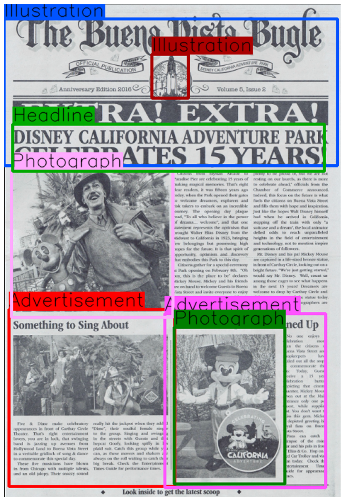

<p align="center">
  
  <h3 align="center">
  </h3>
</p>

# Adding new models and running with **deep**doctection

The `ModelCatalog` is a registry that allows models and their metadata to be inventoried within **deep**doctection. 
This enables faster instantiation and easier use of models within a pipeline. We provide a brief overview of the 
available tools for model registration and downloading, and then demonstrate how to seamlessly use pre-trained models 
in **deep**doctection.

!!! info "Writing a custom model wrapper"

    Of course, using a model in this way assumes that a corresponding model wrapper has already been implemented. If this 
    is not the case, the [**notebook**](Analyzer_Doclaynet_With_YOLO.md) illustrates how such a model wrapper can be 
    implemented and integrated into a pipeline.

## Model Catalog

The `ModelCatalog` is a class for registering models along with essential metadata.

!!! info

    By default (unless otherwise configured), the model definitions are stored in the file 
    `~/.cache/deepdoctection/profiles.jsonl`. When **deep**doctection is imported, the model information is automatically 
    loaded.
    Model weights and model configuration files are stored in separate directories. Metadata for a specific model can be 
    accessed via its corresponding `ModelProfile`.


```python
import os

import deepdoctection as dd
from matplotlib import pyplot as plt

dd.ModelCatalog.get_profile_list()
```

??? info "Output"

    <pre>
    ['layout/model-800000_inf_only.data-00000-of-00001',
     'cell/model-1800000_inf_only.data-00000-of-00001',
     'item/model-1620000_inf_only.data-00000-of-00001',
     'layout/d2_model_0829999_layout_inf_only.pt',
     'layout/d2_model_0829999_layout_inf_only.ts',
     'cell/d2_model_1849999_cell_inf_only.pt',
     'cell/d2_model_1849999_cell_inf_only.ts',
     'item/d2_model_1639999_item_inf_only.pt',
     'item/d2_model_1639999_item_inf_only.ts',
     'nielsr/lilt-xlm-roberta-base/pytorch_model.bin',
     'SCUT-DLVCLab/lilt-infoxlm-base/pytorch_model.bin',
     'SCUT-DLVCLab/lilt-roberta-en-base/pytorch_model.bin',
     'microsoft/layoutlm-base-uncased/pytorch_model.bin',
     'microsoft/layoutlm-large-uncased/pytorch_model.bin',
     'microsoft/layoutlmv2-base-uncased/pytorch_model.bin',
     'microsoft/layoutxlm-base/pytorch_model.bin',
     'microsoft/layoutlmv3-base/pytorch_model.bin',
     'microsoft/table-transformer-detection/pytorch_model.bin',
     'microsoft/table-transformer-structure-recognition/pytorch_model.bin',
     'doctr/db_resnet50/pt/db_resnet50-ac60cadc.pt',
     'doctr/db_resnet50/tf/db_resnet50-adcafc63.zip',
     'doctr/crnn_vgg16_bn/pt/crnn_vgg16_bn-9762b0b0.pt',
     'doctr/crnn_vgg16_bn/tf/crnn_vgg16_bn-76b7f2c6.zip',
     'FacebookAI/xlm-roberta-base/pytorch_model.bin',
     'fasttext/lid.176.bin',
     'deepdoctection/tatr_tab_struct_v2/pytorch_model.bin',
     'layout/d2_model_0829999_layout.pth',
     'cell/d2_model_1849999_cell.pth',
     'item/d2_model_1639999_item.pth',
     'Felix92/doctr-torch-parseq-multilingual-v1/pytorch_model.bin',
     'doctr/crnn_vgg16_bn/pt/master-fde31e4a.pt',
     'Aryn/deformable-detr-DocLayNet/model.safetensors']
	 </pre>


```python
import pathlib

dd.ModelCatalog.get_full_path_weights('layout/d2_model_0829999_layout_inf_only.pt').replace(str(pathlib.Path.home()),"~")
```

??? info "Output"

    '~/.cache/deepdoctection/weights/layout/d2_model_0829999_layout_inf_only.pt'


```python
dd.ModelCatalog.get_full_path_configs('layout/d2_model_0829999_layout_inf_only.pt').replace(str(pathlib.Path.home()),"~")
```

??? info "Output"

    '~/.cache/deepdoctection/configs/dd/d2/layout/CASCADE_RCNN_R_50_FPN_GN.yaml'


```python
from dataclasses import asdict

asdict(dd.ModelCatalog.get_profile('layout/d2_model_0829999_layout_inf_only.pt'))
```

??? info "Output"

    <pre>
    {'name': 'layout/d2_model_0829999_layout_inf_only.pt',
     'description': 'Detectron2 layout detection model trained on Publaynet',
     'size': [274632215],
     'tp_model': False,
     'config': 'dd/d2/layout/CASCADE_RCNN_R_50_FPN_GN.yaml',
     'preprocessor_config': None,
     'hf_repo_id': 'deepdoctection/d2_casc_rcnn_X_32xd4_50_FPN_GN_2FC_publaynet_inference_only',
     'hf_model_name': 'd2_model_0829999_layout_inf_only.pt',
     'hf_config_file': ['Base-RCNN-FPN.yaml', 'CASCADE_RCNN_R_50_FPN_GN.yaml'],
     'urls': None,
     'categories': {1: <LayoutType.TEXT>,
      2: <LayoutType.TITLE>,
      3: <LayoutType.LIST>,
      4: <LayoutType.TABLE>,
      5: <LayoutType.FIGURE>},
     'categories_orig': None,
     'dl_library': 'PT',
     'model_wrapper': 'D2FrcnnDetector',
     'architecture': None,
     'padding': None}
    </pre>


## Registering a new model

We now demonstrate how to register a pre-trained model and subsequently use it within the **deep**doctection pipeline.

For this purpose, we use a pre-trained model from the [**Layout-Parser**](https://layout-parser.github.io) repository.
This model is supported by Detectron2. The model weights can be found [**here**](https://www.dropbox.com/s/6ewh6g8rqt2ev3a/model_final.pth?dl=1), 
and the model configuration [**here**](https://www.dropbox.com/s/6ewh6g8rqt2ev3a/model_final.pth?dl=1). The model has been pre-trained on a historical newspaper dataset and
detects the following layout segments: PHOTOGRAPH, ILLUSTRATION, MAP, COMIC, EDITORIAL_CARTOON, HEADLINE, and
ADVERTISEMENT. These categories do not yet exist in the **deep**doctection ecosystem and must be registered beforehand.


### Registering the new layout categories

```python
@dd.object_types_registry.register("NewspaperType")
class NewspaperExtension(dd.ObjectTypes):
    """Additional Newspaper labels not registered yet"""

    PHOTOGRAPH ="Photograph",
    ILLUSTRATION = "Illustration",
    MAP = "Map",
    COMIC = "Comics/Cartoon",
    EDITORIAL_CARTOON = "Editorial Cartoon",
    HEADLINE = "Headline",
    ADVERTISEMENT =  "Advertisement"
```

We also need to specify how these layout sections should behave. Ultimately, they should be treated in the same way 
as residual layout sections.

```python
from deepdoctection.datapoint import IMAGE_DEFAULTS

IMAGE_DEFAULTS.IMAGE_ANNOTATION_TO_LAYOUTS.update({i: dd.Layout for i in NewspaperExtension})
IMAGE_DEFAULTS.RESIDUAL_TEXT_BLOCK_CATEGORIES= IMAGE_DEFAULTS.RESIDUAL_TEXT_BLOCK_CATEGORIES + tuple(cat for cat in NewspaperExtension)
```

Adding the model `layoutparser/newspaper/model_final.pth` requires to save weights to 
`~/.cache/deepdoctection/layoutparser/newspaper/model_final.pth` and the config to 
`~/.cache/deepdoctection/layoutparser/newspaper/config.yml`.


```python
dd.ModelCatalog.save_profiles_to_file("/path/to/target/profiles.jsonl")

dd.ModelCatalog.register("layoutparser/newspaper/model_final.pth", dd.ModelProfile(
    name="layoutparser/newspaper/model_final.pth",
    description="layout detection ",
    config="layoutparser/newspaper/config.yml",
    size=[],
    tp_model=False,
    categories={1: NewspaperExtension.PHOTOGRAPH,
                2: NewspaperExtension.ILLUSTRATION,
                3: NewspaperExtension.MAP,
                4: NewspaperExtension.COMIC,
                5: NewspaperExtension.EDITORIAL_CARTOON,
                6: NewspaperExtension.HEADLINE,
                7: NewspaperExtension.ADVERTISEMENT},
    model_wrapper="D2FrcnnDetector",
))
```

Once the model is registered we can use this model in the `analyzer`:


```python
analyzer = dd.get_dd_analyzer(config_overwrite=["PT.LAYOUT.WEIGHTS=layoutparser/newspaper/model_final.pth",
                                                "USE_OCR=False",
                                                "USE_TABLE_SEGMENTATION=False",])

df = analyzer.analyze(path="/path/to/dir/newspaper_layout")
df.reset_state()

df_iter = iter(df)
dp = next(df_iter)

image = dp.viz(show_residual_layouts=True)

plt.figure(figsize = (25,17))
plt.axis('off')
plt.imshow(image)
```




```python
dp.residual_layouts
```

??? info "Output"

    [Layout(active=True, _annotation_id='df22c03b-896c-323c-b5ae-2e4b1fd1faf3', service_id='9dcc2fbd', model_id='cfa02246', session_id=None, category_name=<NewspaperExtension.PHOTOGRAPH>, _category_name=<NewspaperExtension.PHOTOGRAPH>, category_id=1, score=0.9747101664543152, sub_categories={}, relationships={}, bounding_box=BoundingBox(absolute_coords=True, ulx=453, uly=806, lrx=786, lry=1291, width=333, height=485)),
     Layout(active=True, _annotation_id='77d4e101-e45a-35fe-ab2c-53465c9c2a14', service_id='9dcc2fbd', model_id='cfa02246', session_id=None, category_name=<NewspaperExtension.HEADLINE>, _category_name=<NewspaperExtension.HEADLINE>, category_id=6, score=0.8193893432617188, sub_categories={}, relationships={}, bounding_box=BoundingBox(absolute_coords=True, ulx=33, uly=286, lrx=868, lry=456, width=835, height=170)),
     Layout(active=True, _annotation_id='ab329403-f1c3-3d41-8166-e476867c1eeb', service_id='9dcc2fbd', model_id='cfa02246', session_id=None, category_name=<NewspaperExtension.PHOTOGRAPH>, _category_name=<NewspaperExtension.PHOTOGRAPH>, category_id=1, score=0.793633222579956, sub_categories={}, relationships={}, bounding_box=BoundingBox(absolute_coords=True, ulx=24, uly=789, lrx=443, lry=1275, width=419, height=486)),
     Layout(active=True, _annotation_id='c0d708e1-4632-39f4-ad46-9f469a41fc48', service_id='9dcc2fbd', model_id='cfa02246', session_id=None, category_name=<NewspaperExtension.ILLUSTRATION>, _category_name=<NewspaperExtension.ILLUSTRATION>, category_id=2, score=0.7907929420471191, sub_categories={}, relationships={}, bounding_box=BoundingBox(absolute_coords=True, ulx=43, uly=450, lrx=456, lry=815, width=413, height=365))]


