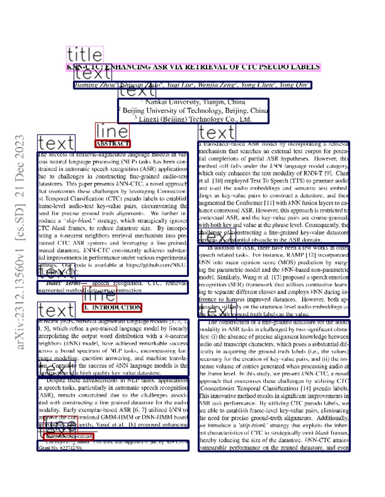
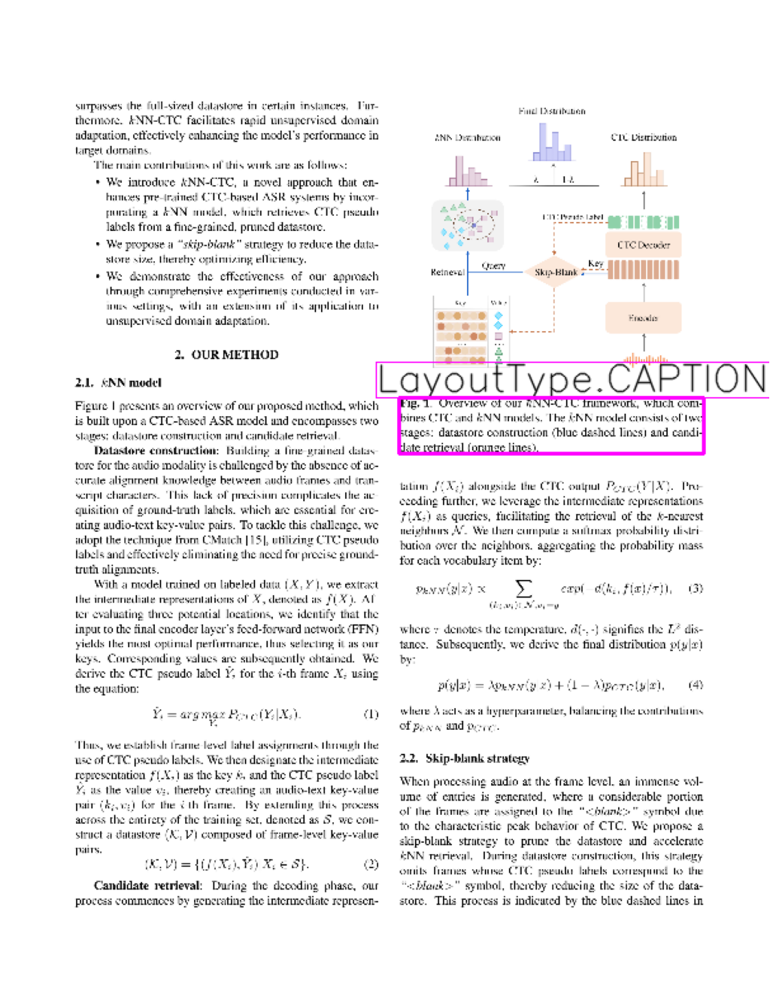

 


# More on Parsing

In our first example, we parsed a page and looked at the individual components that were returned as a result of the parsing. Now, we will look at another example and demonstrate what other kinds of results can also be displayed.


```python
import deepdoctection as dd
from pathlib import Path
from matplotlib import pyplot as plt
```

We begin by instantiating the analyzer, which we configure slightly differently from the default settings. For more detailed information on the configuration, please refer to the corresponding notebook.


```python
analyzer = dd.get_dd_analyzer(config_overwrite=['USE_LAYOUT_LINK=True'])
```

Let's choose a machine learning research paper taken from arXiv. 


```python
pdf_path = Path.cwd() / "sample/2312.13560.pdf"
df = analyzer.analyze(path=pdf_path)
df.reset_state() 
```


```python
doc=iter(df)
page = next(doc)
```

You may notice that some `line`s are labeled with the category line. This layout section is artificial and generated by the `analyzer`. Every word recognized by the OCR must be assigned to a layout section. If this is not possible for certain `word`s, they are grouped together and merged into a `line`.


```python
plt.figure(figsize = (25,17))
plt.axis('off')
plt.imshow(page.viz())
```


    <matplotlib.image.AxesImage at 0x1f4cd9790>


    

    


```python
for layout in page.layouts: 
    print(f"category_name: {layout.category_name.value}, annotation_id: {layout.annotation_id}")
```

    category_name: text, annotation_id: 45248bd0-268c-373d-b04c-f8188d33c77c
    category_name: text, annotation_id: 13cb9477-f605-324a-b497-9f42335c747d
    category_name: text, annotation_id: bd761965-ccc1-3183-931d-4756361ee02f
    category_name: text, annotation_id: ace5bf6c-ef6f-3501-9af8-31f803a14348
    category_name: text, annotation_id: 67b22566-c4fe-3986-9556-12b9596e6805
    category_name: text, annotation_id: 13a5f0ea-19e5-3317-b50c-e4c829a73d09
    category_name: text, annotation_id: 6528c3d3-c5c2-38d5-9e80-664827479525
    category_name: text, annotation_id: 1a94c6e9-2e91-3c48-b589-4bc34656fbd1
    category_name: text, annotation_id: bc739f06-fea0-3cbd-be5c-e816c1e95101
    category_name: text, annotation_id: b1f9c0b4-a5e1-3141-b42c-e50edeab6d08
    category_name: text, annotation_id: 20f7bb66-7ac4-3f1e-b873-f729def42ea4
    category_name: list, annotation_id: 07924bd1-cb94-37bf-8256-1193610d5847
    category_name: list, annotation_id: d0f8cb8e-0d0e-302b-8e8a-57bfa51e8bfb
    category_name: list, annotation_id: 93b7077c-530c-3bd7-8541-4af7a960a5cb
    category_name: line, annotation_id: c203937b-e90e-36c1-a667-7587e662ee72
    category_name: line, annotation_id: bd04beab-2fe8-3ec2-8afc-2b109d62daca
    category_name: line, annotation_id: d0213b5f-7136-3a99-836e-58af8784de7a
    category_name: line, annotation_id: c728edd1-6cd2-331f-847a-d480f74a99ec
    category_name: line, annotation_id: 8bc8bccf-e61e-3f7b-a9c3-7df940b2c3db
    category_name: line, annotation_id: 01f0bcdb-a304-3540-b67c-d962e02309f4
    category_name: line, annotation_id: 9ea097a0-dde3-357e-b0d0-f6e501c8e796
    category_name: line, annotation_id: 9490b521-accc-3fe2-b3f3-eebd4f1d6cce
    category_name: line, annotation_id: 208cfa02-dd28-3f14-a2e1-0afe945c4b56
    category_name: line, annotation_id: c243eb1a-bd56-35bf-b436-3c6da749035a
    category_name: line, annotation_id: 40d63bea-9815-3e97-906f-76b501c67667


The watermark on the left is also noticeable — it is not displayed. However, there are certain layout segments that do not belong to the main body text. These include elements such as tables, as shown in the first notebook. Additionally, there are residual_layouts like page_header and page_footer. These special layout sections can be displayed if needed.


```python
[layout.category_name.value for layout in page.residual_layouts]
```


    ['page_header', 'page_footer']


```python
plt.figure(figsize = (25,17))
plt.axis('off')
plt.imshow(page.viz(page_header="category_name",page_footer="category_name")) # pass the layout section`s 
# category_name as argument. It`s value is the value we want to display, in this case it`s category_name. 
# You can also display other attributes, e.g. annotation_id.
```


    <matplotlib.image.AxesImage at 0x1f4ad8f10>


    

    


The **deep**doctection reading order algorithm is rule-based but can handle various layout types, such as multi-column layouts. However, there are also page layouts where determining the correct reading order fails.


```python
print(page.text)
```

    KNN-CTC: ENHANCING ASR VIA RETRIEVAL OF CTC PSEUDO LABELS
    Jiaming Zhou', Shiwan Zhao*, Yaqi Liu, Wenjia Zengs, Yong Chen, Yong Qin't
    Nankai University, Tianjin, China 2 Beijing University of Technology, Beijing, China 3 Lingxi (Beijing) Technology Co., Ltd.
    ABSTRACT
    The success of retrieval-augmented language models in var- ious natural language processing (NLP) tasks has been con- strained in automatic speech recognition (ASR) applications due to challenges in constructing fine-grained audio-text datastores. This paper presents KNN-CTC, a novel approach that overcomes these challenges by leveraging Connection- ist Temporal Classification (CTC) pseudo labels to establish frame-level audio-text key-value pairs, circumventing the need for precise ground truth alignments. We further in- troduce a "skip-blank" strategy, which strategically ignores CTC blank frames, to reduce datastore size. By incorpo- rating a k-nearest neighbors retrieval mechanism into pre- trained CTC ASR systems and leveraging a fine-grained, pruned datastore, KNN-CTC consistently achieves substan- tial improvements in performance under various experimental settings. Our code is available at htps/gihuhcomNKU: HLT/KNN-CTC.
    Index Terms- speech recognition, CTC, retrieval- augmented method, datastore construction
    1. INTRODUCTION
    In recent years, retrieval-augmented language models [1,2,3, 4, 5], which refine a pre-trained language model by linearly interpolating the output word distribution with a k-nearest neighbors (KNN) model, have achieved remarkable success across a broad spectrum of NLP tasks, encompassing lan- guage modeling, question answering, and machine transla- tion. Central to the success of KNN language models is the construction of a high-quality key-value datastore.
    Despite these advancements in NLP tasks, applications in speech tasks, particularly in automatic speech recognition (ASR), remain constrained due to the challenges associ- ated with constructing a fine-grained datastore for the audio modality. Early exemplar-based ASR [6, 7] utilized KNN to improve the conventional GMM-HMM or DNN-HMM based approaches. Recently, Yusuf et al. [8] proposed enhancing
    Independent researcher.
    TCorresponding author. This work was supported in part by NSF China (Grant No. 62271270).
    a transducer-based ASR model by incorporating a retrieval mechanism that searches an external text corpus for poten- tial completions of partial ASR hypotheses. However, this method still falls under the KNN language model category, which only enhances the text modality of RNN-T [9]. Chan etal. [10] employed Text To Speech (TTS) to generate audio and used the audio embeddings and semantic text embed- dings as key-value pairs to construct a datastore, and then augmented the Conformer [11] with KNN fusion layers to en- hance contextual ASR. However, this approach is restricted to contextual ASR, and the key-value pairs are coarse-grained, with both key and value at the phrase level. Consequently, the challenge of constructing a fine-grained key-value datastore remains a substantial obstacle in the ASR domain.
    In addition to ASR, there have been a few works in other speech-related tasks. For instance, RAMP [12] incorporated KNN into mean opinion score (MOS) prediction by merg- ing the parametric model and the KNN-based non-parametric model. Similarly, Wang et al. [13] proposed a speech emotion recognition (SER) framework that utilizes contrastive learn- ing to separate different classes and employs KNN during in- ference to harness improved distances. However, both ap- proaches still rely on the utterance-level audio embeddings as the key, with ground truth labels as the value.
    The construction of a fine-grained datastore for the audio modality in ASR tasks is challenged by two significant obsta- cles: (i) the absence of precise alignment knowledge between audio and transcript characters, which poses a substantial dif- ficulty in acquiring the ground-truth labels (i.e., the values) necessary for the creation of key-value pairs, and (i) the im- mense volume of entries generated when processing audio at the frame level. In this study, we present KNN-CTC, a novel approach that overcomes these challenges by utilizing CTC (Connectionist Temporal Classification) [14] pseudo labels. This innovative method results in significant improvements in ASR task performance. By utilizing CTC pseudo labels, W6 are able to establish frame-level key-value pairs, eliminating the need for precise ground-truth alignments. Additionally we introduce a 'skip-blank' strategy that exploits the inher ent characteristics of CTC to strategically omit blank frames thereby reducing the size of the datastore. KNN-CTC attains comparable performance on the pruned datastore, and ever


We can detect figures...


```python
page = next(doc)
plt.figure(figsize = (25,17))
plt.axis('off')
plt.imshow(page.viz(figure="category_name"))
```

... and captions.


```python
plt.figure(figsize = (25,17))
plt.axis('off')
plt.imshow(page.viz(caption="category_name"))
```

    

    


Figure type layout segments have their own attributes: 


```python
figure = page.figures[0]
```

`figure.image.viz()` returns a NumPy array containing the image segment enclosed by the bounding box.


```python
plt.figure(figsize = (25,17))
plt.axis('off')
plt.imshow(figure.image.viz())
```

    

    


This makes it easy to store layout sections under a unique ID.


```python
dd.viz_handler.write_image(f"/path/to/dir/{figure.annotation_id}.png",figure.image.image)
```

Let’s return to our configuration. By setting `USE_LAYOUT_LINK=True`, we enabled a component that links `caption`s to `table`s or `figure`s. The linking is rule-based: if a `table` or `figure` is present, a `caption` is associated with the nearest one in terms of spatial proximity.


```python
for caption in figure.layout_link:
    print(f"annotation_id: {caption.annotation_id}, text: {caption.text}")
```

    text: Fig. 1. Overview of our KNN-CTC framework, which com- bines CTC and KNN models. The KNN model consists of two stages: datastore construction (blue dashed lines) and candi- date retrieval (orange lines)., annotation_id: 46bd4e42-8d50-30fb-883a-6c4d82b236af


We conclude our tutorial with some special features. Suppose you have a specific layout segment. Using get_layout_context, you can retrieve the surrounding layout segments within a given context_size, i.e., the k layout segments that appear before and after it in the reading order.


```python
for layout in page.get_layout_context(annotation_id="13a5f0ea-19e5-3317-b50c-e4c829a73d09",context_size=1):
    print("-----------------")
    print(f"annotation_id: {layout.annotation_id}, text: {layout.text}")
```

    -----------------
    annotation_id: 40d63bea-9815-3e97-906f-76b501c67667, text: (2)
    -----------------
    annotation_id: 13a5f0ea-19e5-3317-b50c-e4c829a73d09, text: Candidate retrieval: During the decoding phase, our process commences by generating the intermediate represen-
    -----------------
    annotation_id: 13cb9477-f605-324a-b497-9f42335c747d, text: tation f(Xi) alongside the CTC output PCTC(YIx). Pro- ceeding further, we leverage the intermediate representations f(Xi) as queries, facilitating the retrieval of the k-nearest neighbors N. We then compute a softmax probability distri- bution over the neighbors, aggregating the probability mass for each vocabulary item by:


What does the analyzer predict? 

We can use the meta annotations to find out which attributes are determined for which object types. The attribute image_annotations represent all layout segments constructed by the analyzer. Ultimately, `ImageAnnotation`s are everything that can be enclosed by a bounding box. 


```python
meta_annotations = analyzer.get_meta_annotation()
meta_annotations.image_annotations
```


    (<DefaultType.DEFAULT_TYPE>,
     <LayoutType.CAPTION>,
     <LayoutType.TEXT>,
     <LayoutType.TITLE>,
     <LayoutType.FOOTNOTE>,
     <LayoutType.FORMULA>,
     <LayoutType.LIST_ITEM>,
     <LayoutType.PAGE_FOOTER>,
     <LayoutType.PAGE_HEADER>,
     <LayoutType.FIGURE>,
     <LayoutType.SECTION_HEADER>,
     <LayoutType.TABLE>,
     <LayoutType.COLUMN>,
     <LayoutType.ROW>,
     <CellType.COLUMN_HEADER>,
     <CellType.PROJECTED_ROW_HEADER>,
     <CellType.SPANNING>,
     <LayoutType.WORD>,
     <LayoutType.LINE>)


The `sub_categories` represent attributes associated with specific `ImageAnnotations`. For a table cell, for example, these include: <CellType.COLUMN_NUMBER>, <CellType.COLUMN_SPAN>, <CellType.ROW_NUMBER> and <CellType.ROW_SPAN>. 


```python
meta_annotations.sub_categories
```


    {<LayoutType.CELL>: {<CellType.COLUMN_NUMBER>,
      <CellType.COLUMN_SPAN>,
      <CellType.ROW_NUMBER>,
      <CellType.ROW_SPAN>},
     <CellType.SPANNING>: {<CellType.COLUMN_NUMBER>,
      <CellType.COLUMN_SPAN>,
      <CellType.ROW_NUMBER>,
      <CellType.ROW_SPAN>},
     <CellType.ROW_HEADER>: {<CellType.COLUMN_NUMBER>,
      <CellType.COLUMN_SPAN>,
      <CellType.ROW_NUMBER>,
      <CellType.ROW_SPAN>},
     <CellType.COLUMN_HEADER>: {<CellType.COLUMN_NUMBER>,
      <CellType.COLUMN_SPAN>,
      <CellType.ROW_NUMBER>,
      <CellType.ROW_SPAN>},
     <CellType.PROJECTED_ROW_HEADER>: {<CellType.COLUMN_NUMBER>,
      <CellType.COLUMN_SPAN>,
      <CellType.ROW_NUMBER>,
      <CellType.ROW_SPAN>},
     <LayoutType.ROW>: {<CellType.ROW_NUMBER>},
     <LayoutType.COLUMN>: {<CellType.COLUMN_NUMBER>},
     <LayoutType.WORD>: {<WordType.CHARACTERS>, <Relationships.READING_ORDER>},
     <LayoutType.TEXT>: {<Relationships.READING_ORDER>},
     <LayoutType.TITLE>: {<Relationships.READING_ORDER>},
     <LayoutType.LIST>: {<Relationships.READING_ORDER>},
     <LayoutType.KEY_VALUE_AREA>: {<Relationships.READING_ORDER>},
     <LayoutType.LINE>: {<Relationships.READING_ORDER>}}


The relationships represent one or more relations between different `ImageAnnotation`s. 


```python
meta_annotations.relationships
```


    {<LayoutType.TABLE>: {<Relationships.CHILD>, <Relationships.LAYOUT_LINK>},
     <LayoutType.TABLE_ROTATED>: {<Relationships.CHILD>},
     <LayoutType.TEXT>: {<Relationships.CHILD>},
     <LayoutType.TITLE>: {<Relationships.CHILD>},
     <LayoutType.LIST_ITEM>: {<Relationships.CHILD>},
     <LayoutType.LIST>: {<Relationships.CHILD>},
     <LayoutType.CAPTION>: {<Relationships.CHILD>},
     <LayoutType.PAGE_HEADER>: {<Relationships.CHILD>},
     <LayoutType.PAGE_FOOTER>: {<Relationships.CHILD>},
     <LayoutType.PAGE_NUMBER>: {<Relationships.CHILD>},
     <LayoutType.MARK>: {<Relationships.CHILD>},
     <LayoutType.KEY_VALUE_AREA>: {<Relationships.CHILD>},
     <LayoutType.FIGURE>: {<Relationships.CHILD>, <Relationships.LAYOUT_LINK>},
     <CellType.SPANNING>: {<Relationships.CHILD>},
     <LayoutType.CELL>: {<Relationships.CHILD>}}


The summaries describe facts presented at the page level — for instance, a `document_type`. This pipeline does not have a document type classifier.


```python
meta_annotations.summaries
```

    ()


By the way, don’t be confused by the obscure way the different categories are displayed. The categories are specific enum members. Each enum member can be converted into a string type, and vice versa — a string type can be converted back into an enum member:


```python
dd.LayoutType.CELL, dd.LayoutType.CELL.value, dd.get_type('cell')
```


    (<LayoutType.CELL>, 'cell', <LayoutType.CELL>)


