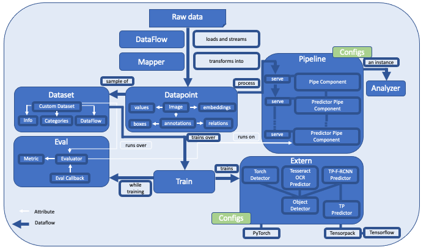

<p align="center">
  
  <h3 align="center">
  </h3>
</p>

# Architecture





## Dataflow

[Dataflow](https://github.com/tensorpack/dataflow>) is a package for loading data. It has originally been developed
for training purposes. The idea is basically to have blocks of generators you can chain so that building a pipeline
for loading and transforming data becomes easy. We have integrated the most important `Dataflow` classes into
**deep**doctection. 

!!! Note

    We refer to the comprehensive and extremely well presented [tutorials](https://tensorpack.readthedocs.
    io/en/latest/tutorial/index.html#dataflow-tutorials>) for details. 

We can load `.jsonlines`, `.json` or file paths with serializers.

```python
import deepdoctection as dd 

df = dd.SerializerJsonlines.load("path/to/dir",max_datapoints=100)
df.reset_state()
for dp in df:
	page = dd.Page.from_dict(dp)
``` 

or 

```python 
df = dd.SerializerCoco("path/to/dir")
df.reset_state()
for dp in df:
	# dp is a dict with {'image':{'id',...},
						 'annotations':[{'id':…,'bbox':...}]}
```

We can load a pdf and stream the document page by page:

```python
df = dd.SerializerPdfDoc.load("path/to/dir/pdf_file.pdf",)
df.reset_state()

for dp in df:
   # dp is a dict with keys: path, file_name, pdf_bytes, page_number and a document_id
``` 


## Datapoint


The [datapoint][deepdoctection.datapoint] package adds the internal data structure to the library. We can interpret a 
datapoint as a document page. When processing images or document everything that can will be captured in a page will be
saved in the [`Image`][deepdoctection.datapoint.image] object.


```python
image = dd.Image(file_name="image_1.png", location = "path/to/dir")
``` 

Layout sections and all other visual lower level objects are instances of the [`ImageAnnotation`]
[deepdoctection.datapoint.annotation.ImageAnnotation] class. They have, attributes like `category_name`, `category_id`, 
`score` and a `bounding_box`.

```python

bounding_box = dd.BoundingBox1(absolute_coords=True, ulx=100, uly=120, lrx=200, lry=250)
table = dd.ImageAnnotation(bounding_box=bounding_box,
                           category_name=LayoutType.TABLE,
                           category_id=1)  # (1)
image.dump(table)  # (2)
``` 

1. The `category_id` is used for training models.
2. When dumping an `ImageAnnotation` to an `Image`, a unique identifier is generated for the annotation.


To store additional attributes that depend on the object type (think of table cells where row and column numbers
are needed), a generic attribute `sub_categories` is provided. `sub_categories` is a dictionary that stores 
`CategoryAnnotation` by a given key.

```python

cell = dd.ImageAnnotation(bounding_box, category_name=LayoutType.CELL,  category_id=2)
row_num = dd.CategoryAnnotation(category_name=CellType.ROW_NUMBER, category_id=6)
cell.dump_sub_category(sub_category_name=CellType.ROW_NUMBER, 
					   annotation=row_num)
```


A generic `relationships` allows to save object specific attributes that relate different `ImageAnnotation` to each 
other.

```python

cell = dd.ImageAnnotation(bounding_box, category_name="cell", category_id=2)

for word in word_in_cell:
    cell.dump_relationship(Relationships.CHILD, word.annotation_id)
```

## Datasets

Please check [`Datasets`](Datasets.md) for additional information regarding this package.


## Extern


Models from third party packages must be wrapped into a **deep**doctection class structure so that they are
available for pipelines in an unified way. This package provides these wrapper classes.

In many cases, model wrappers will be instantiated by providing a config file, some weights
and a mapping of `category_id`s to `category_name`s.

```python

path_weights = dd.ModelCatalog.get_full_path_weights(model_name)
path_yaml = dd.ModelCatalog.get_full_path_configs(model_name)
categories = dd.ModelCatalog.get_profile(model_name).categories
d2_detector = dd.D2FrcnnDetector(path_yaml,path_weights,categories)
```


## Mapper

Mappers are arbitrary functions (not generators!). They accept a data point
(as a JSON object, an `Image` instance , a `Page` instance, ...) and return a data point. 

```python
def my_func(dp: dd.Image) -> dd.Image:
	# do something
	return dp

df = dd.Dataflow(df)
df = dd.MapData(df, my_func)

# or if my_func does some heavy transformation and turns out to be the bottleneck

df = dd.Dataflow(df)
df = dd.MultiProcessMapData(df, my_func)
```

!!! info "Multi-Thread and Multi-Process"

    The snippet above already shows how we transform our data structure or how we perform any other operation: We 
    write a mapper function `my_func` and use [`MapData`][deepdoctection.dataflow.common.MapData] to transform the 
    function into a generator. If we see that `my_func` is a bottleneck in our data processing pipeline we can speed up 
    the bottleneck function by using a [`MultiProcessMapData`][deepdoctection.dataflow.parallel_map.MultiProcessMapData] 
    or [`MultiThreadMapData`][deepdoctection.dataflow.parallel_map.MultiThreadMapData]. This class will spawn multiple
    processes and parallelize the mapping function to increase throughput. There are some caveats, though: 
    Multi-threading and multi-processing only work if we have an inifinite dataflow and if you do not bother about 
    procssing samples multiple times.


Mappers must be compatible with dataflows. On the other hand, mappers should be flexible enough, and therefore they
must be able to accept additional arguments for configuration purposes. That means, that if we have a function `my_func`
that accepts some arguments and returns a function that accepts the datapoint we want to process in our pipeline: 

```python
dp = my_func(cfg_param_1, cfg_param_2)(dp)
```

then we can use it this type of function in a dataflow: 

```python
df = # some Dataflow
df = dd.MapData(df, my_func(cfg_param_1, cfg_param_2))
...

```

The [`curry`][deepdoctection.mapper.maputils.curry] decorator disentangles the first argument of a function from the
remaining ones.

```python
@curry # (1)
def  my_func(dp: Image, config_1, config_2) -> dd.Image:
	...
	return dp
```

1. This makes `my_mapper` callable twice


## Pipelines

This package provides us with pipeline components for tasks like layout detection, OCR and several other services
needed. Chained pipeline components will form a pipeline. Check [`Building a custom pipeline`](Custom_Pipeline.md)
to learn, how to build pipelines for a concrete task. Here, we will be giving only a short overview.

There is a registry

```python
print(pipeline_component_registry.get_all())
```

??? info "Output"

    <pre>
    {'ImageCroppingService': <class 'deepdoctection.pipe.concurrency.MultiThreadPipelineComponent'>, 
     'MatchingService': <class 'deepdoctection.pipe.common.MatchingService'>, 
     'PageParsingService': <class 'deepdoctection.pipe.common.PageParsingService'>, 
     'AnnotationNmsService': <class 'deepdoctection.pipe.common.AnnotationNmsService'>, 
     'ImageParsingService': <class 'deepdoctection.pipe.common.ImageParsingService'>, 
     'LanguageDetectionService': <class 'deepdoctection.pipe.language.LanguageDetectionService'>, 
     'ImageLayoutService': <class 'deepdoctection.pipe.layout.ImageLayoutService'>, 
     'LMTokenClassifierService': <class 'deepdoctection.pipe.lm.LMTokenClassifierService'>, 
     'LMSequenceClassifierService': <class 'deepdoctection.pipe.lm.LMSequenceClassifierService'>, 
     'TextOrderService': <class 'deepdoctection.pipe.order.TextOrderService'>, 
     'TableSegmentationRefinementService': <class 'deepdoctection.pipe.refine.TableSegmentationRefinementService'>, 
     'TableSegmentationService': <class 'deepdoctection.pipe.segment.TableSegmentationService'>, 
     'SubImageLayoutService': <class 'deepdoctection.pipe.sub_layout.SubImageLayoutService'>, 
     'TextExtractionService': <class 'deepdoctection.pipe.text.TextExtractionService'>, 
     'SimpleTransformService': <class 'deepdoctection.pipe.transform.SimpleTransformService'>}
    </pre>


The following is a full OCR system with a word detector (generating bounding boxes around words) and a text 
recognizer (recognizing text within each word bounding box defines by the word detector) powered by DocTr.

```python
path_weights = dd.ModelCatalog.get_full_path_weights("doctr/db_resnet50/pt/db_resnet50-ac60cadc.pt")
architecture = dd.ModelCatalog.get_profile("doctr/db_resnet50/pt/db_resnet50-ac60cadc.pt").architecture
categories = dd.ModelCatalog.get_profile("doctr/db_resnet50/pt/db_resnet50-ac60cadc.pt").categories

text_line_predictor = dd.DoctrTextlineDetector(architecture=architecture, 
											   path_weights=path_weights, 
											   categories=categories,
											   device = "cpu")

layout = dd.ImageLayoutService(text_line_predictor,
							   to_image=True)  # (1)
											   
path_weights = dd.ModelCatalog.get_full_path_weights("doctr/crnn_vgg16_bn/pt/crnn_vgg16_bn-9762b0b0.pt")
architecture = dd.ModelCatalog.get_profile("doctr/crnn_vgg16_bn/pt/crnn_vgg16_bn-9762b0b0.pt").architecture

text_recognizer = dd.DoctrTextRecognizer(architecture=architecture, 
										 path_weights=path_weights)
text = dd.TextExtractionService(text_recognizer, extract_from_roi="word") # (2) 
analyzer = dd.DoctectionPipe(pipeline_component_list=[layout, text]) 


path_to_pdf = "path/to/doc.pdf"

df = analyzer.analyze(path=path_to_pdf)
dd.SerializerJsonlines.save(df, path= "path/to/target_dir",
								file_name="doc.jsonl",
								max_datapoints=20)
```

1. `ImageAnnotation` created from this service will receive an `Image` instance defined by the bounding boxes of its 
   annotation. This is helpful if we want to call a service only on the region of the `ImageAnnotation`. 
2. Text recognition on the region of interest defined by all `ImageAnnotation` instances of `category_name="word"`.