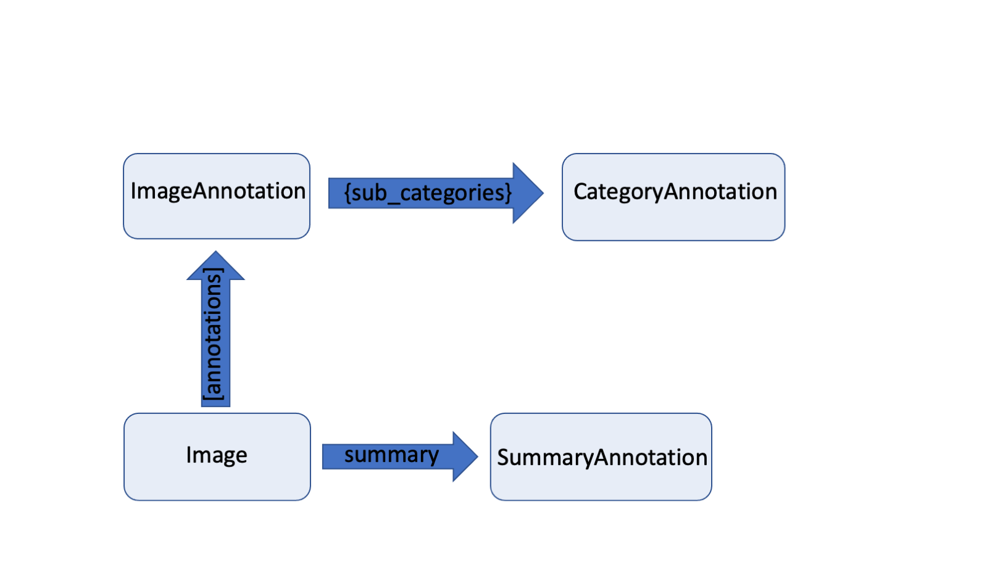

<p align="center">
  
  <h3 align="center">
  </h3>
</p>


# Data structure

This section will give you a more in depth introduction of **deep**doctection's data model. 

## Page and Image


We have already covered the `Page` class which can be viewed as a consumer layer on top of the `Image` dataclass 
that stores all parsed information from a document page. The `Page` object simplifies the generic 
`Image` data class concept. It contains numerous attributes defined as `property` and thus represents a more 
content-driven view of the extracted data. For example, a `Page` contains `layouts`, `words` and `tables`. These 
concepts do not exist on the `Image` level.



The `Image` object together with its `Annotation`s forms the **deep**doctection data model. All information that can be 
retrieved via the `Page` object is already in the `Image` object. `Image` has an attribute for saving a `summary`. 
In a `summary` one can store top level information of a document page (e.g. document type).

Even more essential is the attribute `annotations`. This list saves all `ImageAnnotation`. Every instance from 
`Page.layouts`, `Page.words` or `Page.tables` is derived from an `ImageAnnotation` instance.

`ImageAnnotation` are objects that can be detected on a document page. This can be layout section (paragraphs, text,
captions, tables, etc.) or lines or words. `ImageAnnotation` have a `category_name`, `category_id` and an 
`annotation_id`. The `annotation_id` is the unique identifier for the `ImageAnnotation` instance. 
`ImageAnnotation`s have a dict attribute `sub_categories`. Here, everything related to the `ImageAnnotation` can be 
stored. 


```python
import deepdoctection as dd

path = "/path/to/dir/parsed_image.json"
page = dd.Page.from_file(file_path=path)

image = page.image_orig
```

The `Image` object has an `image_id`, which is a uuid that depends on the location where the original image has been 
loaded.

!!! info

    On the other hand there is a `state_id` that changes once the whole `image` instance changes.


```python
print(f"image_id: {image.image_id} state_id: {image.state_id}")
```

??? info "Output"

    image_id: 2aa98b36-196e-3cdf-af09-8f2d885d5f88 state_id: 98eebb5d-f319-3094-94af-fb0f02229dad


## `ImageAnnotation`s

We have a 1:1 correspondence between a `Layout`, `Word`, `Table`, `Cell` on the `Page` level and `ImageAnnotation` on 
the `Image` level. In fact, all layout sections are sub classes of `ImageAnnotation`:


```python
word.__class__.__bases__[0].__bases__[0]
```

??? info "Output"

    deepdoctection.datapoint.annotation.ImageAnnotation


We can even retrieve the `ImageAnnotation` instance from which the `word` instance has been derived by its 
`annotation_id`.


```python
ann = image.get_annotation(annotation_ids='844631a5-5ddb-3ba8-b81a-bb9f05604d58')[0]
```

Categories and keys are stored as members of special classes called `ObjectTypes`.


```python
ann.sub_categories.keys()
```

??? info "Output"

    dict_keys([WordType.CHARACTERS, WordType.BLOCK, WordType.TEXT_LINE, Relationships.READING_ORDER])

```python
ann.category_name
```

??? info "Output"

    LayoutType.WORD


## `ObjectTypes`

`ObjectTypes` is a string based enum. For related keys or categories a subclass of `ObjectTypes` is formed.
The `object_types_registry` is responsible for cataloging the `ObjectTypes`.


```python
dd.object_types_registry.get_all()
```

??? info "Output"

     <pre>
    {'DefaultType': <enum 'DefaultType'>,
     'PageType': <enum 'PageType'>,
     'SummaryType': <enum 'SummaryType'>,
     'DocumentType': <enum 'DocumentType'>,
     'LayoutType': <enum 'LayoutType'>,
     'TableType': <enum 'TableType'>,
     'CellType': <enum 'CellType'>,
     'WordType': <enum 'WordType'>,
     'TokenClasses': <enum 'TokenClasses'>,
     'BioTag': <enum 'BioTag'>,
     'TokenClassWithTag': <enum 'TokenClassWithTag'>,
     'Relationships': <enum 'Relationships'>,
     'Languages': <enum 'Languages'>,
     'DatasetType': <enum 'DatasetType'>}
     </pre>


```python
word = dd.object_types_registry.get("WordType")
for word_type in word:
    print(word_type)
```

??? info "Output"

    WordType.CHARACTERS
    WordType.BLOCK
    WordType.TOKEN_CLASS
    WordType.TAG
    WordType.TOKEN_TAG
    WordType.TEXT_LINE
    WordType.CHARACTER_TYPE
    WordType.PRINTED
    WordType.HANDWRITTEN


### Modifying `ObjectTypes`

We have already mentioned that it is not directly possible to modify values using the `Page` attributes. We need to
access the `ImageAnnotation` or `CategoryAnnotation` in order to modify values.


```python
character_ann = ann.get_sub_category("characters")
character_ann
```

??? info "Output"

    ContainerAnnotation(active=True, 
                        _annotation_id='ded39c8a-72c0-335b-853f-e6c8b50fbfbc', 
                        service_id=None, 
                        model_id=None, 
                        session_id=None, 
                        category_name=<WordType.CHARACTERS>, 
                        _category_name=<WordType.CHARACTERS>, 
                        category_id=-1, 
                        score=0.91, 
                        sub_categories={}, 
                        relationships={}, 
                        value='Gesamtvergütung')


Beside `ImageAnnotation` and `CategoryAnnotation` there is also a `ContainerAnnotation` class. It only differs 
from `CategoryAnnotation` by having an attribute `value` that can store a string or a value. 


```python
character_ann.value="Gesamtvergütungsbericht"
ann.category_name="line"
```


As already mentioned, `category_name` and sub category keys require values that are `ObjectTypes` members. If the value 
does not exist as registered `ObjectTypes` members an error is raised.


```python
ann.category_name="headline"
```

??? Info "Output"

    ---------------------------------------------------------------------------

    KeyError                                  Traceback (most recent call last)

    Cell In[16], line 1
    ----> 1 ann.category_name="headline"


    File ~/Documents/Repos/deepdoctection_pt/deepdoctection/deepdoctection/datapoint/annotation.py:293, in CategoryAnnotation.category_name(self, category_name)
        291 """category name setter"""
        292 if not isinstance(category_name, property):
    --> 293     self._category_name = get_type(category_name)


    File ~/Documents/Repos/deepdoctection_pt/deepdoctection/deepdoctection/utils/settings.py:414, in get_type(obj_type)
        412 return_value = _ALL_TYPES_DICT.get(obj_type)
        413 if return_value is None:
    --> 414     raise KeyError(f"String {obj_type} does not correspond to a registered ObjectType")
        415 return return_value


    KeyError: 'String headline does not correspond to a registered ObjectType'


Adding an `ObjectTypes` with the required Enum member, registering and updating will then
allow you to use this category.


```python
@dd.object_types_registry.register("NewspaperType")
class NewspaperType(dd.ObjectTypes):

    headline = "headline"
    advertising = "advertising"
    
dd.update_all_types_dict()
```


```python
ann.category_name="headline" # (1) 
```

1. No key error anymore


## Adding an `ImageAnnotation`

Suppose, we want to add a new word to the page corpus. We have to define an `ImageAnnotation` and need to dump it. 


```python
new_ann = dd.ImageAnnotation(category_name="word")
new_ann  # (1) 
```

1. No annotation_id has been assigned yet. This will happen once we dump the ImageAnnotation to the image.

??? Info "Output"

    ImageAnnotation(active=True, 
    _annotation_id=None, 
    service_id=None, 
    model_id=None, 
    session_id=None, 
    category_name=<LayoutType.WORD>, 
    _category_name=<LayoutType.WORD>, 
    category_id=-1, 
    score=None, 
    sub_categories={}, 
    relationships={}, 
    bounding_box=None)

```python
bbox = dd.BoundingBox1(absolute_coords=False, ulx=0.5, uly=0.7, lrx=0.6, lry=0.9)  # setting up a bounding box
new_ann.bounding_box = bbox
image.dump(new_ann)  # (1)
new_ann.annotation_id  # (2)
```

1. Dump the annotation to the image
2. There is an annotation_id available right now


??? Info "Output"

   0de5d9cf-f136-321d-b177-08c06157e600


```python
print(f"image_id: {image.image_id} state_id: {image.state_id}") # (1)
```

1. The state_id has changed because we have added a new annotation to the image.

??? Info "Output"

    image_id: 2aa98b36-196e-3cdf-af09-8f2d885d5f88 
    state_id: b673b2b1-18c6-3b94-bbc1-14432b564ce4


## Adding a `ContainerAnnotation` to an `ImageAnnotation`


```python
container_ann = dd.ContainerAnnotation(category_name=dd.WordType.CHARACTERS, value='Gesamtvergütung')
new_ann.dump_sub_category(dd.WordType.CHARACTERS, container_ann)
```


## Sub images from given `ImageAnnotation`

In some situation we want to operate on a specific part of the whole image that is defined by 
some `ImageAnnotation`. E.g. when building table recognition system, first we detect the table region, then we crop
the table and perform cell/row/column detection on the sub image.

We therefore need a simple way to convert an `ImageAnnotation` into a corresponding `Image` object.


```python
image.image_ann_to_image(annotation_id='844631a5-5ddb-3ba8-b81a-bb9f05604d58')
```

`image_ann_to_image` adds an `Image` object to the `ImageAnnotation` with `image_id` being the same as the 
`annotation_id`. 


```python
ann = image.get_annotation(annotation_ids='844631a5-5ddb-3ba8-b81a-bb9f05604d58')[0]
ann.image
```

??? Info "Output"

    Image(file_name='sample_2.png', 
          location='/home/janis/Public/notebooks/pics/samples/sample_2/sample_2.png', 
          document_id='844631a5-5ddb-3ba8-b81a-bb9f05604d58', 
          _image_id='844631a5-5ddb-3ba8-b81a-bb9f05604d58', 
          embeddings={'844631a5-5ddb-3ba8-b81a-bb9f05604d58': 
              BoundingBox(absolute_coords=True, ulx=0, uly=0, lrx=131, lry=15, height=15, width=131), 
                      '2aa98b36-196e-3cdf-af09-8f2d885d5f88': 
              BoundingBox(absolute_coords=True, ulx=146, uly=1481, lrx=277, lry=1496, height=15, width=131)},
          annotations=[])


There are also embedding bounding boxes that describe the relative position to the full image. 


```python
ann.image.get_embedding(image.image_id)
```

??? Info "Output"

    BoundingBox(absolute_coords=True, ulx=146, uly=1481, lrx=277, lry=1496, height=15, width=131)


There is a second bounding box that describes the position of the image in terms of its own coordinates. 


```python
ann.image.get_embedding(ann.annotation_id)
```

??? Info "Output"

    BoundingBox(absolute_coords=True, ulx=0, uly=0, lrx=131, lry=15, height=15, width=131)


Setting `crop_image=True` will even store the pixel values of the sub image.


```python
image.image_ann_to_image(annotation_id='844631a5-5ddb-3ba8-b81a-bb9f05604d58',crop_image=True)
```


```python
plt.figure(figsize = (25,17))
plt.axis('off')
plt.imshow(ann.image.image)
```
    

