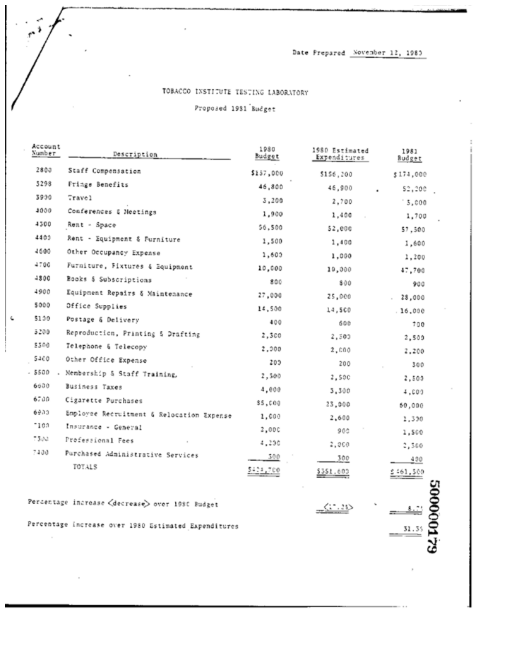

<p align="center">
  
  <h3 align="center">
  </h3>
</p>

# Project: LayoutLM for sequence classification

[**LayoutLM**](https://arxiv.org/abs/1912.13318) developed by Microsoft Research Asia has become a very popular model for document understanding task 
such as sequence or token classification. In contrast to other language models even the simplest version heavily relies 
not only on the word/token itself but also on the positional information of words in the document. For scans this 
requires to perform OCR as a pre-processing step making the task for training or experimenting with different OCR 
tools and putting the whole framework into production a lot more challenging. 

In this project we are going to show how to train and evaluate a document classifier using LayoutLM and how to run 
predictions with the model. We divide the task into the following steps:

- First generate a sub data set from the very large and popular [**RVL-CDIP**](https://huggingface.co/datasets/rvl_cdip) 
  dataset. In order to make the 
  dataset ready for training we need to generate features. That means that we OCR the selected documents and generate 
  `.json` files with bounding boxes and detected words. The dataset has a document type label for each scan. We use the 
  labels as ground truth for training the classifier.   

- We build a custom **deep**doctection dataset for the sub dataset. We wrap the dataset into a special class to 
  create a training, eval and test split.

- We download pre-trained base models from the Huggingface hub. 

- Next, we setup the environment for running the training script. We choose a metric and define the evaluation setup. 
  Then we run the training script. The script itself uses the default trainer from the transformer library with 
  standard configuration. 

- After training has finished we run evaluation on the test split. 

- At the last step we show how to build a **deep**doctection pipeline with an OCR model and how to use the trained 
  model in practise. 


## Step 1: Generating a RVL-CDIP sub dataset with words and bounding box features

To OCR some specific documents we first build a **deep**doctection pipeline with an OCR model. We use the 
[**DocTr library**](https://github.com/mindee/doctr) that has a concept to break the OCR task into two 
parts: text line detection 
and text recognition.   


```python
import os
import deepdoctection as dd

def get_doctr_pipe():
    path_weights_tl = dd.ModelDownloadManager.maybe_download_weights_and_configs(
        "doctr/db_resnet50/pt/db_resnet50-ac60cadc.pt")
    categories_tl = dd.ModelCatalog.get_profile("doctr/db_resnet50/pt/db_resnet50-ac60cadc.pt").categories
    text_line_predictor = dd.DoctrTextlineDetector("db_resnet50", path_weights_tl, categories_tl, "cpu", "PT")
    layout = dd.ImageLayoutService(text_line_predictor, to_image=True, crop_image=True)

    path_weights_tr = dd.ModelDownloadManager.maybe_download_weights_and_configs(
        "doctr/crnn_vgg16_bn/pt/crnn_vgg16_bn-9762b0b0.pt")
    text_recognizer = dd.DoctrTextRecognizer("crnn_vgg16_bn", path_weights_tr, "cpu", "PT")
    text = dd.TextExtractionService(text_recognizer, extract_from_roi="word")
    analyzer = dd.DoctectionPipe(pipeline_component_list=[layout, text])

    return analyzer
```

Next, we use the RVL-CDIP dataset from the **deep** library. This step requires the full dataset to be downloaded. 
The full data set has more than 300k samples with 16 different labels. We choose three labels *form*, *invoice* and 
*budget* and select around 1000 samples for each label. 

!!! note

    We do not know the distribution of each category. In order have all labels equally weighted we stream at most 1K
    samples with each label individually, pass them to the OCR-pipeline and save the OCR result for every image in 
    a folder with one `JSON` file.  

    

```python

path_to_save_samples =  "~/.cache/deepdoctection/datasets/rvl"

rvlcdip = dd.get_dataset("rvl-cdip")
rvlcdip.dataflow.categories.filter_categories({"budget"})
pipeline = get_doctr_pipe()

df = rvlcdip.dataflow.build(split="train", load_image=True)
df = pipeline.analyze(dataset_dataflow=df, output="image")
dd.dataflow_to_json(df, path_to_save_samples,
                    single_files=True,
                    file_name=None,
                    max_datapoints=1000,
                    save_image_in_json=False,
                    highest_hierarchy_only=True)

rvlcdip = dd.get_dataset("rvl-cdip")
rvlcdip.dataflow.categories.filter_categories({"invoice"})
pipeline = get_doctr_pipe()

df = rvlcdip.dataflow.build(split="train", load_image=True)
df = pipeline.analyze(dataset_dataflow=df, output="image")
dd.dataflow_to_json(df, path_to_save_samples,
                    single_files=True,
                    file_name=None,
                    max_datapoints=1000,
                    save_image_in_json=False,
                    highest_hierarchy_only=True)

rvlcdip = dd.get_dataset("rvl-cdip")
rvlcdip.dataflow.categories.filter_categories({"form"})
pipeline = get_doctr_pipe()

df = rvlcdip.dataflow.build(split="train", load_image=True)
df = pipeline.analyze(dataset_dataflow=df, output="image")
dd.dataflow_to_json(df, path_to_save_samples,
                    single_files=True,
                    file_name=None,
                    max_datapoints=1000,
                    save_image_in_json=False,
                    highest_hierarchy_only=True)
```


## Step 2: Defining a dataset 

Having generated a dataset with features and labels at `/path/to/rvlcdip` we now copy the folder into the 
**deep**doctection cache and define a custom dataset with a custom dataflow for sequence classification.


```python
class RvlBuilder(dd.DataFlowBaseBuilder):

    def build(self, **kwargs) -> dd.DataFlow:
        load_image = kwargs.get("load_image", False)

        ann_files_dir = self.get_workdir()
        image_dir = self.get_workdir() / "image"

        df = dd.SerializerFiles.load(ann_files_dir,".json")   # get a stream of .json files
        df = dd.MapData(df, dd.load_json)   # load .json file
        categories = self.categories.get_categories(name_as_key=True)

        @dd.curry
        def map_to_img(dp, cats):
            dp = dd.Image.from_dict(**dp)
            dp.file_name= dp.file_name.replace(".tif",".png")
            dp.location = image_dir / dp.file_name
            if not os.path.isfile(dp.location): # (1) 
                return None
            if not len(dp.annotations): # (2) 
                return None
            sub_cat = dp.summary.get_sub_category(dd.PageType.DOCUMENT_TYPE)
            sub_cat.category_id = cats[sub_cat.category_name]
            if load_image:
                dp.image = dd.load_image_from_file(dp.location)
            return dp
        df = dd.MapData(df, map_to_img(categories))

        return df
    
rvlcdip = dd.CustomDataset(name = "rvl",
                 dataset_type=dd.DatasetType.SEQUENCE_CLASSIFICATION,
                 location="rvl",
                 init_categories=[dd.DocumentType.FORM, dd.DocumentType.INVOICE,dd.DocumentType.BUDGET],
                 dataflow_builder=RvlBuilder)
```

1. When creating the dataset some images could not be generated and we have to skip these
2. Some samples were rotated where OCR was not able to recognize text. No text -> no features


## Step 3: Downloading the LayoutLM base model

We use `layoutlm-base-uncased`. This model does not have any head yet and the top head will be specified by the task 
as well as by the number of labels in the training script.  


```python
dd.ModelDownloadManager.maybe_download_weights_and_configs("microsoft/layoutlm-base-uncased/pytorch_model.bin") 
```

## Defining the model

!!! info 

    For those who might wonder why we do not use the very handy transformer `.from_pretained` methods and rather 
    setup a model by passing a config file and weights: All models trainable by the **deep**doctection framework are 
    build using a config file and specifying a path to the artifact.


```python
path_config_json = dd.ModelCatalog.get_full_path_configs("microsoft/layoutlm-base-uncased/pytorch_model.bin")
path_weights = dd.ModelCatalog.get_full_path_weights("microsoft/layoutlm-base-uncased/pytorch_model.bin")
```

## Step 4: Generating a split

Using the `MergeDataset` class we can load the dataset into memory and split it into a `train`, `val` and `test` set.
Specifying a ratio of 0.05 means that the `train` split will contain on 
average 90% of overall dataset with the remaining two splits sharing on average the last 10% equally. It does not mean 
that the train split contains exactly 90%.  


```python
merge = dd.MergeDataset(rvlcdip)
merge.buffer_datasets()
merge.split_datasets(ratio=0.1)
```

??? info "Output"

    {'test': 91, 'train': 1693, 'val': 91}


## Step 5: Training


We run the training scripts more or less with default arguments as specified by the Transformers `Trainer` class. 
We choose `max_steps` of the training to be equal the size of the training split and `per_device_train_batch_size` to 
be 8.
When running with one machine this corresponds to run training for 8 epochs. We evaluate on small intervals. Adapt 
your parameters if you train with more machines or if you need to reduce `batch_size` because of memory constraints.


```python
dataset_train = merge
dataset_val = merge

metric = dd.get_metric("accuracy")
metric.set_categories(summary_sub_category_names="document_type")

dd.train_hf_layoutlm(path_config_json,
                     dataset_train,
                     path_weights,
                     log_dir="/path/to/dir",
                     dataset_val= dataset_val,
                     metric=metric,
                     pipeline_component_name="LMSequenceClassifierService")
```

### Tensorboard

Logging does not look very neat on the jupyter notebook display. We can start tensorboard from a terminal
to get an overview of current learning rate, epoch, train loss and accuracy for the validation set.

```sh
tensorboard --logdir /path/to/traindir
```


## Step 6:  Running evaluation on the test set

Configuration files and checkpoints are being saved in sub folders of `/path/to/dir`. We use them to run a final 
evaluation on the test split.

!!! info 

    The training script already selects a tokenizer that is needed to convert raw features, i.e. words into tokens. It 
    also chooses the mapping framework that converts datapoints of the internal **deep**doctection image format into 
    layoutlm features. 

    The Evaluator however, has been designed to run evaluation on various tasks. Hence it needs a pipeline component. 
    The pipeline component for language model sequence classification must be instatiated by choosing the layoutlm 
    model, but also the right converter to generate layoutlm features from the intrinsic **deep**doctection data 
    model as well as the right tokenizer.

!!! info

    We only use Huggingface's fast tokenizer as it contains helpful additional outputs to generate LayoutLM inputs. 
    Choosing the conventional tokenizer will not work.  


```python
from transformers import LayoutLMTokenizerFast

path_config_json = "/path/to/dir/checkpoint-2500/config.json"
path_weights = "/path/to/dir/checkpoint-2500/pytorch_model.bin"

layoutlm_classifier = dd.HFLayoutLmSequenceClassifier(path_config_json,
                                                      path_weights,
                                                      merge.dataflow.categories.get_categories(as_dict=True))

tokenizer_fast = LayoutLMTokenizerFast.from_pretrained("microsoft/layoutlm-base-uncased")

pipe_component = dd.LMSequenceClassifierService(tokenizer_fast,layoutlm_classifier)

evaluator = dd.Evaluator(merge,
                         pipe_component,
                         metric)

evaluator.run(split="test")
```

??? info "Output"

    [{'key': 'document_type', 'val': 0.8851351351351351, 'num_samples': 148}]


## Step 6: Building a pipeline for production

In the final step we setup a complete pipeline for running the LayoutLM model. We use the same OCR framework for the 
first part of the pipeline followed by the `LMSequenceClassifierService`.


```python
def get_layoutlm_pipeline():
    path_weights_tl = dd.ModelDownloadManager.maybe_download_weights_and_configs("doctr/db_resnet50/pt/db_resnet50-ac60cadc.pt")
    categories_tl = dd.ModelCatalog.get_profile("doctr/db_resnet50/pt/db_resnet50-ac60cadc.pt").categories
    text_line_predictor = dd.DoctrTextlineDetector("db_resnet50", path_weights_tl, categories_tl, "cpu", "PT")
    layout_component = dd.ImageLayoutService(text_line_predictor,to_image=True, crop_image=True)
    
    path_weights_tr = dd.ModelDownloadManager.maybe_download_weights_and_configs("doctr/crnn_vgg16_bn/pt/crnn_vgg16_bn-9762b0b0.pt")
    text_recognizer = dd.DoctrTextRecognizer("crnn_vgg16_bn", path_weights_tr, "cpu", "PT")
    text_component = dd.TextExtractionService(text_recognizer, extract_from_roi="word")
    
    
    layoutlm_classifier = dd.HFLayoutLmSequenceClassifier(path_config_json,
                                                          path_weights,
                                                          {1: 'form', 2: 'invoice', 3: 'budget'})
    
    tokenizer_fast = LayoutLMTokenizerFast.from_pretrained("microsoft/layoutlm-base-uncased")
    layoutlm_component = dd.LMSequenceClassifierService(tokenizer_fast,
                                                        layoutlm_classifier)
    
    return dd.DoctectionPipe(pipeline_component_list=[layout_component, text_component, layoutlm_component])
```

## Step 7: Running the pipeline

We use a subfolder of plain images of the `rvl` dataset to demonstrate how it works.


```python
from matplotlib import pyplot as plt

path = "/path/to/.cache/deepdoctection/rvl/image"

doc_classifier = get_layoutlm_pipeline()

df = doc_classifier.analyze(path=path)
df.reset_state()
df_iter = iter(df)

dp = next(df_iter)

plt.figure(figsize = (25,17))
plt.axis('off')
plt.imshow(dp.viz())
```


    



```python
dp.document_type.value
```

??? info "Output"

    'BUDGET'


```python
dp=next(df_iter)

plt.figure(figsize = (25,17))
plt.axis('off')
plt.imshow(dp.viz())
```

    


```python
dp.document_type.value
```

??? info "Output"

    'BUDGET'
