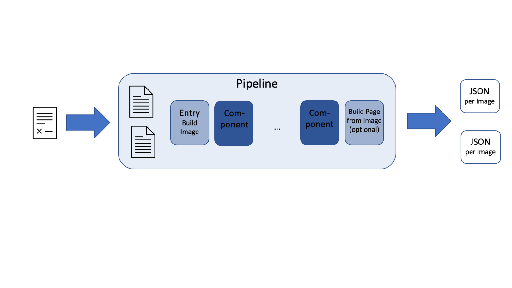
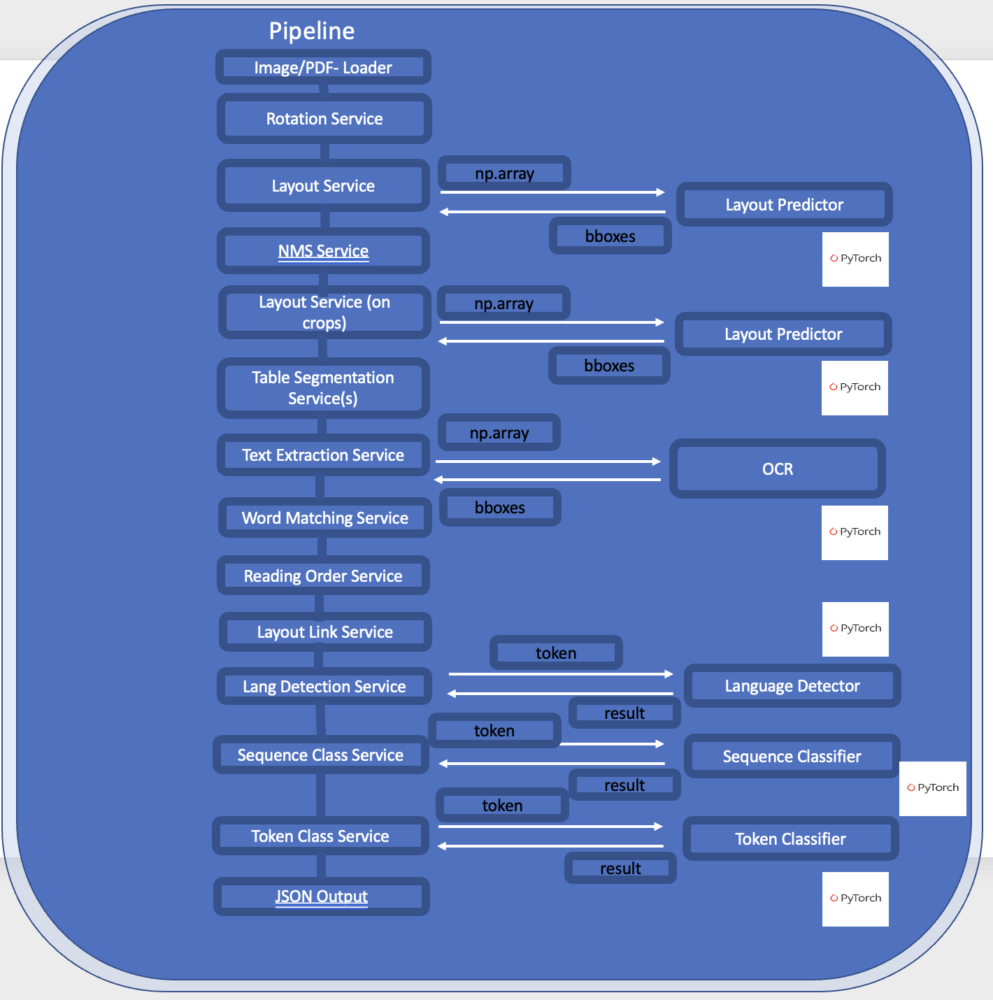

<p align="center">
  
  <h3 align="center">
  </h3>
</p>

# Pipelines

In the [**configuration tutorial**](./Analyzer_Configuration.md), we have already touched on the structure of a 
pipeline. In this section, we will take a deeper look into its architecture.

As a first step, we will take a closer look at the **deep**doctection analyzer and lay the groundwork for developing 
custom pipelines tailored to specific use cases. After all, document parsing is just one possible application.

!!! info

    You might, for example, want to build a pipeline that classifies pages from a scanned binder and extracts entities 
    from them. For such scenarios, **deep**doctection provides powerful components and tools that help you achieve your 
    goals with a manageable amount of code.

If you go to the get started notebook and scroll to the cell where the image processed, you will see some logs:

??? Info "Output"

    <pre>
    [0523 22:14.35 @doctectionpipe.py:103]  INF  Processing sample_2.png
    [0523 22:14.37 @context.py:133]         INF  ImageLayoutService total: 2.3095 sec.
    [0523 22:14.37 @context.py:133]         INF  AnnotationNmsService total: 0.002 sec.
    [0523 22:14.38 @context.py:133]         INF  SubImageLayoutService total: 0.3684 sec.
    [0523 22:14.38 @context.py:133]         INF  PubtablesSegmentationService total: 0.0066 sec.
    [0523 22:14.38 @context.py:133]         INF  ImageLayoutService total: 0.4052 sec.
    [0523 22:14.39 @context.py:133]         INF  TextExtractionService total: 0.9374 sec.
    [0523 22:14.39 @context.py:133]         INF  MatchingService total: 0.0059 sec.
    [0523 22:14.39 @context.py:133]         INF  TextOrderService total: 0.0301 sec.
    </pre>


The logs reveal which pipeline component the image passed through and how much time each component took to process it. 
Some pipeline components have been deactivated by configuration.

A pipeline is built as a sequence of tasks. These tasks are called pipeline components or services.



Once a pipeline is defined, images or documents can be processed. These are either pure image files (like JPG, PNG, 
TIFF) or PDF files. PDF files are read and processed page by page. Each page is converted into a numpy array because 
arrays are the input for vision and OCR models. 


```python
import deepdoctection as dd
from pathlib import Path

analyzer = dd.get_dd_analyzer()
```

??? Info "Output"

    <pre>
    {
    'DEVICE': device(type='mps'),
    'LANGUAGE': None,
    'LAYOUT_LINK': {'CHILD_CATEGORIES': ['LayoutType.CAPTION'],
                    'PARENTAL_CATEGORIES': ['LayoutType.FIGURE', 'LayoutType.TABLE']},
    'LAYOUT_NMS_PAIRS': {'COMBINATIONS': [['LayoutType.TABLE', 'LayoutType.TITLE'],
                                          ['LayoutType.TABLE', 'LayoutType.TEXT'],
                                          ['LayoutType.TABLE', 'LayoutType.KEY_VALUE_AREA'],
                                          ['LayoutType.TABLE', 'LayoutType.LIST_ITEM'],
                                          ['LayoutType.TABLE', 'LayoutType.LIST'],
                                          ['LayoutType.TABLE', 'LayoutType.FIGURE'],
                                          ['LayoutType.TITLE', 'LayoutType.TEXT'],
                                          ['LayoutType.TEXT', 'LayoutType.KEY_VALUE_AREA'],
                                          ['LayoutType.TEXT', 'LayoutType.LIST_ITEM'],
                                          ['LayoutType.TEXT', 'LayoutType.CAPTION'],
                                          ['LayoutType.KEY_VALUE_AREA', 
                                           'LayoutType.LIST_ITEM'],
                                          ['LayoutType.FIGURE', 
                                           'LayoutType.CAPTION']],
                         'PRIORITY': ['LayoutType.TABLE', 
                                      'LayoutType.TABLE', 
                                      'LayoutType.TABLE',
                                      'LayoutType.TABLE', 
                                      'LayoutType.TABLE', 
                                      'LayoutType.TABLE',
                                      'LayoutType.TEXT', 
                                      'LayoutType.TEXT', 
                                       None, 
                                      'LayoutType.CAPTION',
                                      'LayoutType.KEY_VALUE_AREA', 
                                      'LayoutType.FIGURE'],
                         'THRESHOLDS': [0.001, 
                                        0.01, 
                                        0.01, 
                                        0.001, 
                                        0.01,  
                                        0.01, 
                                        0.05, 
                                        0.01, 
                                        0.01, 
                                        0.01,
                                        0.01, 
                                        0.001]},
    'LIB': 'PT',
    'OCR': {'CONFIG': {'TESSERACT': 'dd/conf_tesseract.yaml'},
            'USE_DOCTR': True,
            'USE_TESSERACT': False,
            'USE_TEXTRACT': False,
            'WEIGHTS': {'DOCTR_RECOGNITION': 'doctr/crnn_vgg16_bn/crnn_vgg16_bn-9762b0b0.pt',
                        'DOCTR_WORD': 'doctr/db_resnet50/db_resnet50-ac60cadc.pt'}},
    'PDF_MINER': {'X_TOLERANCE': 3, 'Y_TOLERANCE': 3},
    'CELL': {'FILTER': None,
             'PAD': {'BOTTOM': 60, 'LEFT': 60, 'RIGHT': 60, 'TOP': 60},
             'PADDING': False,
             'WEIGHTS': 'cell/d2_model_1849999_cell_inf_only.pt',
             'WEIGHTS_TS': 'cell/d2_model_1849999_cell_inf_only.ts',
             'ENFORCE_WEIGHTS': {'CELL': True, 'ITEM': True, 'LAYOUT': True},
    'ITEM': {'FILTER': ['table'],
             'PAD': {'BOTTOM': 60, 'LEFT': 60, 'RIGHT': 60, 'TOP': 60},
             'PADDING': False,
             'WEIGHTS': 'deepdoctection/tatr_tab_struct_v2/pytorch_model.bin',
             'WEIGHTS_TS': 'item/d2_model_1639999_item_inf_only.ts'},
    'LAYOUT': {'FILTER': None,
               'PAD': {'BOTTOM': 0, 'LEFT': 0, 'RIGHT': 0, 'TOP': 0},
               'PADDING': False,
               'WEIGHTS': 'Aryn/deformable-detr-DocLayNet/model.safetensors',
               'WEIGHTS_TS': 'layout/d2_model_0829999_layout_inf_only.ts'},
    'SEGMENTATION': {'ASSIGNMENT_RULE': 'ioa',
                     'CELL_NAMES': ['CellType.HEADER', 
                                    'CellType.BODY', 
                                    'LayoutType.CELL'],
                     'FULL_TABLE_TILING': True,
                     'ITEM_NAMES': ['LayoutType.ROW', 'LayoutType.COLUMN'],
                     'PUBTABLES_CELL_NAMES': ['LayoutType.CELL'],
                     'PUBTABLES_ITEM_HEADER_CELL_NAMES': ['CellType.COLUMN_HEADER',
                                                          'CellType.ROW_HEADER',
                                                          'CellType.PROJECTED_ROW_HEADER'],
                     'PUBTABLES_ITEM_HEADER_THRESHOLDS': [0.6, 0.0001],
                     'PUBTABLES_ITEM_NAMES': ['LayoutType.ROW', 'LayoutType.COLUMN'],
                     'PUBTABLES_SPANNING_CELL_NAMES': ['CellType.SPANNING'],
                     'PUBTABLES_SUB_ITEM_NAMES': ['CellType.ROW_NUMBER', 
                                                  'CellType.COLUMN_NUMBER'],
                     'REMOVE_IOU_THRESHOLD_COLS': 0.2,
                     'REMOVE_IOU_THRESHOLD_ROWS': 0.2,
                     'STRETCH_RULE': 'equal',
                     'SUB_ITEM_NAMES': ['CellType.ROW_NUMBER', 'CellType.COLUMN_NUMBER'],
                     'TABLE_NAME': 'LayoutType.TABLE',
                     'THRESHOLD_COLS': 0.4,
                     'THRESHOLD_ROWS': 0.4},
    'TEXT_CONTAINER': 'LayoutType.WORD',
    'TEXT_ORDERING': {'BROKEN_LINE_TOLERANCE': 0.003,
                      'FLOATING_TEXT_BLOCK_CATEGORIES': ('LayoutType.TEXT', 
                                                         'LayoutType.TITLE',
                                                         'LayoutType.LIST',
                                                         'LayoutType.KEY_VALUE_AREA'),
                      'HEIGHT_TOLERANCE': 2.0,
                      'INCLUDE_RESIDUAL_TEXT_CONTAINER': True,
                      'PARAGRAPH_BREAK': 0.035,
                      'STARTING_POINT_TOLERANCE': 0.005,
                      'TEXT_BLOCK_CATEGORIES': ('LayoutType.TEXT', 
                                                'LayoutType.TITLE',
                                                'LayoutType.LIST_ITEM', 
                                                'LayoutType.LIST',
                                                'LayoutType.CAPTION', 
                                                'LayoutType.PAGE_HEADER',
                                                'LayoutType.PAGE_FOOTER', 
                                                'LayoutType.PAGE_NUMBER',
                                                'LayoutType.MARK', 
                                                'LayoutType.KEY_VALUE_AREA',
                                                'LayoutType.FIGURE', 
                                                'CellType.SPANNING',
                                                'LayoutType.CELL')},
    'USE_LAYOUT': True,
    'USE_LAYOUT_LINK': False,
    'USE_LAYOUT_NMS': True,
    'USE_LINE_MATCHER': False,
    'USE_OCR': True,
    'USE_PDF_MINER': False,
    'USE_ROTATOR': False,
    'USE_TABLE_REFINEMENT': False,
    'USE_TABLE_SEGMENTATION': True,
    'WORD_MATCHING': {'MAX_PARENT_ONLY': True,
                      'PARENTAL_CATEGORIES': ('LayoutType.TEXT', 
                                              'LayoutType.TITLE',
                                              'LayoutType.LIST_ITEM', 
                                              'LayoutType.LIST',
                                              'LayoutType.CAPTION', 
                                              'LayoutType.PAGE_HEADER',
                                              'LayoutType.PAGE_FOOTER', 
                                              'LayoutType.PAGE_NUMBER',
                                              'LayoutType.MARK', 
                                              'LayoutType.KEY_VALUE_AREA',
                                              'LayoutType.FIGURE', 
                                              'CellType.SPANNING',
                                              'LayoutType.CELL'),
                      'RULE': 'ioa',
                      'THRESHOLD': 0.3}
    }
    </pre>

Let's take a closer look at the **deep**doctection analyzer. 



The architecture is modular, and a pipeline consists of individual components, each typically performing a single 
processing step. We have already explored the [**configuration**](Analyzer_Configuration.md) options. When the analyzer 
is instantiated, a dictionary is printed to the logs, which begins approximately like this:

??? Info "Output"

    <pre>
    {'DEVICE': device(type='mps'),
     'LANGUAGE': None,
     'LAYOUT_LINK': {'CHILD_CATEGORIES': ['caption'], 
                     'PARENTAL_CATEGORIES': ['figure', 'table']},
     'LAYOUT_NMS_PAIRS': {'COMBINATIONS': 
                          [['table', 'title'], 
                           ['table', 'text'], 
                           ['table', 'key_value_area'], 
                           ['table', 'list_item'],
                           ['table', 'list'], 
                           ['table', 'figure'], 
                           ['title', 'text'],
                           ['text', 'key_value_area'], 
                           ['text', 'list_item'],
                           ['key_value_area', 'list_item']],
     'PRIORITY': ['table', 
                  'table', 
                  'table', 
                  'table', 
                  'table', 
                  'table', 
                  'text',
                  'text', 
                   None, 
                  'key_value_area'],
     'THRESHOLDS': [0.001, 
                    0.01, 
                    0.01, 
                    0.001, 
                    0.01, 
                    0.01, 
                    0.05, 
                    0.01, 
                    0.01, 
                    0.01]},
     ...
    }
    </pre>


Having a pipeline, we can list the components with `get_pipeline_info()`. It returns a dictionary with the a so 
called `service_id` and a name of the component. Note, that the name of the component depends not only on the service 
itself but also on the model that is being chosen.


```python
analyzer.get_pipeline_info()

```

??? Info "Output"

    <pre>
    {'5497d92c': 'image_Transformers_Tatr_deformable-detr-DocLayNet_model.safetensors',
     '3b56c997': 'nms',
     '8c23055e': 'sub_image_Transformers_Tatr_tatr_tab_struct_v2_pytorch_model.bin',
     '03844ddb': 'table_transformer_segment',
     '01a15bff': 'image_doctr_db_resnet50pt_db_resnet50-ac60cadc.pt',
     '1cedc14d': 'text_extract_doctr_crnn_vgg16_bnpt_crnn_vgg16_bn-9762b0b0.pt',
     'd6219eba': 'matching',
     'f10aa678': 'text_order'}
    </pre>


```python
component = analyzer.get_pipeline_component(service_id="5497d92c")
component.name
```

??? Info "Output"

    'image_Transformers_Tatr_deformable-detr-DocLayNet_model.safetensors'


Each pipeline component has a `DatapointManager`, which manages the dataclass responsible for collecting all information 
related to a page. The results are then provided through the `Page` object, which generates the corresponding `JSON` 
output. If a service uses a model, the model will also receive a `model_id`. If we want to process a pile of documents 
with a pipeline, we can pass a `service_id` to the `analyze` method which allows you to version the run. The 
`service_id` will be added in our JSON output. Note, that the analyzer will not generate a `session_id` by itself.

The `get_meta_annotation()` method allows us to see which elements are being detected. 

!!! Info 
    
    We already mentioned this method in the [**More on parsing**](Analyzer_More_On_Parsing.md) notebook. It exists 
    both at the level of individual pipeline components and at the level of the entire pipeline.

At the pipeline level, all `get_meta_annotation()` outputs from the individual components are aggregated.

```python
component.dp_manager.model_id, component.dp_manager.service_id, component.dp_manager.session_id
```

??? Info "Output"

    ('af516519', '5497d92c', None)


## Pipeline operations and parsing results

Let’s now take a look at the parsed results from a technical perspective.


```python
pdf_path = "path/to/dir/sample/2312.13560.pdf"

df = analyzer.analyze(path=pdf_path, 
					  session_id="9999z99z", 
					  max_datapoints=3) # (1) 
df.reset_state()
all_results = list(df)

page_2 = all_results[1]

sample_layout_section = page_2.layouts[0] # get the first layout section
print(f"service_id: {sample_layout_section.service_id}, 
        model_id: {sample_layout_section.model_id}, 
        session_id: {sample_layout_section.session_id}")
```

1. `max_datapoints` limits the number of samples to at most 3

??? Info "Output"

    service_id: 5497d92c, model_id: af516519, session_id: 9999z99z


```python
sample_word = sample_layout_section.get_ordered_words()[2]
print(f"layout section text: {sample_layout_section.text} \n \n word text: {sample_word.characters}  
        service_id: {sample_word.service_id}, model_id: {sample_word.model_id}, session_id: {sample_word.session_id}")
```

??? Info "Output"

    layout section text: When processing audio at the frame level, an immense vol- ume of entries is generated, where 
    a considerable portion of the frames are assigned to the <blank * symbol due to the characteristic peak behavior 
    of CTC. We propose skip-blank strategy to prune the datastore and accelerat KNN retrieval. During datastore 
    construction, this strateg omits frames whose CTC pseudo labels correspond to th <blank " symbol, thereby reducing 
    the size of the data store. This process is indicated by the blue dashed lines 11 
     
    word text: audio  service_id: 01a15bff, model_id: 65b358ea, session_id: 9999z99z


As is well known, a pipeline does not only generate layout sections but also determines other elements—such as reading 
orders or relationships between layout sections. The associated `service_id` must be extracted from the container that 
stores the reading order information.

!!! Info

    We can find more information about the data structure in the [**Data structure tutorial**](../concepts/Data_Structure.md).


```python
reading_order = sample_layout_section.get_sub_category("reading_order")
print(type(reading_order))
```

    <class 'deepdoctection.datapoint.annotation.CategoryAnnotation'>


```python
print(f"position: {reading_order.category_id},
        service_id: {reading_order.service_id}  
        model_id: {reading_order.model_id}, 
        session_id: {reading_order.session_id}")
```

??? Info "Output"

    position: 25
    service_id: f10aa678  
    model_id: None 
    session_id: 9999z99z


We can get an overview of all `service_id`'s and their `annotation_id`'s they generated.


```python
service_id_to_annotation_id = page_2.get_service_id_to_annotation_id()
service_id_to_annotation_id.keys(), service_id_to_annotation_id["01a15bff"][:10]
```

??? Info "Output"

    (dict_keys(['5497d92c', 'f10aa678', '01a15bff', '1cedc14d', 'd6219eba']),
     ['a0ef728f-57c7-304e-9d98-903a492b6dea',
      '9340f60a-8088-3b7c-bf5b-f41e472e61b1',
      '14bdcabc-49a6-37e7-8890-4c03f6b6bfed',
      '2c119bf0-d344-3c6c-9ec2-60f7f07c3092',
      '48e5f8f8-90d4-3d2d-bbc1-a8793961d3e1',
      '811addaf-6388-345c-97b4-0def4114822f',
      '589cbd78-dfbc-3af6-9de7-0c2a9ee31956',
      '9b4474c8-7c14-3b97-8533-3998aa832ed3',
      '29440674-f9d3-3611-942b-1f9370ac213a',
      '1b44b477-8c20-3fd2-8f14-accc04abe601'])


Conversely, for a given `annotation_id`, we can use the `AnnotationMap` to locate the position where the object with 
that specific `annotation_id` can be found.

In the case below, the object with `annotation_id="966e6cc7-8b2c-38c5-9416-cfe114af1cc1"` is located within the layout 
section with `annotation_id="6ac8cd0b-8425-392c-ae8a-76c1f198ecf0"` and represents the `sub_category = 
<Relationships.READING_ORDER>`.


```python
annotation_id_to_annotation_maps = page_2.get_annotation_id_to_annotation_maps()
annotation_id_to_annotation_maps["966e6cc7-8b2c-38c5-9416-cfe114af1cc1"]
```

??? Info "Output"

    [AnnotationMap(image_annotation_id='6ac8cd0b-8425-392c-ae8a-76c1f198ecf0',
                   sub_category_key=<Relationships.READING_ORDER>, 
                   relationship_key=None, 
                   summary_key=None)]


We can retrieve the object in two steps:


```python
image_annotation = page_2.get_annotation(annotation_ids="6ac8cd0b-8425-392c-ae8a-76c1f198ecf0")[0] # (1) 
reading_order_ann = image_annotation.get_sub_category("reading_order") # (2) 
reading_order_ann.annotation_id # (3)
```

1. Get the layout section
2. Get the reading order annotation
3. Reading_order_ann is the object we were looking for

??? Info "Output"

    '966e6cc7-8b2c-38c5-9416-cfe114af1cc1'


## Undoing a pipeline component operation

Not only the creation of objects but also the revision of a parsing structure can be important. In particular, 
the output of a component can be reverted using `undo`. In this example, we remove all word positions that were 
identified by the DocTr text detection model.


```python
text_detection_component = analyzer.get_pipeline_component(service_id="01a15bff")
df = dd.DataFromList([dp.base_image for dp in all_results]) # (1) 
df = text_detection_component.undo(df)
df.reset_state()

all_results_modified = [dp for dp in df]
```

1. Check the notebook [Data_structure](../concepts/Data_Structure.md)  in order to understand why we use `dp.base_image`.

!!! Info

    Note that not only the objects generated by the pipeline itself are affected, but also those from all pipeline 
    components that build upon its results. In this case, objects related to text ordering and layout segments remain. 
    The fact that text ordering objects persist might be surprising, but it can be explained by the fact that not only 
    the words, but also the layout segments themselves are ordered. As a result, the reading order determined for these 
    segments leads to the retention of objects from this service.


```python
page_2_modified = all_results_modified[1]
service_id_to_annotation_id_modified = page_2_modified.get_service_id_to_annotation_id()
service_id_to_annotation_id_modified.keys(), service_id_to_annotation_id_modified.get("01a15bff")
```

??? Info "Output"

    (dict_keys(['5497d92c', 'f10aa678']), None)


## Analyzer Factory


How is an Analyzer constructed and where does the configuration come from? The configuration is provided by a default 
instance called `cfg`, which can be modified by defrosting it.


```python
from deepdoctection.analyzer import cfg, ServiceFactory

cfg.USE_OCR
```

??? Info "Output"

    True


```python
cfg.freeze(False)
cfg.USE_OCR=False  # (1) 
cfg.freeze(True)
```

1. After defrosting we can change values and add new attributes


For constructing predictors (layout, table segmentation, OCR, etc.), pipeline components, and the default pipeline, a 
`ServiceFactory` offers a variety of methods. We will not cover all the methods provided by the factory here, but 
rather give just one example.


```python
rotation_detector = ServiceFactory.build_rotation_detector() # (1)
transform_service = ServiceFactory.build_transform_service(transform_predictor=rotation_detector)
pipeline = dd.DoctectionPipe(pipeline_component_list=[transform_service])
```

1. A very simple example of a pipeline includes a rotation detector that determines the rotation angle 
   of a page (in multiples of 90 degrees) and rotates each page so that the text is in its correct,
   readable orientation.
