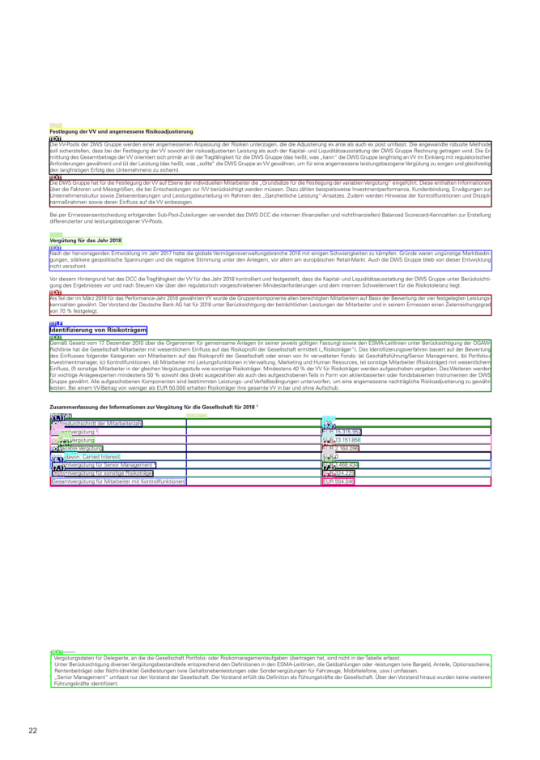

 

# Getting started

**deep**doctection is a package that can be used to extract text from complex structured documents. These can be native PDFs but also scans. In contrast to various text miners **deep**doctection makes use of deep learning models from powerful third party libraries for solving OCR, vision or language embedding problems. 

This notebook will give you a quick tour so that you can get started straight away.


```python
import cv2
from pathlib import Path
from matplotlib import pyplot as plt
from IPython.core.display import HTML

import deepdoctection as dd
```

## Sample

Take an image (e.g. .png, .jpg, ...). If you take the example below you'll maybe need to change ```image_path```.


```python
image_path = Path.cwd() / "pics/samples/sample_2/sample_2.png"
image = cv2.imread(image_path.as_posix())
plt.figure(figsize = (25,17))
plt.axis('off')
plt.imshow(image)
```


## Analyzer

Next, we instantiate the **deep**doctection [analyzer][deepdoctection.analyzer.dd.get_dd_analyzer]. There is a built-in pipeline you can use. The analyzer is an example of a pipeline that can be built depending on the problem you want to tackle. This particular pipeline is built from various building blocks as shown in the diagram. 

There is a lot going on under the hood. The analyzer calls three object detectors to structure the page and an OCR engine to extract the text. However, this is clearly not enough. On top of that, words have to be mapped to layout structures and a reading order has to be inferred. 

  


```python
analyzer = dd.get_dd_analyzer(language='deu')
```

The language of the sample is german and passing the argument `language='deu'` will use a Tesseract model that has been trained on a german corpus giving much better result than the default english version.

## Analyze methods

Once all models have been loaded, we can process single pages or documents. You can either set `path=path/to/dir` if you have a folder of scans or `path=path/to/my/doc.pdf` if you have a single pdf document.


```python
path = Path.cwd() / "pics/samples/sample_2"

df = analyzer.analyze(path=path)
df.reset_state()  # This method must be called just before starting the iteration. It is part of the API.
```
|1/?[00:00<00:00,1129.63it/s]

&nbsp;

You can see when activating the cell that not much has happened yet. The reason is that `analyze` is a generator function. We need a `for`-loop or `next` to start the process.   


```python
doc=iter(df)
page = next(doc)
```
```
[32m[1219 16:02.38 @context.py:131][ImageLayoutService total: 0.1225 sec.[0m
[32m[1219 16:02.38 @context.py:131][SubImageLayoutService total: 0.0449 sec.[0m
[32m[1219 16:02.38 @context.py:131][SubImageLayoutService total: 0.0378 sec.[0m
[32m[1219 16:02.38 @context.py:131][TableSegmentationService total: 0.004 sec.[0m
[32m[1219 16:02.38 @context.py:131][TableSegmentationRefinementService total: 0.0028 sec.[0m
[32m[1219 16:02.42 @context.py:131][TextExtractionService total: 3.6468 sec.[0m
[32m[1219 16:02.42 @context.py:131][MatchingService total: 0.005 sec.[0m
[32m[1219 16:02.42 @context.py:131][TextOrderService total: 0.0483 sec.[0m
```

## Page

Let's see what we got back. We start with some header information about the page. With `get_attribute_names()` you get a list of all attributes. 


```python
page.height, page.width, page.file_name, page.location
```


    (2339.0,
     1654.0,
     'sample_2.png',
     './pics/samples/sample_2/sample_2.png')


```python
page.get_attribute_names()
```

    {<PageType.document_type>,
     <PageType.language>,
     'layouts',
     'residual_words',
     'tables',
     'text',
     'words'}


`page.document_type` returns None. The reason is that this pipeline is not built for document classification. You can easily build a pipeline containing a document classifier, though. 
Check this [notebook](using_layoutlm_for_sequence_classification_notebook.md) for further information.

&nbsp;

```python
print(page.document_type)
```

    None

&nbsp;

We can visualize the detected segments. If you set `interactive=True` a viewer will pop up. Use + and - to zoom out/in. Use q to close the page.

Alternatively, you can visualize the output with matplotlib.


```python
image = page.viz()
plt.figure(figsize = (25,17))
plt.axis('off')
plt.imshow(image)
```



Let's have a look at other attributes. We can use the `text` property to get the content of the document. You will notice that the table is not included. You can therefore filter tables from the other content. In fact you can even filter on every layout segment.


```python
print(page.text)
```

    
    Festlegung der VV und angemessene Risikoadjustierung
    Die VV-Pools der DWS Gruppe werden einer angemessenen Anpassung der Risiken unterzogen, die die Adjustierung ex ante als auch ex post umfasst. Die angewandte robuste Methode soll sicherstellen, dass bei der Festlegung der VV sowohl der risikoadjustierten Leistung als auch der Kapital- und Liquiditätsausstattung der DWS Gruppe Rechnung getragen wird. Die Er- mittlung des Gesamtbetrags der VV orientiert sich primär an (i) der Tragfähigkeit für die DWS Gruppe (das heißt, was „kann” die DWS Gruppe langfristig an VV im Einklang mit regulatorischen ‚Anforderungen gewähren) und (il) der Leistung (das heißt, was „sollte” die DWS Gruppe an VV gewähren, um für eine angemessene leistungsbezogene Vergütung zu sorgen und gleichzeitig den langfristigen Erfolg des Unternehmens zu sichern)
    Die DWS Gruppe hat für die Festlegung der VV auf Ebene der individuellen Mitarbeiter die „Grundsätze für die Festlegung der variablen Vergütung” eingeführt. Diese enthalten Informationen über die Faktoren und Messgrößen, die bei Entscheidungen zur IVV berücksichtigt werden müssen. Dazu zählen beispielsweise Investmentperformance, Kundenbindung, Erwägungen zur Unternehmenskultur sowie Zielvereinbarungen und Leistungsbeurteilung im Rahmen des „Ganzheitliche Leistung“-Ansatzes. Zudem werden Hinweise der Kontrollfunktionen und Diszipli- narmaßnahmen sowie deren Einfluss auf die VV einbezogen
    Bei per Ermessensentscheidung erfolgenden Sub-Pool-Zuteilungen verwendet das DWS DCC die internen (finanziellen und nichtfinanziellen) Balanced Scorecard-Kennzahlen zur Erstellung differenzierter und leistungsbezogener VV-Pools,
    Vergütung für das Jahr 2018
    Nach der hervorragenden Entwicklung im Jahr 2017 hatte die globale Vermögensverwaltungsbranche 2018 mit einigen Schwierigkeiten zu kämpfen. Gründe waren ungünstige Marktbedin- gungen, stärkere geopolitische Spannungen und die negative Stimmung unter den Anlegern, vor allem am europäischen Retail-Miarkt. Auch die DWS Gruppe blieb von dieser Entwicklung nicht verschont.
    Vor diesem Hintergrund hat das DCC die Tragfähigkeit der VV für das Jahr 2018 kontrolliert und festgestellt, dass die Kapital- und Liquiditätsausstattung der DWS Gruppe unter Berücksichti- ‚gung des Ergebnisses vor und nach Steuern klar über den regulatorisch vorgeschriebenen Mindestanforderungen und dem internen Schwellenwert für die Risikotoleranz liegt.
    Als Teil der im März 2019 für das Performance-Jahr 2018 gewährten VV wurde die Gruppenkomponente allen berechtigten Mitarbeitern auf Basis der Bewertung der vier festgelegten Leistungs- kennzahlen gewährt. Der Vorstand der Deutsche Bank AG hat für 2018 unter Berücksichtigung der beträchtlichen Leistungen der Mitarbeiter und in seinem Ermessen einen Zielerreichungsgrad von 70 % festgelegt
    Identifi ierung von Risikoträgern
    Gemäß Gesetz vom 17. Dezember 2010 über die Organismen für gemeinsame Anlagen (in seiner jeweils gültigen Fassung) sowie den ESMA-Leitlinien unter Berücksichtigung der OGAW- Richtlinie hat die Gesellschaft Mitarbeiter mit wesentlichem Einfluss auf das Risikoprofil der Gesellschaft ermittelt („Risikoträger"). Das Identifizierungsverfahren basiert auf der Bewertung des Einflusses folgender Kategorien von Mitarbeitern auf das Risikoprofil der Gesellschaft oder einen von ihr verwalteten Fonds: (a) Geschäftsführung/Senior Management, (b) Portfolio-/ Investmentmanager, (c) Kontrollfunktionen, (d) Mitarbeiter mit Leitungsfunktionen in Verwaltung, Marketing und Human Resources, (e) sonstige Mitarbeiter (Risikoträger) mit wesentlichem Einfluss, (f} sonstige Mitarbeiter in der gleichen Vergütungsstufe wie sonstige Risikoträger. Mindestens 40 % der VV für Risikoträger werden aufgeschoben vergeben. Des Weiteren werden für wichtige Anlageexperten mindestens 50 % sowohl des direkt ausgezahlten als auch des aufgeschobenen Teils in Form von aktienbasierten oder fondsbasierten Instrumenten der DWS Gruppe gewährt. Alle aufgeschobenen Komponenten sind bestimmten Leistungs- und Verfallbedingungen unterworfen, um eine angemessene nachträgliche Risikoadjustierung zu gewähr- leisten. Bei einem VV-Betrag von weniger als EUR 50.000 erhalten Risikoträger ihre gesamte \VV in bar und ohne Aufschub.
    Zusammenfassung der Informationen zur Vergütung für die Gesellschaft für 2018 '
    \ Vergütungsdaten für Delegierte, die die Gesellschaft Portfolio- oder Risikomanagementaufgaben übertragen hat, sind nicht der Tabelle erfasst. an in Unter Berücksichtigung diverser Vergütungsbestandteile entsprechend den Definitionen in den ESMA-Leitlinien, die Geldzahlungen oder leistungen (wie Bargeld, Anteile, Optionsscheine, Rentenbeiträge) oder Nicht-(direkte) Geldleistungen (wie Gehaltsnebenleistungen oder Sondervergütungen für Fahrzeuge, Mobiltelefone, usw.) umfassen 3 „Senior Management” umfasst nur den Vorstand der Gesellschaft. Der Vorstand erfüllt die Definition als Führungskräfte der Gesellschaft. Uber den Vorstand hinaus wurden keine weiteren Führungskräfte identifiziert.

&nbsp;

```python
for layout in page.layouts:
    if layout.category_name=="title":
        print(f"Title: {layout.text}")
```

    Title: Identifi ierung von Risikoträgern
    Title: Vergütung für das Jahr 2018
    Title: Festlegung der VV und angemessene Risikoadjustierung

&nbsp;

Tables are stored in `page.tables` which is a python list of table objects. Obviously, only one table has been detected. Let's have a closer look at the table. Most attributes are hopefully self explained. If you `print(page.tables)` you will get a very cryptic `__repr__` output.


```python
len(page.tables)
```

    1


```python
table = page.tables[0]
table.get_attribute_names()
```


    {'bbox',
     'cells',
     'columns',
     <TableType.html>,
     <TableType.item>,
     <TableType.max_col_span>,
     <TableType.max_row_span>,
     <TableType.number_of_columns>,
     <TableType.number_of_rows>,
     <Relationships.reading_order>,
     'rows',
     'text',
     'words'}


```python
table.number_of_rows, table.number_of_columns
```


    (8, 2)


```python
HTML(table.html)
```


<table><tr><td>Jahresdurchschnitt der Mitarbeiterzahl</td><td>139</td></tr><tr><td>Gesamtvergütung ?</td><td>EUR 15.315.952</td></tr><tr><td>Fixe Vergütung</td><td>EUR 13.151.856</td></tr><tr><td>Variable Vergütung</td><td>EUR 2.164.096</td></tr><tr><td>davon: Carried Interest</td><td>EURO</td></tr><tr><td>Gesamtvergütung für Senior Management ®</td><td>EUR 1.468.434</td></tr><tr><td>Gesamtvergütung für sonstige Risikoträger</td><td>EUR 324.229</td></tr><tr><td>Gesamtvergütung für Mitarbeiter mit Kontrollfunktionen</td><td>EUR 554.046</td></tr></table>

&nbsp;

Let's go deeper down the rabbit hole. A `Table` has cells and we can even get the text of one particular cell. Note that the output list is not sorted by row or column. You have to do it yourself.


```python
cell = table.cells[0]
cell.get_attribute_names()
```


    {'bbox',
     <CellType.body>,
     <CellType.column_number>,
     <CellType.column_span>,
     <CellType.header>,
     <Relationships.reading_order>,
     <CellType.row_number>,
     <CellType.row_span>,
     'text',
     'words'}


```python
cell.column_number, cell.row_number, cell.text, cell.annotation_id  # every object comes with a unique annotation_id
```


    (1,
     8,
     'Gesamtvergütung für Mitarbeiter mit Kontrollfunktionen',
     '8a6224cb-fc75-32db-be30-983e8f9b42c1')

&nbsp;

Still not down yet, we have a list of words that is responsible to generate the text string.


```python
word = cell.words[0]
word.get_attribute_names()
```


    {'bbox',
     <WordType.block>,
     <WordType.characters>,
     <Relationships.reading_order>,
     <WordType.tag>,
     <WordType.text_line>,
     <WordType.token_class>,
     <WordType.token_tag>}


The reading order determines the string position. OCR engines generally provide a some heuristics to infer a reading order. This library, however, follows the apporach to disentangle every processing step.


```python
word.characters, word.reading_order, word.token_class
```


    ('Gesamtvergütung', 1, None)

&nbsp;

The `Page` object is read-only and even though you can change the value it will not be persisted.


```python
word.token_class = "ORG"
```


```python
word #  __repr__ of the base object does carry <WordType.token_class> information.  
```


    Word(active=True, _annotation_id='844631a5-5ddb-3ba8-b81a-bb9f05604d58', category_name=<LayoutType.word>, _category_name=<LayoutType.word>, category_id='1', score=0.91, sub_categories={<WordType.characters>: ContainerAnnotation(active=True, _annotation_id='ded39c8a-72c0-335b-853f-e6c8b50fbfbc', category_name=<WordType.characters>, _category_name=<WordType.characters>, category_id='None', score=0.91, sub_categories={}, relationships={}, value='Gesamtvergütung'), <WordType.block>: CategoryAnnotation(active=True, _annotation_id='a0712a5f-b3ff-3217-a8ca-690e4f5c7297', category_name=<WordType.block>, _category_name=<WordType.block>, category_id='47', score=None, sub_categories={}, relationships={}), <WordType.text_line>: CategoryAnnotation(active=True, _annotation_id='ffa96640-1fbd-3411-b932-0c8db602052d', category_name=<WordType.text_line>, _category_name=<WordType.text_line>, category_id='1', score=None, sub_categories={}, relationships={}), <Relationships.reading_order>: CategoryAnnotation(active=True, _annotation_id='9a2ced50-d1b6-378e-bbb7-49b8d3cfee61', category_name=<Relationships.reading_order>, _category_name=<Relationships.reading_order>, category_id='1', score=None, sub_categories={}, relationships={})}, relationships={}, bounding_box=BoundingBox(absolute_coords=True, ulx=146, uly=1481, lrx=277, lry=1496, height=15, width=131))

&nbsp;

You can save your result in a big `.json` file. The default `save` configuration will store the image as b64 encoded string, so be aware: The `.json` file with that image has a size of 6,2 MB!


```python
page.save()
```

Having saved the results you can easily parse the file into the `Page` format.


```python
path = Path.cwd() / "pics/samples/sample_2/sample_2.json"

df = dd.SerializerJsonlines.load(path)
page = dd.Page.from_dict(**next(iter(df)))
```
