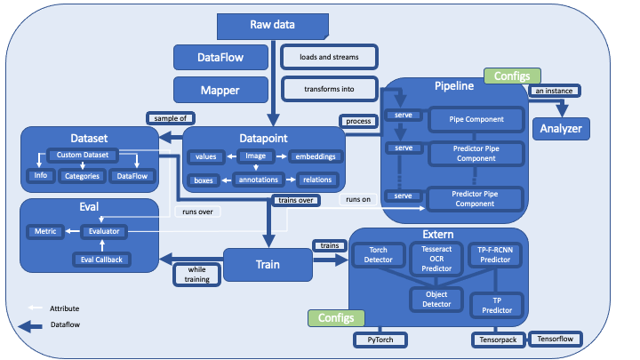

# Architecture





## Dataflow

[Dataflow](https://github.com/tensorpack/dataflow>) is a package for loading data. It has originally been developed
for training purposes. The idea is basically to have blocks of generators you can chain so that building a pipeline
for loading and transforming data becomes easy. We have integrated the most important `Dataflow` classes into
**deep**doctection. Please refer to the comprehensive and extremely well presented
[tutorials](https://tensorpack.readthedocs.io/en/latest/tutorial/index.html#dataflow-tutorials>) for details. Let's
cover some basic facts.

You can load `.jsonlines`, `.json` or file paths with serializers.

```python
    import deepdoctection as dd 

    df = dd.SerializerJsonlines.load("path/to/dir",max_datapoints=100)
    df.reset_state()
    for dp in df:
        # dp is dict
``` 

```python 
    df = dd.SerializerCoco("path/to/dir")
    df.reset_state()
    for dp in df:
        # dp is a dict with {'image':{'id',...},
                             'annotations':[{'id':…,'bbox':...}]}
``` 

&nbsp;

You can load a pdf and convert the `SerializerPdfDoc` into the internal data structure.

```python
    df = dd.SerializerPdfDoc("path/to/dir")

    def _to_image(dp: str) -> Optional[dd.Image]:
        _, file_name = os.path.split(dp)
        dp_dict = {"file_name": file_name, "location": dp}
        return dp_dict

    df = dd.MapData(df, _to_image)
    df.reset_state()
    for dp in df:
       # is now an Image
``` 

The snippet above already shows how you transform your data structure or how you perform any other operation: You simply
write a mapper function and use [`MapData`][deepdoctection.dataflow.common.MapData]. If you see that your mapper is a bottleneck in your data process you can
speed the bottleneck function by using a [`MultiProcessMapData`][deepdoctection.dataflow.parallel_map.MultiProcessMapData] or
[`MultiThreadMapData`][deepdoctection.dataflow.parallel_map.MultiThreadMapData]. This class will spawn multiple
processes and parallelize the mapping function to increase throughput.
Check the section [Mapper](#mapper) for tools and samples on how to write mappers to be used with dataflows.


## Datapoint


The [datapoint][deepdoctection.datapoint] package adds the internal data structure to the library. You can view a datapoint as a document
page. The highest level object is provided by the [`Image`][deepdoctection.datapoint.image].

```python

    image = dd.Image(file_name="image_1.png", location = "path/to/dir")
``` 

The image carries all data retrieved from ground truth annotations in data sets or from models in pipelines.
This can be detected layout sections, words and relations between various objects.
Visual lower level objects are modeled as [`ImageAnnotation`][deepdoctection.datapoint.annotation.ImageAnnotation]. 
They have, among other things, an attribute `category_name`to define the object type and a 
[`BoundingBox`][deepdoctection.datapoint.box].

```python

    bounding_box = dd.BoundingBox(absolute_coords=True,ulx=100.,uly=120.,lrx=200.,lry=250.)
    table = dd.ImageAnnotation(bounding_box = bounding_box,
                            category_name = LayoutType.TABLE,
                            category_id=1)  # ids will be used for model training
    image.dump(table)    # this adds the table annotation to the image. It generates a md5 hash that you can get
                         # with table.annotation_id
``` 

&nbsp;

To store additional attributes that depend on the object type (think of table cells where row and column numbers
are needed), a generic attribute `sub_categories` is provided.

```python

cell = dd.ImageAnnotation(bounding_box, category_name="cell", category_id=2)
row_num = dd.CategoryAnnotation(category_name=CellType.ROW_NUMBER, category_id=6)
cell.dump_sub_category(CellType.ROW_NUMBER, row_num)
``` 
&nbsp;

ObjectTypes are enums whose members define all categories. All ObjectTypes are registered with the
`object_types_registry`. If you want to add new categories you have to define a subclass of ObjectTypes
and add the members you want. Do not forget to register your `ObjectTypes`.

```python
    @dd.object_types_registry.register("custom_labels")
    class CustomLabel(ObjectTypes):
          TRAIN_TICKET = "train_ticket"
          BUS_TICKET = "bus_ticket"
```

&nbsp;

A generic `relationships` allows to save object specific attributes that relate different
`ImageAnnotation` to each other.

```python

cell = dd.ImageAnnotation(bounding_box, category_name="cell", category_id=2)

for word in word_in_cell:
    cell.dump_relationship(Relationships.CHILD, word.annotation_id)
```

## Datasets


Please check [`Datasets`](datasets.md) for additional information regarding this package.


## Extern


Models from third party packages must be wrapped into a **deep**doctection class structure so that they are
available for pipelines in unified way. This package provides these wrapper classes.

In many cases, model wrappers will be instantiated by providing a config file, some weights
and a Mapping of category_ids to category names.

```python

    path_weights = dd.ModelCatalog.get_full_path_weights(model_name)
    path_yaml = dd.ModelCatalog.get_full_path_configs(model_name)
    categories = dd.ModelCatalog.get_profile(model_name).categories
    tp_detector = dd.TPFrcnnDetector(path_yaml,path_weights,categories)
```

To get an overview of all models use `print_model_infos`. For more specific information
consult the [`ModelCatalog`][deepdoctection.extern.model.ModelCatalog].

```python

    dd.print_model_infos()
    profile = dd.ModelCatalog.get_profile(model_name)

    profile.model_wrapper  # the deepdoctection wrapper, where you can plug in the model
    profile.categories     # dict of category ids and their category names.
    profile.hf_repo_id     # remote storage

```

Download a model with [`ModelDownloadManager`][deepdoctection.extern.model.ModelDownloadManager]:

```python

    dd.ModelDownloadManager.maybe_download_weights_and_configs(model_name)
```


## Mapper


Mappers are functions (not generators!) for transforming data structures. They accept a data point
(as a Json object, image, page, ...) and return a data point. Mappers are used within pipelines:

```python

    def my_func(dp: dd.Image) -> dd.Image:
        # do something
        return dp

    df = dd.Dataflow(df)
    df = dd.MapData(df, my_func)

    # or if my_func does some heavy transformation and turns out to be the bottleneck

    df = dd.Dataflow(df)
    df = dd.MultiProcessMapData(df, my_func)
```

&nbsp;

Mappers must be compatible with dataflows. On the other hand, mappers should be flexible enough, and therefore they
must be able to accept additional arguments so that additional configuration within the mapping can be applied.
To resolve the problem, a function must be callable twice, i.e.

```python

    dp = my_func(cfg_param_1, cfg_param_2)(dp)

    # you can also run my_func in a Dataflow with some pre-defined setting cfg_param_1, cfg_param_2

    df = dd.Dataflow(df)
    df = dd.MapData(df, my_func(cfg_param_1, cfg_param_2))
    ...

```

The [`curry`][deepdoctection.mapper.maputils.curry] decorator disentangles the first argument of a function from the
remaining ones.

```python

   # this makes my_mapper callable twice
   @curry
   def  my_mapper(dp: Image, config_1: ... , config_2: ...) -> dd.Image:
       # map Image to Image
```

## Pipelines

This package provides you with pipeline components for tasks like layout detection, ocr and several other services
needed. Chained pipeline components will form a pipeline. Check [`Building a custom pipeline`](custom_pipeline_notebook.md)
to learn, how to build pipelines for a concrete task. Here, we will be giving only a short overview.

There is a registry

```python

    print(pipeline_component_registry.get_all())
```

&nbsp;

Predictor pipeline components will generally require a model, e.g. an ObjectDetector. The following is a full OCR system
with a word detector (generating bounding boxes around words) and a text recognizer (recognizing text within each word
bounding box defines by the word detector).

```python
    path_weights = dd.ModelCatalog.get_full_path_weights("doctr/db_resnet50/pt/db_resnet50-ac60cadc.pt")
    architecture = dd.ModelCatalog.get_profile("doctr/db_resnet50/pt/db_resnet50-ac60cadc.pt").architecture
    categories = dd.ModelCatalog.get_profile("doctr/db_resnet50/pt/db_resnet50-ac60cadc.pt").categories

    text_line_predictor = dd.DoctrTextlineDetector(architecture=architecture, 
                                                weights="path/to/weights", 
                                                categories=categories,
                                                device = "cpu")
    layout = dd.ImageLayoutService(text_line_predictor,
                                   to_image=True)     # ImageAnnotation created from this service will get a nested image
                                                   # defined by the bounding boxes of its annotation. This is helpful
                                                   # if you want to call a service only on the region of the
                                                   # ImageAnnotation
                                                   
    path_weights = dd.ModelCatalog.get_full_path_weights("doctr/crnn_vgg16_bn/pt/crnn_vgg16_bn-9762b0b0.pt")
    architecture = dd.ModelCatalog.get_profile("doctr/crnn_vgg16_bn/pt/crnn_vgg16_bn-9762b0b0.pt").architecture

    text_recognizer = dd.DoctrTextRecognizer(architecture=architecture, path_weights=path_weights)
    text = dd.TextExtractionService(text_recognizer, extract_from_roi="word") # text recognition on the region of word
                                                                           # ImageAnnotation
    analyzer = dd.DoctectionPipe(pipeline_component_list=[layout, text])      # defining the pipeline


    path_to_pdf = "path/to/doc.pdf"

    df = analyzer.analyze(path=path_to_pdf)
    dd.SerializerJsonlines.save(df, path= "path/to",
                                 file_name="doc.jsonl",
                                 max_datapoints=20)
```
