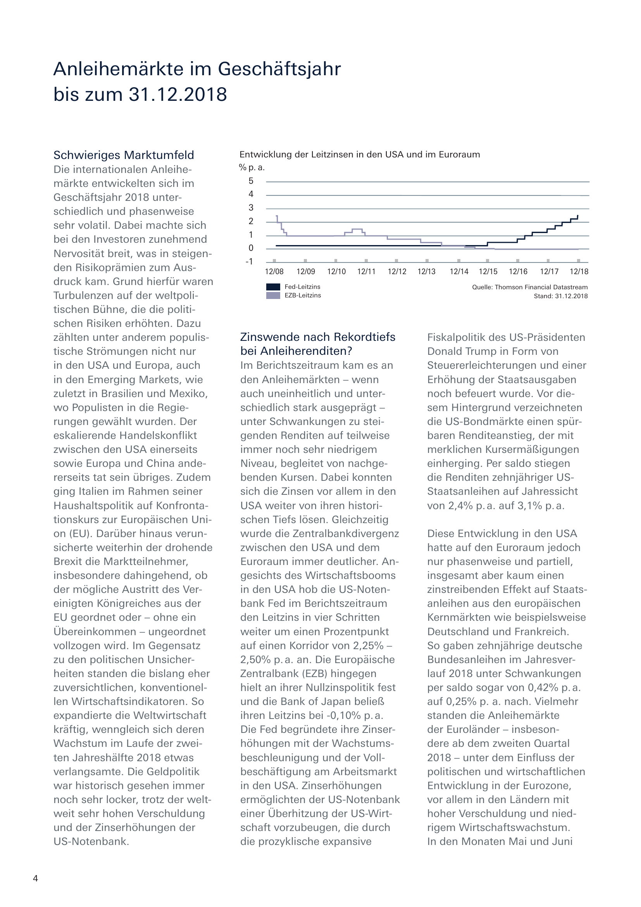

Building a custom pipeline
==========================

The **deep**\ doctection analyzer is an example of a Document Layout
Analysis pipeline. In this tutorial we’ll show you the concepts so that
you can build a pipeline youself.

.. code:: ipython3

    from pathlib import Path
    import deepdoctection as dd

The idea is not that difficult: There are models that fulfill a given
task, there are pipeline components or pipeline backbones that invoke
models and take care of pre- and post-processing results. There are also
pipeline backbones that do not invoke models but only consolidate
results.

And there is the pipeline that puts everything together.

Catalog and registries
----------------------

You can get the essential information for pre-trained model from the
``ModelCatalog``.

.. code:: ipython3

    dd.print_model_infos(add_description=False,add_config=False,add_categories=False)

Let’s select fasttext language detector. We need the categories that the
model predicts and the model wrapper. ``fasttext/lid.176.bin`` is just
an artefact.

.. code:: ipython3

    categories=dd.ModelCatalog.get_profile("fasttext/lid.176.bin").categories

.. code:: ipython3

    dd.ModelCatalog.get_profile("fasttext/lid.176.bin").model_wrapper

.. parsed-literal::

    'FasttextLangDetector'

We can download ``lid.176.bin`` with help of the
``ModelDownloadManager``.

.. code:: ipython3

    path_weights=dd.ModelDownloadManager.maybe_download_weights_and_configs("fasttext/lid.176.bin")

Model wrapper
-------------

We know from the ``ModelCatalog`` which wrapper we must use for the
fasttext model.

.. code:: ipython3

    fast_text = dd.FasttextLangDetector(path_weights, categories)

We are not done yet, because we still need to choose how to extract
text. Let’s simply stick to Tesseract and use the default english
setting.

.. code:: ipython3

    tess_ocr_config_path = dd.get_configs_dir_path() / "dd/conf_tesseract.yaml"  # This file will be in you .cache if you ran the analyzer before. 
    # Otherwise make sure to copy the file from 'configs/conf_tesseract.yaml'
    
    tesseract_ocr = dd.TesseractOcrDetector(tess_ocr_config_path.as_posix())

Pipeline backbone
-----------------

As with models et all. we have a pipeline component registry. Having
this starting point we can select the right backbone. Check the API
documentation to see what the components are used for.

.. code:: ipython3

    dd.pipeline_component_registry.get_all()

.. parsed-literal::

    {'SubImageLayoutService': deepdoctection.pipe.cell.SubImageLayoutService,
     'ImageCroppingService': deepdoctection.pipe.common.ImageCroppingService,
     'MatchingService': deepdoctection.pipe.common.MatchingService,
     'PageParsingService': deepdoctection.pipe.common.PageParsingService,
     'LanguageDetectionService': deepdoctection.pipe.language.LanguageDetectionService,
     'ImageLayoutService': deepdoctection.pipe.layout.ImageLayoutService,
     'LMTokenClassifierService': deepdoctection.pipe.lm.LMTokenClassifierService,
     'LMSequenceClassifierService': deepdoctection.pipe.lm.LMSequenceClassifierService,
     'TableSegmentationRefinementService': deepdoctection.pipe.refine.TableSegmentationRefinementService,
     'TableSegmentationService': deepdoctection.pipe.segment.TableSegmentationService,
     'TextExtractionService': deepdoctection.pipe.text.TextExtractionService,
     'TextOrderService': deepdoctection.pipe.text.TextOrderService,
     'SimpleTransformService': deepdoctection.pipe.transform.SimpleTransformService}

Fasttext language detector
--------------------------

.. code:: ipython3

    lang_detect_comp = dd.LanguageDetectionService(fast_text,text_detector=tesseract_ocr)

We can now build our very simple pipeline.

.. code:: ipython3

    pipe_comp_list = [lang_detect_comp]
    pipe = dd.DoctectionPipe(pipeline_component_list=pipe_comp_list)

.. code:: ipython3

    image_path = Path(dd.get_package_path()) / "notebooks/pics/samples/sample_3" 

When running the pipe, we get the language in which the document was
written.

.. code:: ipython3

    df = pipe.analyze(path=image_path)
    df.reset_state()
    dp = next(iter(df))
    dp.language

When getting the text, the response is somewhat disappointing.

.. code:: ipython3

    dp.text

.. parsed-literal::

    ''

The reason for that is that ``LanguageDetectionService`` is not
responsible for extracting text. It has an OCR model, but the output is
only used as input feed to the language detector. The text however is
not persisted. If we had added a ``TextExtractionService`` before
``LanguageDetectionService`` we could have omitted the OCR model in the
``LanguageDetectionService``.

Tesseract OCR detector
----------------------

.. code:: ipython3

    tesseract_ocr = dd.TesseractOcrDetector(tess_ocr_config_path.as_posix(),["LANGUAGES=deu"])

.. code:: ipython3

    tesseract_ocr.config

.. parsed-literal::

    {'LANGUAGES': 'deu', 'LINES': False, 'psm': 11}

.. code:: ipython3

    # setting run_time_ocr_language_selection=True will dynamically select the OCR model for text extraction based on 
    # the predicted languages. This helps to get much improved OCR results, if you have documents with various languages.
    
    text_comp = dd.TextExtractionService(tesseract_ocr, run_time_ocr_language_selection=True)
    pipe_comp_list.append(text_comp)

.. code:: ipython3

    df = pipe.analyze(path=image_path)
    df.reset_state()
    dp = next(iter(df))
    dp.text

This is something unexpected. Why don’t we generate any text? We can
clearly see that the ``TextExtractionService`` did its job.

.. code:: ipython3

    word_sample = dp.words[0]
    len(dp.words), word_sample.characters, word_sample.bbox, word_sample.reading_order 

.. parsed-literal::

    (553, 'Anleihemärkte', [137.0, 158.0, 472.0, 195.0], None)

Text ordering
-------------

The reason is, that we do not have inferred a reading order. If there is
no reading order, there is no contiguous text. We treat text extraction
as a character recognition problem only. If we want a reading order of
predicted words, we need to do it ourself. So let’s add the
‘TextOrderService’.

.. code:: ipython3

    order_comp = dd.TextOrderService(text_container=dd.LayoutType.word)
    pipe_comp_list.append(order_comp)

At least, we got some text. The beginning sounds good. But once the text
comes to the region where the second and third column also have text
lines, the order service does not distinguish between columns. So we
must identify columns. For that we use the layout analyzer.

.. code:: ipython3

    df = pipe.analyze(path=image_path)
    df.reset_state()
    dp = next(iter(df))
    dp.text

Layout service
--------------

It now depends on whether we use Tensorflow or PyTorch. We opt for
PyTorch, just because the model runs on a CPU. Make sure, that the model
has been loaded to your .cache.

.. code:: ipython3

    path_weights = dd.ModelCatalog.get_full_path_weights("layout/d2_model_0829999_layout_inf_only.pt")
    path_configs = dd.ModelCatalog.get_full_path_configs("layout/d2_model_0829999_layout_inf_only.pt")
    categories = dd.ModelCatalog.get_profile("layout/d2_model_0829999_layout_inf_only.pt").categories
    
    categories

.. parsed-literal::

    {'1': <LayoutType.text>,
     '2': <LayoutType.title>,
     '3': <LayoutType.list>,
     '4': <LayoutType.table>,
     '5': <LayoutType.figure>}

.. code:: ipython3

    layout_detector = dd.D2FrcnnDetector(path_configs,path_weights,categories,device="cpu")
    layout_comp = dd.ImageLayoutService(layout_detector)

We need to make sure, that the ``ImageLayoutService`` has been invoked
before ``TextOrderService``.

.. code:: ipython3

    pipe_comp_list.insert(0,layout_comp)

.. code:: ipython3

    df = pipe.analyze(path=image_path)
    df.reset_state()
    dp = next(iter(df))
    dp.layouts

.. code:: ipython3

    dp.text, dp.layouts[0].text

.. parsed-literal::

    ('', '')

Now this looks weird again, doesn’t it? However the reason is still
quite simple. We now get an empty text string because once we have a
non-empty ``dp.layouts`` the routine responsible for creating
``dp.text`` will try to get the text from the ``Layout``\ ’s. But we
haven’t run any method that maps a ``word`` to some ``Layout`` object.
We need to specify this by applying a ``MatchingService``. We will also
have to slightly change the configuration of the ``TextOrderService``.

.. code:: ipython3

    map_comp = dd.MatchingService(parent_categories=["text","title","list","table","figure"], child_categories=["word"],
                                 matching_rule = 'ioa', threshold=0.6) # same setting as for the deepdoctection analyzer
    
    order_comp = dd.TextOrderService(text_container=dd.LayoutType.word,
                                     floating_text_block_names=["text","title","list", "figure"],
                                     text_block_names=["text","title","list","table","figure"])
    
    pipe_comp_list = [layout_comp, lang_detect_comp, text_comp, map_comp, order_comp]
    pipe = dd.DoctectionPipe(pipeline_component_list=pipe_comp_list)

.. code:: ipython3

    df = pipe.analyze(path=image_path)
    df.reset_state()
    dp = next(iter(df))
    dp.text

Finally, we got it!
