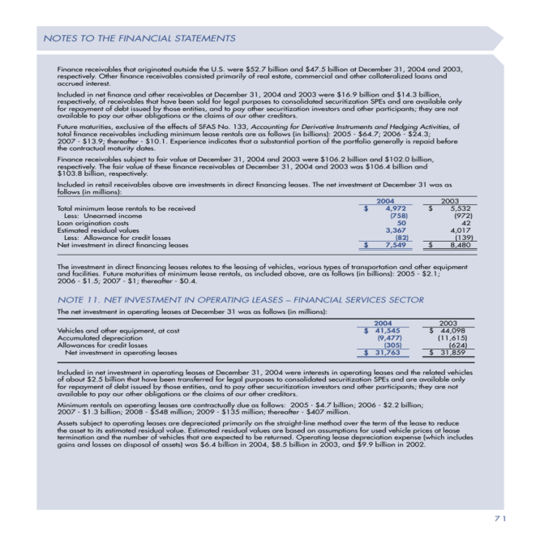

# Datasets, evaluation and fine-tuning.

## Dataset

In **deep**doctection, there is a module `datasets` available that allows you to use some public datasets straight away. They might also help you by providing examples if you want to make your custom dataset ready for **deep**doctection.


```python
import deepdoctection as dd

from matplotlib import pyplot as plt
```

    /home/janis/Documents/Repos/deepdoctection_pt/.venv/lib/python3.9/site-packages/tqdm/auto.py:22: TqdmWarning: IProgress not found. Please update jupyter and ipywidgets. See https://ipywidgets.readthedocs.io/en/stable/user_install.html
      from .autonotebook import tqdm as notebook_tqdm
    [0712 16:32.53 @file_utils.py:36]  INF  PyTorch version 2.1.2+cu121 available.
    [0712 16:32.53 @file_utils.py:74]  INF  Disabling Tensorflow because USE_TORCH is set


Let's print a list of all built-in datasets. 


```python
dd.print_dataset_infos(add_license=False, add_info=False)
```

    ╒════════════════════╕
    │ dataset            │
    ╞════════════════════╡
    │ doclaynet          │
    ├────────────────────┤
    │ doclaynet-seq      │
    ├────────────────────┤
    │ fintabnet          │
    ├────────────────────┤
    │ funsd              │
    ├────────────────────┤
    │ iiitar13k          │
    ├────────────────────┤
    │ testlayout         │
    ├────────────────────┤
    │ publaynet          │
    ├────────────────────┤
    │ pubtables1m_det    │
    ├────────────────────┤
    │ pubtables1m_struct │
    ├────────────────────┤
    │ pubtabnet          │
    ├────────────────────┤
    │ rvl-cdip           │
    ├────────────────────┤
    │ xfund              │
    ╘════════════════════╛


With `get_dataset("doclaynet")` we can create an instance of a built-in dataset.


```python
doclaynet = dd.get_dataset("doclaynet")

print(doclaynet.dataset_info.description)
```

    DocLayNet is a human-annotated document layout segmentation dataset containing 80863 pages from a broad variety of document sources. 
    DocLayNet provides page-by-page layout segmentation ground-truth using bounding-boxes for 11 distinct class labels on 80863 unique pages from 6 document categories. It provides several unique features compared to related work such as PubLayNet or DocBank: 
    Human Annotation: DocLayNet is hand-annotated by well-trained experts, providing a gold-standard in layout segmentation through human recognition and interpretation of each page layout 
    Large layout variability: DocLayNet includes diverse and complex layouts from a large variety of public sources in Finance, Science, Patents, Tenders, Law texts and Manuals 
    Detailed label set: DocLayNet defines 11 class labels to distinguish layout features in high detail. 
    Redundant annotations: A fraction of the pages in DocLayNet are double- or triple-annotated, allowing to estimate annotation uncertainty and an upper-bound of achievable prediction accuracy with ML models Pre-defined train- test- and validation-sets: DocLayNet provides fixed sets for each to ensure proportional representation of the class-labels and avoid leakage of unique layout styles across the sets.


In **deep**doctection there is no function that automatically downloads a dataset from its remote storage. You have to download and unpack it by yourself. Note further, that all datasets are image datasets and in most cases quite large. 

To install the dataset, go to the url below and download the zip-file. 


```python
doclaynet.dataset_info.url
```


    'https://codait-cos-dax.s3.us.cloud-object-storage.appdomain.cloud/dax-doclaynet/1.0.0/DocLayNet_core.zip'


You will have to unzip and place the data set in your local **.cache/deepdoctection/dataset** directory. Once extracted, the dataset will already have the expected folder structure. If you are unsure, however, you can get some additional information about the physical structure by calling the dataset module docstring:


```python
doclaynet.dataflow.get_workdir()
```


    PosixPath('/media/janis/Elements/.cache/deepdoctection/datasets/DocLayNet_core')


```python
print(dd.datasets.instances.doclaynet.__doc__)
```

    
    Module for DocLayNet dataset. Place the dataset as follows
    
        DocLayNet_core
        ├── COCO
        │ ├── test.json
        │ ├── val.json
        ├── PNG
        │ ├── 0a0d43e301facee9e99cc33b9b16e732dd207135f4027e75f6aea2bf117535a2.png
    


## Dataflow

If you know iterable-style datasets in PyTorch you will see that in **deep**doctection samples will be generated in the same fashion. The API differs, though: We will now use the `datasets.dataflow.build` method to display some data points. 

Samples produced by `datasets.dataflow.build` are already in **deep**doctection's data format. 


```python
df = doclaynet.dataflow.build(split="train") # get the dataflow generator
df.reset_state() # an intrinsic dataflow method that must always be called before streaming data. You will get an 
                 # error if you forget to do this.

df_iter = iter(df) 

datapoint = next(df_iter)

datapoint_dict = datapoint.as_dict() # displaying the Image class is very messy

datapoint_dict["file_name"],datapoint_dict["_image_id"], datapoint_dict["annotations"][0]
```

    [0712 16:33.03 @context.py:133]  INF  Loading annotations to memory total: 8.884 sec.
    [0712 16:33.03 @context.py:133]  INF  creating index total: 0.4643 sec.
    [0712 16:33.03 @context.py:133]  INF  Start loading .json file and serializing total: 9.4419 sec.


    ('c6effb847ae7e4a80431696984fa90c98bb08c266481b9a03842422459c43bdd.png',
     '4385125b-dd1e-3025-880f-3311517cc8d5',
     {'active': True,
      'external_id': 0,
      '_annotation_id': '4385125b-dd1e-3025-880f-3311517cc8d5',
      'service_id': None,
      'model_id': None,
      'session_id': None,
      'category_name': <LayoutType.PAGE_HEADER>,
      '_category_name': <LayoutType.PAGE_HEADER>,
      'category_id': 6,
      'score': None,
      'sub_categories': {<DatasetType.PUBLAYNET>: {'active': True,
        'external_id': None,
        '_annotation_id': '4f10073e-a211-3336-8347-8b34e8a2e59a',
        'service_id': None,
        'model_id': None,
        'session_id': None,
        'category_name': <LayoutType.TITLE>,
        '_category_name': <LayoutType.TITLE>,
        'category_id': 11,
        'score': None,
        'sub_categories': {},
        'relationships': {}}},
      'relationships': {},
      'bounding_box': {'absolute_coords': True,
       'ulx': 72.35294285130719,
       'uly': 55.47565740740731,
       'lrx': 444.5686274509804,
       'lry': 75.92855715197959},
      'image': None})


Depending on the data set, different configurations of the `build` method can yield different representations of data points. For example, the underlying image is not loaded by default. Passing the parameter `load_image=True` will load the image.

Note, that all images in **deepdoctection** are loaded using the OpenCV framework, where the default loading setting is `BGR`. Matplotlib (and PIL default-setting) expects a numpy array in `RGB` order, which is why we have to swap dimensions. If you load an image and you want to pass it to **deep**doctection consider only using OpenCV. If you coincidently load the image in `RGB` format you will get much worse results without having any errors.


```python
df = doclaynet.dataflow.build(split="train",load_image=True)
df.reset_state()

df_iter = iter(df)
datapoint = next(df_iter)

plt.figure(figsize = (15,12))
plt.axis('off')
plt.imshow(datapoint.image[:,:,::-1])
```

    [0712 16:33.14 @context.py:133]  INF  Loading annotations to memory total: 10.8108 sec.
    [0712 16:33.15 @context.py:133]  INF  creating index total: 0.4645 sec.
    [0712 16:33.15 @context.py:133]  INF  Start loading .json file and serializing total: 11.4056 sec.

    

    


## Custom dataset

If you bring your own dataset, there is a client-class `CustomDataset` with a simple interface. Please check the [docs](https://deepdoctection.readthedocs.io/en/latest/tutorials/datasets/) to get some help for this class.

## Evaluation

In many situation you are not interested in raw predictions of a model but on results which have been polished through several post-processing steps. In other situations, you want to measure accuracy/precision etc. not after running one but several models. For example, getting the HTML representation of a table requires output from several predictors. Evaluating along a pipeline allows you to see how model prediction(s) and post processing works in conjunction. 

**deep**doctection comes equipped with an Evaluator that allows you to run evaluation not on a model directly but on a pipeline component or a full pipeline.   

Let's take the layout detection model. It has been trained on `Publaynet`, a dataset of images from medical research papers. We will check, how it will perform on `Doclaynet`.  

First we need to set up a pipeline backbone. We use the **Detectron2** framework. With some easy modifications in the code you can easily switch to the **Tensorpack** framework.


```python
config_yaml_path = dd.ModelCatalog.get_full_path_configs("layout/d2_model_0829999_layout_inf_only.pt")
weights_path = dd.ModelCatalog.get_full_path_weights("layout/d2_model_0829999_layout_inf_only.pt")
categories = dd.ModelCatalog.get_profile("layout/d2_model_0829999_layout_inf_only.pt").categories
layout_detector = dd.D2FrcnnDetector(config_yaml_path,weights_path,categories)
layout_service = dd.ImageLayoutService(layout_detector)
```

    [0712 16:33.15 @config.py:66]  WRN  Loading config /media/janis/Elements/.cache/deepdoctection/configs/dd/d2/layout/CASCADE_RCNN_R_50_FPN_GN.yaml with yaml.unsafe_load. Your machine may be at risk if the file contains malicious content.
    [0712 16:33.16 @detection_checkpoint.py:38]  INF  [DetectionCheckpointer] Loading from /media/janis/Elements/.cache/deepdoctection/weights/layout/d2_model_0829999_layout_inf_only.pt ...
    [0712 16:33.16 @checkpoint.py:150]  INF  [Checkpointer] Loading from /media/janis/Elements/.cache/deepdoctection/weights/layout/d2_model_0829999_layout_inf_only.pt ...


Next, we need a metric.


```python
coco_metric = dd.get_metric("coco")
```

Now for the dataset. Doclaynet has several other labels but there is a mapping that collapses all doclaynet labels into publaynet labels. Let's see how to invoke this mapping. Datasets have a categories object:


```python
doclaynet.dataflow.categories.get_categories()
```


    {1: <LayoutType.CAPTION>,
     2: <LayoutType.FOOTNOTE>,
     3: <LayoutType.FORMULA>,
     4: <LayoutType.LIST>,
     5: <LayoutType.PAGE_FOOTER>,
     6: <LayoutType.PAGE_HEADER>,
     7: <LayoutType.FIGURE>,
     8: <LayoutType.SECTION_HEADER>,
     9: <LayoutType.TABLE>,
     10: <LayoutType.TEXT>,
     11: <LayoutType.TITLE>}


```python
cat_to_sub_cat = doclaynet.dataflow.categories.get_sub_categories()
cat_to_sub_cat = {key:val[0] for key, val in cat_to_sub_cat.items()}
cat_to_sub_cat
```


    {<LayoutType.CAPTION>: <DatasetType.PUBLAYNET>,
     <LayoutType.FOOTNOTE>: <DatasetType.PUBLAYNET>,
     <LayoutType.FORMULA>: <DatasetType.PUBLAYNET>,
     <LayoutType.LIST>: <DatasetType.PUBLAYNET>,
     <LayoutType.PAGE_FOOTER>: <DatasetType.PUBLAYNET>,
     <LayoutType.PAGE_HEADER>: <DatasetType.PUBLAYNET>,
     <LayoutType.FIGURE>: <DatasetType.PUBLAYNET>,
     <LayoutType.SECTION_HEADER>: <DatasetType.PUBLAYNET>,
     <LayoutType.TABLE>: <DatasetType.PUBLAYNET>,
     <LayoutType.TEXT>: <DatasetType.PUBLAYNET>,
     <LayoutType.TITLE>: <DatasetType.PUBLAYNET>}


The sub category `publaynet` provides the mapping into `publaynet` labels. Let's use them.


```python
doclaynet.dataflow.categories.set_cat_to_sub_cat(cat_to_sub_cat)
```

Now, that dataset, pipeline component and metric have been setup, we can build the evaluator.


```python
evaluator = dd.Evaluator(doclaynet,layout_service, coco_metric)
```

    [0712 16:33.16 @eval.py:112]  INF  Building multi threading pipeline component to increase prediction throughput. Using 2 threads
    [0712 16:33.16 @config.py:66]  WRN  Loading config /media/janis/Elements/.cache/deepdoctection/configs/dd/d2/layout/CASCADE_RCNN_R_50_FPN_GN.yaml with yaml.unsafe_load. Your machine may be at risk if the file contains malicious content.
    [0712 16:33.17 @detection_checkpoint.py:38]  INF  [DetectionCheckpointer] Loading from /media/janis/Elements/.cache/deepdoctection/weights/layout/d2_model_0829999_layout_inf_only.pt ...
    [0712 16:33.17 @checkpoint.py:150]  INF  [Checkpointer] Loading from /media/janis/Elements/.cache/deepdoctection/weights/layout/d2_model_0829999_layout_inf_only.pt ...


We start evaluation using the `run` method. `max_datapoints` limits the number of samples to at most 100 samples. The `val` split is used by default.


```python
evaluator = dd.Evaluator(doclaynet,layout_service, coco_metric)
output= evaluator.run(max_datapoints=100)
```

    [0712 16:33.17 @eval.py:112]  INF  Building multi threading pipeline component to increase prediction throughput. Using 2 threads
    [0712 16:33.17 @config.py:66]  WRN  Loading config /media/janis/Elements/.cache/deepdoctection/configs/dd/d2/layout/CASCADE_RCNN_R_50_FPN_GN.yaml with yaml.unsafe_load. Your machine may be at risk if the file contains malicious content.
    [0712 16:33.18 @detection_checkpoint.py:38]  INF  [DetectionCheckpointer] Loading from /media/janis/Elements/.cache/deepdoctection/weights/layout/d2_model_0829999_layout_inf_only.pt ...
    [0712 16:33.18 @checkpoint.py:150]  INF  [Checkpointer] Loading from /media/janis/Elements/.cache/deepdoctection/weights/layout/d2_model_0829999_layout_inf_only.pt ...
    [0712 16:33.19 @context.py:133]  INF  Loading annotations to memory total: 0.5808 sec.
    [0712 16:33.19 @context.py:133]  INF  creating index total: 0.0468 sec.
    100%|#####################################################################################################################################################################################################################################################################################################################|6489/6489[00:00<00:00,1460365.87it/s]
    [0712 16:33.19 @context.py:133]  INF  Start loading .json file and serializing total: 0.6359 sec.
    [0712 16:33.19 @context.py:133]  INF  Loading annotations to memory total: 0.6267 sec.
    [0712 16:33.19 @context.py:133]  INF  creating index total: 0.0433 sec.
    100%|#####################################################################################################################################################################################################################################################################################################################|6489/6489[00:00<00:00,1384446.75it/s]
    [0712 16:33.19 @context.py:133]  INF  Start loading .json file and serializing total: 0.6811 sec. 


    creating index...
    index created!
    creating index...
    index created!
    Running per image evaluation...
    Evaluate annotation type *bbox*
    DONE (t=0.12s).
    Accumulating evaluation results...
    DONE (t=0.03s).
     Average Precision  (AP) @[ IoU=0.50:0.95 | area=   all | maxDets=100 ] = 0.147
     Average Precision  (AP) @[ IoU=0.50      | area=   all | maxDets=100 ] = 0.195
     Average Precision  (AP) @[ IoU=0.75      | area=   all | maxDets=100 ] = 0.144
     Average Precision  (AP) @[ IoU=0.50:0.95 | area= small | maxDets=100 ] = 0.010
     Average Precision  (AP) @[ IoU=0.50:0.95 | area=medium | maxDets=100 ] = 0.022
     Average Precision  (AP) @[ IoU=0.50:0.95 | area= large | maxDets=100 ] = 0.200
     Average Recall     (AR) @[ IoU=0.50:0.95 | area=   all | maxDets=  1 ] = 0.100
     Average Recall     (AR) @[ IoU=0.50:0.95 | area=   all | maxDets= 10 ] = 0.171
     Average Recall     (AR) @[ IoU=0.50:0.95 | area=   all | maxDets=100 ] = 0.174
     Average Recall     (AR) @[ IoU=0.50:0.95 | area= small | maxDets=100 ] = 0.009
     Average Recall     (AR) @[ IoU=0.50:0.95 | area=medium | maxDets=100 ] = 0.031
     Average Recall     (AR) @[ IoU=0.50:0.95 | area= large | maxDets=100 ] = 0.231


The result shows that Doclaynet has a very different layout compared to Publaynet where the model has been trained on. To get a feeling, results on the Publaynet test split are in the range of 0.9+ !


```python
import tabulate

header = output[0].keys()
rows =  [x.values() for x in output]
print(tabulate.tabulate(rows, header))
```

      ap  iouThr    areaRng      maxDets  mode           val
    ----  --------  ---------  ---------  ------  ----------
       1            all              100  bbox    0.146865
       1  0.5       all              100  bbox    0.195227
       1  0.75      all              100  bbox    0.143791
       1            small            100  bbox    0.00988449
       1            medium           100  bbox    0.0219617
       1            large            100  bbox    0.199536
       0            all                1  bbox    0.100273
       0            all               10  bbox    0.170546
       0            all              100  bbox    0.173715
       0            small            100  bbox    0.0092514
       0            medium           100  bbox    0.0306123
       0            large            100  bbox    0.231041


## Fine tuning

You can fine-tune most models to improve accuracy/precision/recall on your data. There are some training scripts available that you can use straight away. The configuration below gives you a decent fine tuning training schedule. For more information about the config, check the docs for **Detectron2**. 


```python
config_overwrite=["SOLVER.MAX_ITER=100000",    # Tensorpack equivalent:  TRAIN.LR_SCHEDULE=[100000]
                  "TEST.EVAL_PERIOD=20000",                           #  TRAIN.EVAL_PERIOD=40 (run a 500 samples * 40) 
                  "SOLVER.CHECKPOINT_PERIOD=20000",                   #  TRAIN.CHECKPOINT_PERIOD=40
                  "MODEL.BACKBONE.FREEZE_AT=0",                       #  BACKBONE.FREEZE_AT=0 (train the every layer of the backbone and do not freeze the bottom layers)
                  "SOLVER.BASE_LR=1e-3",                              #  TRAIN.BASE_LR=1e-3
                  "SOLVER.IMS_PER_BATCH=2"]                           # no equivalent.    

# if you encounter CUDA out of memory, reduce SOLVER.IMS_PER_BATCH to 1

build_train_config = ["max_datapoints=86000"]  # you can also change the setting if you want to train with less sample
```


```python
dd.train_d2_faster_rcnn(path_config_yaml=config_yaml_path,
                  dataset_train= doclaynet,
                  path_weights=weights_path,
                  config_overwrite=config_overwrite,
                  log_dir="/path/to/dir",
                  build_train_config=build_train_config,
                  dataset_val=doclaynet,
                  build_val_config=None,
                  metric=coco_metric,
                  pipeline_component_name="ImageLayoutService"
                 )
```


     |  category  | #box   |  category  | #box   |  category  | #box   |
    |:----------:|:-------|:----------:|:-------|:----------:|:-------|
    |   figure   | 39667  |   table    | 30070  |    list    | 161818 |
    |   title    | 171000 |    text    | 538568 |            |        |
    |   total    | 941123 |            |        |            |        |

     CUDNN_BENCHMARK: False
    DATALOADER:
      ASPECT_RATIO_GROUPING: True
      FILTER_EMPTY_ANNOTATIONS: True
      NUM_WORKERS: 4
      REPEAT_SQRT: True
      REPEAT_THRESHOLD: 0.0
      SAMPLER_TRAIN: TrainingSampler
    DATASETS:
      PRECOMPUTED_PROPOSAL_TOPK_TEST: 1000
      PRECOMPUTED_PROPOSAL_TOPK_TRAIN: 2000
      PROPOSAL_FILES_TEST: ()
      PROPOSAL_FILES_TRAIN: ()
      TEST: ('doclaynet',)
      TRAIN: ('doclaynet',)
    GLOBAL:
      HACK: 1.0
    INPUT:
      CROP:
        ENABLED: False
        SIZE: [0.9, 0.9]
        TYPE: relative_range
      FORMAT: BGR
      MASK_FORMAT: polygon
      MAX_SIZE_TEST: 1333
      MAX_SIZE_TRAIN: 1333
      MIN_SIZE_TEST: 800
      MIN_SIZE_TRAIN: (800, 1200)
      MIN_SIZE_TRAIN_SAMPLING: choice
      RANDOM_FLIP: horizontal
    MODEL:
      ANCHOR_GENERATOR:
        ANGLES: [[-90, 0, 90]]
        ASPECT_RATIOS: [[0.5, 1.0, 2.0]]
        NAME: DefaultAnchorGenerator
        OFFSET: 0.0
        SIZES: [[32], [64], [128], [256], [512]]
      BACKBONE:
        FREEZE_AT: 0
        NAME: build_resnet_fpn_backbone
      DEVICE: cuda
      FPN:
        FUSE_TYPE: sum
        IN_FEATURES: ['res2', 'res3', 'res4', 'res5']
        NORM: GN
        OUT_CHANNELS: 256
      KEYPOINT_ON: False
      LOAD_PROPOSALS: False
      MASK_ON: False
      META_ARCHITECTURE: GeneralizedRCNN
      PANOPTIC_FPN:
        COMBINE:
          ENABLED: True
          INSTANCES_CONFIDENCE_THRESH: 0.5
          OVERLAP_THRESH: 0.5
          STUFF_AREA_LIMIT: 4096
        INSTANCE_LOSS_WEIGHT: 1.0
      PIXEL_MEAN: [238.234, 238.14, 238.145]
      PIXEL_STD: [7.961, 7.876, 7.81]
      PROPOSAL_GENERATOR:
        MIN_SIZE: 0
        NAME: RPN
      RESNETS:
        DEFORM_MODULATED: False
        DEFORM_NUM_GROUPS: 1
        DEFORM_ON_PER_STAGE: [False, False, False, False]
        DEPTH: 50
        NORM: GN
        NUM_GROUPS: 32
        OUT_FEATURES: ['res2', 'res3', 'res4', 'res5']
        RES2_OUT_CHANNELS: 256
        RES5_DILATION: 1
        STEM_OUT_CHANNELS: 64
        STRIDE_IN_1X1: False
        WIDTH_PER_GROUP: 4
      RETINANET:
        BBOX_REG_LOSS_TYPE: smooth_l1
        BBOX_REG_WEIGHTS: (1.0, 1.0, 1.0, 1.0)
        FOCAL_LOSS_ALPHA: 0.25
        FOCAL_LOSS_GAMMA: 2.0
        IN_FEATURES: ['p3', 'p4', 'p5', 'p6', 'p7']
        IOU_LABELS: [0, -1, 1]
        IOU_THRESHOLDS: [0.4, 0.5]
        NMS_THRESH_TEST: 0.5
        NORM: 
        NUM_CLASSES: 80
        NUM_CONVS: 4
        PRIOR_PROB: 0.01
        SCORE_THRESH_TEST: 0.05
        SMOOTH_L1_LOSS_BETA: 0.1
        TOPK_CANDIDATES_TEST: 1000
      ROI_BOX_CASCADE_HEAD:
        BBOX_REG_WEIGHTS: ((10.0, 10.0, 5.0, 5.0), (20.0, 20.0, 10.0, 10.0), (30.0, 30.0, 15.0, 15.0))
        IOUS: (0.5, 0.6, 0.7)
      ROI_BOX_HEAD:
        BBOX_REG_LOSS_TYPE: smooth_l1
        BBOX_REG_LOSS_WEIGHT: 1.0
        BBOX_REG_WEIGHTS: (10.0, 10.0, 5.0, 5.0)
        CLS_AGNOSTIC_BBOX_REG: True
        CONV_DIM: 256
        FC_DIM: 1024
        FED_LOSS_FREQ_WEIGHT_POWER: 0.5
        FED_LOSS_NUM_CLASSES: 50
        NAME: FastRCNNConvFCHead
        NORM: 
        NUM_CONV: 0
        NUM_FC: 2
        POOLER_RESOLUTION: 7
        POOLER_SAMPLING_RATIO: 0
        POOLER_TYPE: ROIAlignV2
        SMOOTH_L1_BETA: 0.0
        TRAIN_ON_PRED_BOXES: False
        USE_FED_LOSS: False
        USE_SIGMOID_CE: False
      ROI_HEADS:
        BATCH_SIZE_PER_IMAGE: 512
        IN_FEATURES: ['p2', 'p3', 'p4', 'p5']
        IOU_LABELS: [0, 1]
        IOU_THRESHOLDS: [0.5]
        NAME: CascadeROIHeads
        NMS_THRESH_TEST: 0.001
        NUM_CLASSES: 5
        POSITIVE_FRACTION: 0.25
        PROPOSAL_APPEND_GT: True
        SCORE_THRESH_TEST: 0.1
      ROI_KEYPOINT_HEAD:
        CONV_DIMS: (512, 512, 512, 512, 512, 512, 512, 512)
        LOSS_WEIGHT: 1.0
        MIN_KEYPOINTS_PER_IMAGE: 1
        NAME: KRCNNConvDeconvUpsampleHead
        NORMALIZE_LOSS_BY_VISIBLE_KEYPOINTS: True
        NUM_KEYPOINTS: 17
        POOLER_RESOLUTION: 14
        POOLER_SAMPLING_RATIO: 0
        POOLER_TYPE: ROIAlignV2
      ROI_MASK_HEAD:
        CLS_AGNOSTIC_MASK: False
        CONV_DIM: 256
        NAME: MaskRCNNConvUpsampleHead
        NORM: 
        NUM_CONV: 4
        POOLER_RESOLUTION: 14
        POOLER_SAMPLING_RATIO: 0
        POOLER_TYPE: ROIAlignV2
      RPN:
        BATCH_SIZE_PER_IMAGE: 256
        BBOX_REG_LOSS_TYPE: smooth_l1
        BBOX_REG_LOSS_WEIGHT: 1.0
        BBOX_REG_WEIGHTS: (1.0, 1.0, 1.0, 1.0)
        BOUNDARY_THRESH: -1
        CONV_DIMS: [-1]
        HEAD_NAME: StandardRPNHead
        IN_FEATURES: ['p2', 'p3', 'p4', 'p5', 'p6']
        IOU_LABELS: [0, -1, 1]
        IOU_THRESHOLDS: [0.3, 0.7]
        LOSS_WEIGHT: 1.0
        NMS_THRESH: 0.7
        POSITIVE_FRACTION: 0.5
        POST_NMS_TOPK_TEST: 1000
        POST_NMS_TOPK_TRAIN: 1000
        PRE_NMS_TOPK_TEST: 1000
        PRE_NMS_TOPK_TRAIN: 2000
        SMOOTH_L1_BETA: 0.0
      SEM_SEG_HEAD:
        COMMON_STRIDE: 4
        CONVS_DIM: 128
        IGNORE_VALUE: 255
        IN_FEATURES: ['p2', 'p3', 'p4', 'p5']
        LOSS_WEIGHT: 1.0
        NAME: SemSegFPNHead
        NORM: GN
        NUM_CLASSES: 54
      WEIGHTS: /media/janis/Elements/.cache/deepdoctection/weights/layout/d2_model_0829999_layout_inf_only.pt
    NMS_THRESH_CLASS_AGNOSTIC: 0.001
    OUTPUT_DIR: /home/janis/Documents/Experiments/Tests/
    SEED: -1
    SOLVER:
      AMP:
        ENABLED: False
      BASE_LR: 0.001
      BASE_LR_END: 0.0
      BIAS_LR_FACTOR: 1.0
      CHECKPOINT_PERIOD: 20000
      CLIP_GRADIENTS:
        CLIP_TYPE: value
        CLIP_VALUE: 1.0
        ENABLED: False
        NORM_TYPE: 2.0
      GAMMA: 0.1
      IMS_PER_BATCH: 2
      LR_SCHEDULER_NAME: WarmupMultiStepLR
      MAX_ITER: 100000
      MOMENTUM: 0.9
      NESTEROV: False
      NUM_DECAYS: 3
      REFERENCE_WORLD_SIZE: 0
      RESCALE_INTERVAL: False
      STEPS: (60000, 80000)
      WARMUP_FACTOR: 0.001
      WARMUP_ITERS: 1000
      WARMUP_METHOD: linear
      WEIGHT_DECAY: 0.0001
      WEIGHT_DECAY_BIAS: None
      WEIGHT_DECAY_NORM: 0.0
    TEST:
      AUG:
        ENABLED: False
        FLIP: True
        MAX_SIZE: 4000
        MIN_SIZES: (400, 500, 600, 700, 800, 900, 1000, 1100, 1200)
      DETECTIONS_PER_IMAGE: 100
      DO_EVAL: True
      EVAL_PERIOD: 20000
      EXPECTED_RESULTS: []
      KEYPOINT_OKS_SIGMAS: []
      PRECISE_BN:
        ENABLED: False
        NUM_ITER: 200
    VERSION: 2
    VIS_PERIOD: 0
    WANDB:
      PROJECT: None
      REPO: deepdoctection
      USE_WANDB: False
    


If you fine tune the model with this setting you can increase mAP/mAR to a region of 0.75.  

If you want to see how you can train a model on two datasets like Publaynet and Doclaynet to increase the variance
the in distribution check the documentation [here](https://deepdoctection.readthedocs.io/en/latest/tutorials/training_and_logging/) to get some guidance
