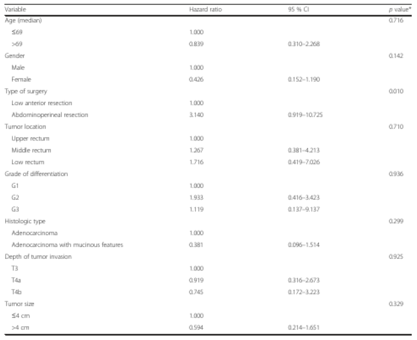

Datasets and Evaluation
=======================

In this tutorial we will introduce the concept of a data set.

Then we will show how to evaluate a predictor with respect to a dataset
and a metric.

**Caution!** This notebook will run only when at least the extended
package **‘tf-full’, ‘source-tf-full’** has been installed! Check the
installation guidelines or the README for further informations. You will
need to modify the script accordingly to run it with the PyTorch
framework.

Dataset concept
---------------

A dataset is a class that consists of an info class, a category and a
dataflow class. The dataflow class can be used to stream data point
samples. Data points are image scans or single page pdfs from documents.

Data points are represented as ``Image`` class. This class has specific
attributes to store several types of annotations. These annotations can
be objects that determine the layout structure, like tables or table
cells, words etc. Annotations are represented by another class
``ImageAnnotation`` that has attributes like bounding boxes, category
names among other things.

Dataflow is package that can be used to load and process data. Dataflow
is a package that allows you to build chains of generators. Each
dataflow chain member can be used to perform some specific tasks such as
loading a or transforming a data point.

.. code:: ipython3

    import deepdoctection as dd
    
    from matplotlib import pyplot as plt

Let’s print a list of all built-in datasets.

.. code:: ipython3

    dd.print_dataset_infos(add_license=False, add_info=False)

.. parsed-literal::

    ╒═══════════════╕
    │ dataset       │
    ╞═══════════════╡
    │ doclaynet     │
    ├───────────────┤
    │ doclaynet-seq │
    ├───────────────┤
    │ fintabnet     │
    ├───────────────┤
    │ funsd         │
    ├───────────────┤
    │ iiitar13k     │
    ├───────────────┤
    │ testlayout    │
    ├───────────────┤
    │ publaynet     │
    ├───────────────┤
    │ pubtables1m   │
    ├───────────────┤
    │ pubtabnet     │
    ├───────────────┤
    │ rvl-cdip      │
    ├───────────────┤
    │ xfund         │
    ╘═══════════════╛

With ``get_dataset("pubtabnet")`` we can create an instance of a
built-in dataset.

.. code:: ipython3

    pubtabnet = dd.get_dataset("pubtabnet")
    
    print(pubtabnet.dataset_info.description)

.. parsed-literal::

    PubTabNet is a large dataset for image-based table recognition, containing 568k+ images of 
    tabular data annotated with the corresponding HTML representation of the tables. The table images 
     are extracted from the scientific publications included in the PubMed Central Open Access Subset 
     (commercial use collection). Table regions are identified by matching the PDF format and 
     the XML format of the articles in the PubMed Central Open Access Subset. More details are 
     available in our paper 'Image-based table recognition: data, model, and evaluation'. 
    Pubtabnet can be used for training cell detection models as well as for semantic table 
    understanding algorithms. For detection it has cell bounding box annotations as 
    well as precisely described table semantics like row - and column numbers and row and col spans. 
    Moreover, every cell can be classified as header or non-header cell. The dataflow builder can also 
    return captions of bounding boxes of rows and columns. Moreover, various filter conditions on 
    the table structure are available: maximum cell numbers, maximal row and column numbers and their 
    minimum equivalents can be used as filter condition

To install the data set, go to the url below and download the zip-file.

.. code:: ipython3

    pubtabnet.dataset_info.url

.. parsed-literal::

    'https://dax-cdn.cdn.appdomain.cloud/dax-pubtabnet/2.0.0/pubtabnet.tar.gz?_ga=2.267291150.146828643.1629125962-1173244232.1625045842'

You will have to unzip and place the data set in your local
**.cache/deepdoctection/dataset** directory. Once extracted, the dataset
will already have the expected folder structure. If you are unsure,
however, you can get some additional information about the physical
structure by calling the dataset module docstring:

.. code:: ipython3

    pubtabnet.dataflow.get_workdir()

.. code:: ipython3

    print(dd.datasets.instances.pubtabnet.__doc__)

.. parsed-literal::

    
    Module for Pubtabnet dataset. Place the dataset as follows
    
    |    pubtabnet
    |    ├── test
    |    │ ├── PMC1.png
    |    ├── train
    |    │ ├── PMC2.png
    |    ├── val
    |    │ ├── PMC3.png
    |    ├── PubTabNet_2.0.0.jsonl
    

Dataflow
--------

We will now use the ``build`` method to display some data points. As
already mentioned, the ``build`` method returns a generator from which
you can create an iterator to stream your data.

Let’s display a tiny fraction of annotations that is available for each
datapoint. ``datapoint_dict["annotations"][0]`` displays all
informations that are available for a single cell. There is a
``category_name`` represented as ``Enum`` member. There is also a
``bounding_box`` and a dict called ``sub_categories`` that carries
additional information relevant to a cell like ``CellType.row_number``.

.. code:: ipython3

    df = pubtabnet.dataflow.build(split="train") # get the dataflow generator
    df.reset_state() # an intrinsic dataflow method that must always be called before streaming data. You will get an 
                     # error if you forget to do this.
    
    df_iter = iter(df) 
    
    datapoint = next(df_iter)
    
    datapoint_dict = datapoint.as_dict() # displaying the Image class is very messy
    
    datapoint_dict["file_name"],datapoint_dict["location"],datapoint_dict["_image_id"], datapoint_dict["annotations"][0]

.. parsed-literal::

    ('PMC4840965_004_00.png',
     PosixPath('/home/janis/.cache/deepdoctection/datasets/pubtabnet/train/PMC4840965_004_00.png'),
     'c87ee674-4ddc-3efe-a74e-dfe25da5d7b3',
     {'active': True,
      'external_id': None,
      '_annotation_id': '6a421e4d-143a-3ede-8494-9fbf5e8ef8b8',
      'category_name': <LayoutType.cell>,
      '_category_name': <LayoutType.cell>,
      'category_id': '1',
      'score': None,
      'sub_categories': {<CellType.row_number>: {'active': True,
        'external_id': None,
        '_annotation_id': 'fcbd492e-4fe1-3185-b8d6-fd0027e1957a',
        'category_name': <CellType.row_number>,
        '_category_name': <CellType.row_number>,
        'category_id': '28',
        'score': None,
        'sub_categories': {},
        'relationships': {}},
       <CellType.column_number>: {'active': True,
        'external_id': None,
        '_annotation_id': '1009bea2-272c-3a4b-abee-5e90a1d9c460',
        'category_name': <CellType.column_number>,
        '_category_name': <CellType.column_number>,
        'category_id': '3',
        'score': None,
        'sub_categories': {},
        'relationships': {}},
       <CellType.row_span>: {'active': True,
        'external_id': None,
        '_annotation_id': '1e9b989b-06c4-388d-956a-83acbc782247',
        'category_name': <CellType.row_span>,
        '_category_name': <CellType.row_span>,
        'category_id': '1',
        'score': None,
        'sub_categories': {},
        'relationships': {}},
       <CellType.column_span>: {'active': True,
        'external_id': None,
        '_annotation_id': '0866c7eb-32ff-3554-ae39-5c20567261c2',
        'category_name': <CellType.column_span>,
        '_category_name': <CellType.column_span>,
        'category_id': '1',
        'score': None,
        'sub_categories': {},
        'relationships': {}},
       <CellType.header>: {'active': True,
        'external_id': None,
        '_annotation_id': 'e0e7178a-b75b-34dd-8a1e-a7e62ed1e3b8',
        'category_name': <CellType.body>,
        '_category_name': <CellType.body>,
        'category_id': '',
        'score': None,
        'sub_categories': {},
        'relationships': {}}},
      'relationships': {},
      'bounding_box': {'absolute_coords': True,
       'ulx': 336.0,
       'uly': 381.0,
       'lrx': 376.0,
       'lry': 391.0},
      'image': None})

Depending on the data set, different configurations of the ``build``
method can yield different representations of data points. For example,
the underlying image is not loaded by default. By passing the parameter
``load_image=True`` the image will be loaded.

Note, that all images are loaded using the OpenCV framework, where
colors are stored as array in BGR format. Matplotlib expects a numpy
array in RGB order, which is why we have to swap dimensions.

.. code:: ipython3

    df = pubtabnet.dataflow.build(split="train",load_image=True)
    df.reset_state()
    
    df_iter = iter(df)
    datapoint = next(df_iter)
    
    plt.figure(figsize = (15,12))
    plt.axis('off')
    plt.imshow(datapoint.image[:,:,::-1])

It is possible to change the representation of a data point as already
mentioned. For example, one can replace the category of an annotation
with one of its sub-categories.

Looking at this dataset, each cell has as a sub-category, stating if it
is a table-header or a table-body cell. Using the method
``dataflow.categories.set_cat_to_sub_cat`` the main category can be
replaced by one of its sub categories.

.. code:: ipython3

    pubtabnet.dataflow.categories.set_cat_to_sub_cat({"CELL":"HEADER"})
    df = pubtabnet.dataflow.build(split="train")
    df.reset_state()
    
    df_iter = iter(df)
    datapoint = next(df_iter)
    
    datapoint_dict = datapoint.as_dict()
    datapoint_dict["file_name"],datapoint_dict["location"],datapoint_dict["_image_id"], datapoint_dict["annotations"][0]

.. parsed-literal::

    ('PMC4840965_004_00.png',
     PosixPath('/home/janis/.cache/deepdoctection/datasets/pubtabnet/train/PMC4840965_004_00.png'),
     'c87ee674-4ddc-3efe-a74e-dfe25da5d7b3',
     {'active': True,
      'external_id': None,
      '_annotation_id': '6a421e4d-143a-3ede-8494-9fbf5e8ef8b8',
      'category_name': <CellType.body>,
      '_category_name': <CellType.body>,
      'category_id': '2',
      'score': None,
      'sub_categories': {<CellType.row_number>: {'active': True,
        'external_id': None,
        '_annotation_id': 'fcbd492e-4fe1-3185-b8d6-fd0027e1957a',
        'category_name': <CellType.row_number>,
        '_category_name': <CellType.row_number>,
        'category_id': '28',
        'score': None,
        'sub_categories': {},
        'relationships': {}},
       <CellType.column_number>: {'active': True,
        'external_id': None,
        '_annotation_id': '1009bea2-272c-3a4b-abee-5e90a1d9c460',
        'category_name': <CellType.column_number>,
        '_category_name': <CellType.column_number>,
        'category_id': '3',
        'score': None,
        'sub_categories': {},
        'relationships': {}},
       <CellType.row_span>: {'active': True,
        'external_id': None,
        '_annotation_id': '1e9b989b-06c4-388d-956a-83acbc782247',
        'category_name': <CellType.row_span>,
        '_category_name': <CellType.row_span>,
        'category_id': '1',
        'score': None,
        'sub_categories': {},
        'relationships': {}},
       <CellType.column_span>: {'active': True,
        'external_id': None,
        '_annotation_id': '0866c7eb-32ff-3554-ae39-5c20567261c2',
        'category_name': <CellType.column_span>,
        '_category_name': <CellType.column_span>,
        'category_id': '1',
        'score': None,
        'sub_categories': {},
        'relationships': {}},
       <CellType.header>: {'active': True,
        'external_id': None,
        '_annotation_id': 'e0e7178a-b75b-34dd-8a1e-a7e62ed1e3b8',
        'category_name': <CellType.body>,
        '_category_name': <CellType.body>,
        'category_id': '',
        'score': None,
        'sub_categories': {},
        'relationships': {}}},
      'relationships': {},
      'bounding_box': {'absolute_coords': True,
       'ulx': 336.0,
       'uly': 381.0,
       'lrx': 376.0,
       'lry': 391.0},
      'image': None})

This data set was used to train the cell detector of the
**dd-analyzer**.

In the section that follows now, we will show how to measure the
performance of the detector on the Pubtabnet validation split. After
that, we are going to measure the performance on another dataset that
has documents from a different domain.

Evaluation
----------

In many situation you are not interested in raw predictions of a model
but on results which have been polished through several post-processing
steps. In other situations, you want to measure accuracy/precision etc.
not after running one but several models. For example, getting the html
representation of a table requires output from several predictors.
Evaluating along a pipeline allows you to see how model prediction(s)
and post processing works in conjunction. **deep**\ doctection therefore
comes equipped with an evaluator that allows you to run evaluation not
on a model directly but on a pipeline component or a full pipeline.

An evaluator needs three things to be constructed:

-  a dataset
-  a pipeline component or a pipeline and
-  a metric.

In this notebook, we are going to evaluate the cell prediction model run
on the Pubtabnet evaluation split. We measure performance using mean
average precision/ mean average recall. This metric has been implemented
by pycocotools. In contrast to traditional object detection task we need
to consider that

-  objects to be identified are generally smaller
-  there are many objects to identify.

Therefore, we change the maximum number of detections to consider and
also choose a different scale for grouping cells into one of the
categories: small, medium and large.

.. code:: ipython3

    config_yaml_path = dd.ModelCatalog.get_full_path_configs("cell/model-1800000.data-00000-of-00001")
    weights_path = dd.ModelCatalog.get_full_path_weights("cell/model-1800000.data-00000-of-00001")

.. code:: ipython3

    coco_metric = dd.get_metric("coco")
    coco_metric.set_params(max_detections=[50,200,600], area_range=[[0,1000000],[0,200],[200,800],[800,1000000]])

Pubtabnet does not only have ground truth for cells but also for rows
and columns. As our model only predicts cells we need to filter out
ground truth for objects that cannot be detected by the model.

.. code:: ipython3

    pubtabnet = dd.get_dataset("pubtabnet")
    pubtabnet.dataflow.categories.filter_categories(categories="CELL")
    categories = pubtabnet.dataflow.categories.get_categories(filtered=True) # this will return a dict {"1": <LayoutType.cell>}
    
    cell_detector = dd.TPFrcnnDetector(config_yaml_path,weights_path,categories)
    layout_service = dd.ImageLayoutService(cell_detector)

We start evaluation using the ``run`` method. ``max_datapoints`` limits
the number of samples to at most 100 samples. The ``val`` split is used
by default.

.. code:: ipython3

    evaluator = dd.Evaluator(pubtabnet,layout_service, coco_metric)
    output= evaluator.run(max_datapoints=100)

.. parsed-literal::

   Average Precision  (AP) @[ IoU=0.50:0.95 | area=   all | maxDets=100 ] = -1.000
   Average Precision  (AP) @[ IoU=0.50      | area=   all | maxDets=600 ] = 0.970
   Average Precision  (AP) @[ IoU=0.75      | area=   all | maxDets=600 ] = 0.948
   Average Precision  (AP) @[ IoU=0.50:0.95 | area= small | maxDets=600 ] = 0.817
   Average Precision  (AP) @[ IoU=0.50:0.95 | area=medium | maxDets=600 ] = 0.860
   Average Precision  (AP) @[ IoU=0.50:0.95 | area= large | maxDets=600 ] = 0.840
   Average Recall     (AR) @[ IoU=0.50:0.95 | area=   all | maxDets= 50 ] = 0.538
   Average Recall     (AR) @[ IoU=0.50:0.95 | area=   all | maxDets=200 ] = 0.864
   Average Recall     (AR) @[ IoU=0.50:0.95 | area=   all | maxDets=600 ] = 0.874
   Average Recall     (AR) @[ IoU=0.50:0.95 | area= small | maxDets=600 ] = 0.852
   Average Recall     (AR) @[ IoU=0.50:0.95 | area=medium | maxDets=600 ] = 0.891
   Average Recall     (AR) @[ IoU=0.50:0.95 | area= large | maxDets=600 ] = 0.864

We are now going to evaluate the cell predictor on tables from business
documents. One difference from the example before is the representation
of the dataset. Unlike Pubtabnet where tables have been cropped from
their surronding document, the images of Fintabnet are whole document
pages. In order to get tables only, we pass a special argument to the
``build`` method, that only affects changes for this datase:
``build_mode = "table"``. Under the hood this will crop tables from the
image and also adjust cell bounding boxes, so that the datapoints will
look like datapoints from Pubtabnet.

We neither change pipeline component not metric.

.. code:: ipython3

    fintabnet = dd.get_dataset("fintabnet")
    fintabnet.dataflow.categories.filter_categories(categories="CELL")
    
    evaluator = dd.Evaluator(fintabnet,layout_service, coco_metric)
    output= evaluator.run(max_datapoints=100,build_mode="table",load_image=True, use_multi_proc=False)

.. parsed-literal::

    Average Precision  (AP) @[ IoU=0.50:0.95 | area=   all | maxDets=100 ] = -1.000
    Average Precision  (AP) @[ IoU=0.50      | area=   all | maxDets=600 ] = 0.911
    Average Precision  (AP) @[ IoU=0.75      | area=   all | maxDets=600 ] = 0.709
    Average Precision  (AP) @[ IoU=0.50:0.95 | area= small | maxDets=600 ] = 0.559
    Average Precision  (AP) @[ IoU=0.50:0.95 | area=medium | maxDets=600 ] = 0.570
    Average Precision  (AP) @[ IoU=0.50:0.95 | area= large | maxDets=600 ] = 0.700
    Average Recall     (AR) @[ IoU=0.50:0.95 | area=   all | maxDets= 50 ] = 0.590
    Average Recall     (AR) @[ IoU=0.50:0.95 | area=   all | maxDets=200 ] = 0.657
    Average Recall     (AR) @[ IoU=0.50:0.95 | area=   all | maxDets=600 ] = 0.657
    Average Recall     (AR) @[ IoU=0.50:0.95 | area= small | maxDets=600 ] = 0.638
    Average Recall     (AR) @[ IoU=0.50:0.95 | area=medium | maxDets=600 ] = 0.636
    Average Recall     (AR) @[ IoU=0.50:0.95 | area= large | maxDets=600 ] = 0.774

What stands out ?

The mAP for a low IoU drops a bit. While the mAP for higher IoUs drops
only slightly compared to Pubtabnet, it drops much more for higher IoUs.
This means that the cell detector has much more problems in its
precision. It recognizes the almost the same amount of cells, however it
struggles to determine bounding boxes that precisely cover the area of a
cell.

How to continue
---------------

In the last **Fine_Tune** notebook tutorial, we will discuss training a
Tensorpack Predictor on a dataset.
