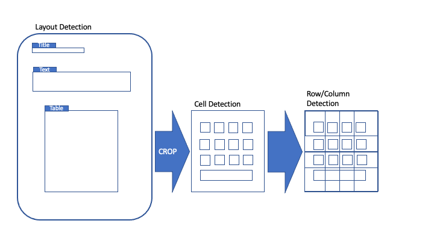

Fine Tuning
===========

Introduction
------------

We show how a model can be fine-tuned for a specific task and how the
performance can be compared with the pre-trained model.

For this purpose, we want to try to improve the table extraction in the
**deep**\ doctection analyzer as an example. To better understand what
we are trying to address, we need to say a little more about processing
table extraction.

   title

Table extraction is carried out in different stages:

-  Table detection
-  Cell detection
-  Row and column detection
-  Segmentation / cell labeling

Tables, cells and rows / columns are recognized with object detectors
(Cascade-RCNN with FPN). The segmentation is carried out by determining
the coverage of cells to rows and columns and is rule-based.

Cell recognition was carried out on the
`PubTabNet <https://github.com/ibm-aur-nlp/PubTabNet>`__ dataset.
PubTabNet contains approx. 500K tables from the field of medical
research.

We want to fine-tune cell recognition on a dataset that comes from a
completely different domain, namely financial reports. For this we use
`FinTabNet <https://arxiv.org/pdf/2005.00589.pdf>`__, a data set that
contains around 100K tables from that domain.

Dataset
-------

In order to fine-tune on your own data set, you should create your one
dataset instance based on the example of the existing datasets. We use a
DatasetRegistry to be able to access the dataset directly. Before we
start fine tuning, let’s take a look at the dataset. It will show you
the advantage of the concept within this framework and how it easily
integrates into the training scripts.

.. code:: ipython3

    import os
    
    from matplotlib import pyplot as plt
    
    from deep_doctection.utils import get_weights_dir_path,get_configs_dir_path
    from deep_doctection.datasets import DatasetRegistry
    from deep_doctection.mapper import to_page
    from deep_doctection.dataflow import MapData
    from deep_doctection.train import train_faster_rcnn

.. code:: ipython3

    DatasetRegistry.print_dataset_names()

.. parsed-literal::

    ['fintabnet', 'funsd', 'testlayout', 'publaynet', 'pubtabnet', 'xfund']

.. code:: ipython3

    fintabnet = DatasetRegistry.get_dataset("fintabnet")
    fintabnet.dataset_info.description

.. parsed-literal::

    'FinTabNet dataset contains complex tables from the annual reports of S&P 500 companies with detailed table structure annotations to help train and test structure recognition. To generate the cell structure labels, one uses token matching between the PDF and HTML version of each article from public records and filings. Financial tables often have diverse styles when compared to ones in scientific and government documents, with fewer graphical lines and larger gaps within each table and more colour variations. Fintabnet can be used for training cell detection models as well as for semantic table understanding algorithms. For detection it has cell bounding box annotations as well as precisely described table semantics like row - and column numbers and row and col spans. The dataflow builder can also return captions of bounding boxes of rows and columns. Moreover, various filter conditions on the table structure are available: maximum cell numbers, maximal row and column numbers and their minimum equivalents can be used as filter condition. Header information of cells are not available. As work around you can artificially add header sub-category to every first row cell. All later row cells will receive a no header  sub-category. Note, that this assumption will generate noise.'

We refer to the in depths tutorial for more details about the
construction of datasets and the architecture of **deep**\ doctection.
Nevertheless, we will briefly go into the individual steps to display a
sample from Fintabnet. The dataset has a method dataflow.build that
returns a generator where samples can be streamed from.

.. code:: ipython3

    df = fintabnet.dataflow.build(split="train",load_image=True,use_multi_proc=False)
    df = MapData(df,to_page)
    df.reset_state()
    df_iter = iter(df)

.. parsed-literal::

    [1216 18:55.28 @fintabnet.py:160] INF Logic will currently display only ONE table per page, even if there are more !!

1.) Datasets have dataflow components. Dataflows allow efficient loading
and mapping of data and thus represent the bloodstream of deep
doctection. The build method creates a dataflow of the dataset. By
selecting certain parameters, for example, a split can be selected or it
can be determined whether the underlying image should be loaded.

2.) In the second line, the core data model is mapped to an easily
consumable page object. Parsed results can be queried and visualized in
the page object.

3.) The reset_state () method of the dataflow must be called before
iterating the dataflow and belongs to the Dataflow API.

4.) We want to use the next method to look at samples, so we create an
iterator.

After we have created a page object, we enter the annotations in the
image with viz () and visualize them.

.. code:: ipython3

    table=next(df_iter)
    image = table.viz()
    plt.figure(figsize = (20,10))
    plt.axis('off')
    plt.imshow(image)

.. figure:: https://github.com/deepdoctection/deepdoctection/raw/master/docs/tutorials/pics/output_7_1.png
   :alt: title

   title

The sample shows that tables are not cropped from the image. Our method
however requires that the cell predictor requires tables only without
surronding. The build method for this particular dataset, however has a
optional parameter ``build_mode`` such that the dataflow returns tables
only, once you pass the value ‘table’. The coordinates of the cells are
also converted to the coordinate system of the cropped image.

Training Tensorpack Predictor
-----------------------------

For the training, we use a training script which stems from the training
of the Faster-RCNN model from Tensorpack. Let’s collect all necessary
inputs:

-  We take the model config for the cell detector. It is important to
   note that the hyperparameter for this detector differs slightly from
   the standard Faster-RCNN config for taking into account that cells
   are generally smaller and have in general a length/height ratio >=1.
-  We take the pre-trained cell weights.
-  We choose fintabnet for training and evaluation for which the
   datasets is pre-splitted.
-  Config overwrites specifies the train setting. We define 1 epoch to
   have 500 pass throughs. (Note, that the term of one epoch is
   different than in most of the literature.) We set the learning rate
   to be .001 which is quite common for fine tuning this model. We set
   the schedule to have 50K iterations and set a random resizing of the
   train dataset between 600 and 1.2K pixels.
-  The other settings affect the dataset dataflow build config. As
   already mentioned we need to crop tables from the images. As we crop
   them at the beginning, we have to store these images in memory. This
   is not ideal but peculiar for this dataset and requires either a
   large memory or a small training dataset. We choose 15k samples. As
   we only use parts of the images this might ok, but you can set this
   setting lower if you RAM is not that large.

.. code:: ipython3

    path_config_yaml=os.path.join(get_configs_dir_path(),"tp/cell/conf_frcnn_cell.yaml")
    path_weights = os.path.join(get_weights_dir_path(),"cell/model-2840000.data-00000-of-00001")
    
    dataset_train = fintabnet
    
    config_overwrite=["TRAIN.STEPS_PER_EPOCH=500","TRAIN.EVAL_PERIOD=20","TRAIN.BASE_LR=1e-3","TRAIN.LR_SCHEDULE=[50000]","PREPROC.TRAIN_SHORT_EDGE_SIZE=[600,1200]"]
    build_train_config=["build_mode=table","load_image=True","max_datapoints=10000","use_multi_proc=False"]
    dataset_val = fintabnet
    build_val_config = ["build_mode=table","load_image=True","max_datapoints=1000","use_multi_proc=False"]

Finally, we set a directory to save the checkpoints and log the training
progress. For evaluation we use the traditional coco metric which
returns mean average precision and mean average recall.

.. code:: ipython3

    train_faster_rcnn(path_config_yaml=path_config_yaml,
                      dataset_train=fintabnet,
                      path_weights=path_weights,
                      config_overwrite=config_overwrite,
                      log_dir="/path/to/dir/test_train",
                      build_train_config=build_train_config,
                      dataset_val=dataset_val,
                      build_val_config=build_val_config,
                      metric_name="coco",
                      pipeline_component_name="ImageLayoutService"
                      )

.. parsed-literal::

    [1216 18:55.36 @logger.py:93] INF Argv: ['/usr/lib/python3/dist-packages/ipykernel_launcher.py', '-f', '/home/janis/.local/share/jupyter/runtime/kernel-60921085-da62-4658-8f59-98ccb0e43f95.json'] 
    [1216 18:55.37 @config.py:320] INF Environment Information:
     -----------------------  ------------------------------------------------------------------------------------------------
    sys.platform             linux
    Python                   3.8.10 (default, Sep 28 2021, 16:10:42) [GCC 9.3.0]
    Tensorpack               v0.11-0-gdb541e8e @/home/janis/Public/deepdoctection/venv/lib/python3.8/site-packages/tensorpack
    Numpy                    1.21.4
    TensorFlow               2.4.1/unknown @/usr/lib/python3/dist-packages/tensorflow
    TF Compiler Version      9.3.0
    TF CUDA support          True
    TF MKL support           False
    TF XLA support           False
    Nvidia Driver            /usr/lib/x86_64-linux-gnu/libnvidia-ml.so.460.73.01
    CUDA libs                /usr/lib/x86_64-linux-gnu/libcudart.so.11.1.74
    CUDNN libs
    TF compute capabilities  52,60,61,70,75,80,86
    TF built with CUDA       11.1
    TF built with CUDNN      8
    NCCL libs                /usr/lib/x86_64-linux-gnu/libnccl.so.2.8.4
    CUDA_VISIBLE_DEVICES     Unspecified
    GPU 0                    GeForce RTX 3090
    Free RAM                 48.37/62.52 GB
    CPU Count                24
    Horovod                  0.22.1 @/usr/local/lib/python3.8/dist-packages/horovod
    cv2                      4.5.3
    msgpack                  1.0.2
    python-prctl             True
    -----------------------  ------------------------------------------------------------------------------------------------
    [1216 18:55.37 @config.py:353] INF Warm Up Schedule (steps, value): [(0, 1e-05), (1000, 0.001)]
    [1216 18:55.37 @config.py:354] INF LR Schedule (epochs, value): [(2, 0.001)]
    [1216 18:55.37 @config.py:357] INF Config: ------------------------------------------
     {'BACKBONE': {'BOTTLENECK': 'resnext_32xd4',
                  'FREEZE_AFFINE': False,
                  'FREEZE_AT': 2,
                  'NORM': 'GN',
                  'RESNET_NUM_BLOCKS': [3, 4, 6, 3],
                  'TF_PAD_MODE': False},
     'CASCADE': {'BBOX_REG_WEIGHTS': [[10.0, 10.0, 5.0, 5.0], [20.0, 20.0, 10.0, 10.0],
                                      [30.0, 30.0, 15.0, 15.0]],
                 'IOUS': [0.5, 0.6, 0.7]},
     'DATA': {'CLASS_DICT': {0: 'BG', '1': 'TABLE', '2': 'CELL', '3': 'ITEM'},
              'CLASS_NAMES': ['TABLE', 'CELL', 'ITEM', 'BG'],
              'NUM_CATEGORY': 3,
              'TRAIN_NUM_WORKERS': 12},
     'FPN': {'ANCHOR_STRIDES': (4, 8, 16, 32, 64),
             'CASCADE': True,
             'FRCNN_CONV_HEAD_DIM': 256,
             'FRCNN_FC_HEAD_DIM': 1024,
             'FRCNN_HEAD_FUNC': 'fastrcnn_2fc_head',
             'MRCNN_HEAD_FUNC': 'maskrcnn_up4conv_head',
             'NORM': 'GN',
             'NUM_CHANNEL': 256,
             'PROPOSAL_MODE': 'Level',
             'RESOLUTION_REQUIREMENT': 32},
     'FRCNN': {'BATCH_PER_IM': 512,
               'BBOX_REG_WEIGHTS': [10.0, 10.0, 5.0, 5.0],
               'FG_RATIO': 0.25,
               'FG_THRESH': 0.5},
     'MODE_MASK': False,
     'MRCNN': {'ACCURATE_PASTE': True, 'HEAD_DIM': 256},
     'NUM_GPUS': 1,
     'OUTPUT': {'FRCNN_NMS_THRESH': 0.01,
                'NMS_THRESH_CLASS_AGNOSTIC': 0.001,
                'RESULTS_PER_IM': 800,
                'RESULT_SCORE_THRESH': 0.4},
     'PREPROC': {'MAX_SIZE': 1408.0,
                 'PIXEL_MEAN': [238.32, 238.22, 238.21],
                 'PIXEL_STD': [8.75, 8.569, 9.14],
                 'SHORT_EDGE_SIZE': 800,
                 'TRAIN_SHORT_EDGE_SIZE': [600, 1200]},
     'RPN': {'ANCHOR_RATIOS': (0.25, 0.5, 1.0),
             'ANCHOR_SIZES': (8, 16, 32, 64, 128),
             'ANCHOR_STRIDE': 8,
             'BATCH_PER_IM': 512,
             'CROWD_OVERLAP_THRESH': 9.99,
             'FG_RATIO': 0.5,
             'HEAD_DIM': 1024,
             'MIN_SIZE': 0,
             'NEGATIVE_ANCHOR_THRESH': 0.3,
             'NUM_ANCHOR': 15,
             'PER_LEVEL_NMS_TOPK': 1000,
             'POSITIVE_ANCHOR_THRESH': 0.7,
             'POST_NMS_TOPK': 1000,
             'PRE_NMS_TOPK': 6000,
             'PROPOSAL_NMS_THRESH': 0.7,
             'TRAIN_PER_LEVEL_NMS_TOPK': 2000,
             'TRAIN_POST_NMS_TOPK': 2000,
             'TRAIN_PRE_NMS_TOPK': 12000},
     'TAG': 'casc_rcnn_X_32xd4_50_FPN_GN_2FC',
     'TRAIN': {'BASE_LR': 0.001,
               'CHECKPOINT_PERIOD': 20,
               'EVAL_PERIOD': 20,
               'LOG_DIR': '/home/janis/Documents/test_train',
               'LR_SCHEDULE': [50000],
               'NUM_GPUS': 1,
               'STARTING_EPOCH': 1,
               'STEPS_PER_EPOCH': 500,
               'WARMUP': 1000,
               'WARMUP_INIT_LR': 1e-05,
               'WEIGHT_DECAY': 0.0001},
     'TRAINER': 'replicated'}
    [1216 18:55.37 @tp_frcnn_train.py:138] INF Loading dataset into memory

.. parsed-literal::

      0%|          |0/10000[00:00<?,?it/s]

.. parsed-literal::

    [1216 18:55.37 @logger.py:193] WRN Datapoint have images as np arrays stored and they will be loaded into memory. To avoid OOM set 'load_image'=False in dataflow build config. This will load images when needed and reduce memory costs!!!

.. parsed-literal::

     34%|###4      |3402/10000[13:59<37:07, 2.96it/s]

