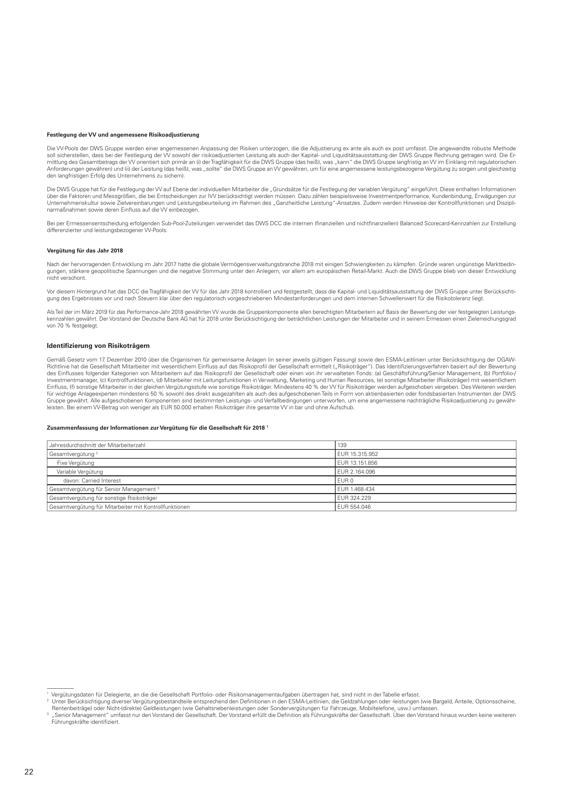
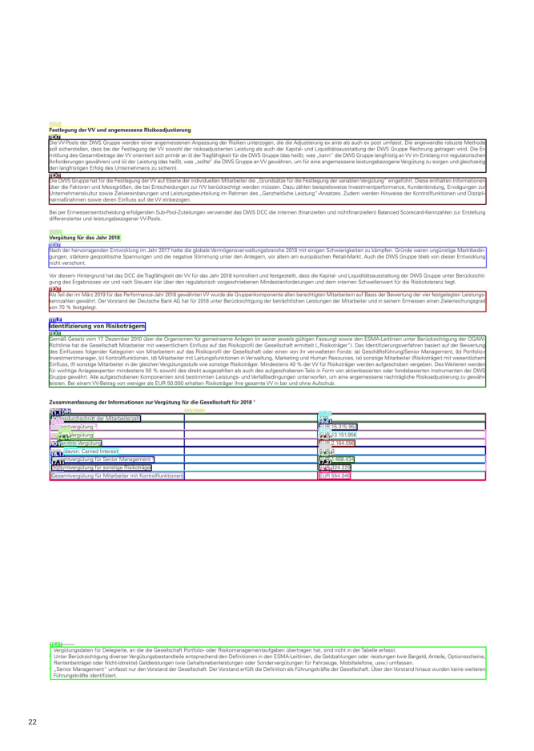

# Notebooks, Tutorials, Scripts and Notes

Tutorials are divided into different groups. 

**Introductory tutorials:** The introductory tutorials are also available as 
[notebooks](https://github.com/deepdoctection/notebooks).

**Deep dive tutorials:** Architectural issues related to the library are discussed. In addition, other topics such 
as training and evaluation of multimodal models are described that did not find a place as introductory tutorial. 

**Notes:** Notes contain topics on special issues, experiments or ideas. Notes have the common feature that 
the implementation is more complex. 

**Scripts:** Following the name, these are training or evaluation scripts. They are provided with little to no comments.


 

# Getting started

**deep**doctection is a package that can be used to extract text from complex structured documents. It also allows to run multi-modal models (text+vision) in an end-to end pipeline. Inputs can be native PDFs or images. In contrast to various text miners **deep**doctection makes use of deep learning models from powerful third party libraries solving OCR, vision or classification or entity recognition problems. It is very versatile.

This notebook will give you a quick introduction to show you, how you can use **deep**doctection for extracting text information from complex documents. 

We assume that you have successfully installed **deep**doctection with Tensorflow or Pytorch extension and that you can run Tesseract.


```python
import cv2
from pathlib import Path
from matplotlib import pyplot as plt
from IPython.core.display import HTML

import deepdoctection as dd
```

## Sample

Take an image (e.g. .png, .jpg, ...). If you take the example below you'll maybe need to change ```image_path```.


```python
image_path = Path.cwd() / "pics/samples/sample_2/sample_2.png"
image = cv2.imread(image_path.as_posix())
plt.figure(figsize = (25,17))
plt.axis('off')
plt.imshow(image)
```



## Analyzer

Next, we instantiate the **deep**doctection analyzer. The analyzer is an example of a pipeline that can be built depending on the problem you want to tackle. This particular pipeline is built from various building blocks. We will come back to this later. 

Because the document is german we will be using Tesseract's model trained on german text (config_overwrite=["LANGUAGE='deu'"]). If you have a document in a different language choose one by entering its [LangCode](https://tesseract-ocr.github.io/tessdoc/Data-Files-in-different-versions.html). Here are some examples: `fra`, `nld`, `chi_sim`, `ces`, `fas`, `ell`, `mkd`, `ron`, `hye`, `kat`. 

This will give you, depending on your language, much better results than using the default english model.


```python
analyzer = dd.get_dd_analyzer(config_overwrite=["LANGUAGE='deu'"])
```

## Analyze methods

Once all models have been loaded, we can process single pages, multi page PDF-documents or `Dataflow`s. Leaving `Dataflow`s aside for now, you can either set `path='path/to/dir'` if you have a folder of images or `path='path/to/my/doc.pdf'` if you have a pdf document. 

You will receive an error if your path points to a single image. Processing images requires to pass the path to the base image directory.


```python
path = Path.cwd() / "pics/samples/sample_2"

df = analyzer.analyze(path=path)
df.reset_state()  # This method must be called just before starting the iteration. It is part of the API.
```

    |                                                                                                                                                                                                                                                                                                                                  |1/?[00:00<00:00,1439.86it/s]


You can see, when activating the cell, that not much has happened yet. The reason is that `analyze` is a [generator function](https://wiki.python.org/moin/Generators). It does not return instantly any results. Instead it returns a `Dataflow`. 

A `Dataflow` is an object to create iterators for data loading and data processing. You can traverse through all the values of the `Dataflow` simply by using a `for`-loop or the `next` function. Let's go!  


```python
doc=iter(df)
page = next(doc)
```

## Page

Let's see what we got back. For each iteration we receive a `Page` object. This object stores all informations that have been collected from a page document when running through the pipeline. 


```python
type(page)
```


    deepdoctection.datapoint.view.Page


Let's also have a look on some top level information. 


```python
print(f" height: {page.height} \n width: {page.width} \n file_name: {page.file_name} \n document_id: {page.document_id} \n image_id: {page.image_id}\n")
```

     height: 2339.0 
     width: 1654.0 
     file_name: sample_2.png 
     document_id: d0e3f4cc-f604-3f08-9dc6-95c04bb6c51b 
     image_id: d0e3f4cc-f604-3f08-9dc6-95c04bb6c51b
    


`document_id` and `image_id` are the same. The reason is because we only process a single image. The naming convention silently assumes that we deal with a one page document. Once we process multi page PDFs `document_id` and `image_id` differ.

With `get_attribute_names()` you get a list of all attributes. 


```python
page.get_attribute_names()
```


    {<PageType.ANGLE>,
     'chunks',
     'document_id',
     <PageType.DOCUMENT_TYPE>,
     'file_name',
     <PageType.LANGUAGE>,
     'layouts',
     'location',
     'page_number',
     'tables',
     'text',
     'words'}


```python
page.document_type, page.language
```


    (None, None)


`page.document_type` and `page.language` both return None. The reason is that the analyzer has no component for predicting a document type or a language.

You can easily build a custom analyzer/pipeline containing a document classifier, though. Check this [notebook](using_layoutlm_for_sequence_classification_notebook.md) for further information.

## Layout segments

We can visualize detected layout segments. If you set `interactive=True` a viewer will pop up. Use `+` and `-` to zoom out/in. Use `q` to close the page.

Alternatively, you can visualize the output with matplotlib.


```python
image = page.viz()
plt.figure(figsize = (25,17))
plt.axis('off')
plt.imshow(image)
```



Let's have a look at other attributes. We can use the `text` property to get the content of the document. You will notice that the table is not included. You can therefore filter tables from the other content. In fact you can even filter on every layout segment.


```python
print(page.text)
```

    Festlegung der VV und angemessene Risikoadjustierung
    Die VV-Pools der DWS Gruppe werden einer angemessenen Anpassung der Risiken unterzogen, die die Adjustierung ex ante als auch ex post umfasst. Die angewandte robuste Methode soll sicherstellen, dass bei der Festlegung der VV sowohl der risikoadjustierten Leistung als auch der Kapital- und Liquiditätsausstattung der DWS Gruppe Rechnung getragen wird. Die Er- mittlung des Gesamtbetrags der VV orientiert sich primär an (i) der Tragfähigkeit für die DWS Gruppe (das heißt, was „kann” die DWS Gruppe langfristig an VV im Einklang mit regulatorischen ‚Anforderungen gewähren) und (il) der Leistung (das heißt, was „sollte” die DWS Gruppe an VV gewähren, um für eine angemessene leistungsbezogene Vergütung zu sorgen und gleichzeitig den langfristigen Erfolg des Unternehmens zu sichern)
    Die DWS Gruppe hat für die Festlegung der VV auf Ebene der individuellen Mitarbeiter die „Grundsätze für die Festlegung der variablen Vergütung” eingeführt. Diese enthalten Informationen über die Faktoren und Messgrößen, die bei Entscheidungen zur IVV berücksichtigt werden müssen. Dazu zählen beispielsweise Investmentperformance, Kundenbindung, Erwägungen zur Unternehmenskultur sowie Zielvereinbarungen und Leistungsbeurteilung im Rahmen des „Ganzheitliche Leistung“-Ansatzes. Zudem werden Hinweise der Kontrollfunktionen und Diszipli- narmaßnahmen sowie deren Einfluss auf die VV einbezogen
    Bei per Ermessensentscheidung erfolgenden Sub-Pool-Zuteilungen verwendet das DWS DCC die internen (finanziellen und nichtfinanziellen) Balanced Scorecard-Kennzahlen zur Erstellung differenzierter und leistungsbezogener VV-Pools,
    Vergütung für das Jahr 2018
    Nach der hervorragenden Entwicklung im Jahr 2017 hatte die globale Vermögensverwaltungsbranche 2018 mit einigen Schwierigkeiten zu kämpfen. Gründe waren ungünstige Marktbedin- gungen, stärkere geopolitische Spannungen und die negative Stimmung unter den Anlegern, vor allem am europäischen Retail-Miarkt. Auch die DWS Gruppe blieb von dieser Entwicklung nicht verschont.
    Vor diesem Hintergrund hat das DCC die Tragfähigkeit der VV für das Jahr 2018 kontrolliert und festgestellt, dass die Kapital- und Liquiditätsausstattung der DWS Gruppe unter Berücksichti- ‚gung des Ergebnisses vor und nach Steuern klar über den regulatorisch vorgeschriebenen Mindestanforderungen und dem internen Schwellenwert für die Risikotoleranz liegt.
    Als Teil der im März 2019 für das Performance-Jahr 2018 gewährten VV wurde die Gruppenkomponente allen berechtigten Mitarbeitern auf Basis der Bewertung der vier festgelegten Leistungs- kennzahlen gewährt. Der Vorstand der Deutsche Bank AG hat für 2018 unter Berücksichtigung der beträchtlichen Leistungen der Mitarbeiter und in seinem Ermessen einen Zielerreichungsgrad von 70 % festgelegt
    Identifi ierung von Risikoträgern
    Gemäß Gesetz vom 17. Dezember 2010 über die Organismen für gemeinsame Anlagen (in seiner jeweils gültigen Fassung) sowie den ESMA-Leitlinien unter Berücksichtigung der OGAW- Richtlinie hat die Gesellschaft Mitarbeiter mit wesentlichem Einfluss auf das Risikoprofil der Gesellschaft ermittelt („Risikoträger"). Das Identifizierungsverfahren basiert auf der Bewertung des Einflusses folgender Kategorien von Mitarbeitern auf das Risikoprofil der Gesellschaft oder einen von ihr verwalteten Fonds: (a) Geschäftsführung/Senior Management, (b) Portfolio-/ Investmentmanager, (c) Kontrollfunktionen, (d) Mitarbeiter mit Leitungsfunktionen in Verwaltung, Marketing und Human Resources, (e) sonstige Mitarbeiter (Risikoträger) mit wesentlichem Einfluss, (f} sonstige Mitarbeiter in der gleichen Vergütungsstufe wie sonstige Risikoträger. Mindestens 40 % der VV für Risikoträger werden aufgeschoben vergeben. Des Weiteren werden für wichtige Anlageexperten mindestens 50 % sowohl des direkt ausgezahlten als auch des aufgeschobenen Teils in Form von aktienbasierten oder fondsbasierten Instrumenten der DWS Gruppe gewährt. Alle aufgeschobenen Komponenten sind bestimmten Leistungs- und Verfallbedingungen unterworfen, um eine angemessene nachträgliche Risikoadjustierung zu gewähr- leisten. Bei einem VV-Betrag von weniger als EUR 50.000 erhalten Risikoträger ihre gesamte \VV in bar und ohne Aufschub.
    Zusammenfassung der Informationen zur Vergütung für die Gesellschaft für 2018 '
    \ Vergütungsdaten für Delegierte, die die Gesellschaft Portfolio- oder Risikomanagementaufgaben übertragen hat, sind nicht der Tabelle erfasst. an in Unter Berücksichtigung diverser Vergütungsbestandteile entsprechend den Definitionen in den ESMA-Leitlinien, die Geldzahlungen oder leistungen (wie Bargeld, Anteile, Optionsscheine, Rentenbeiträge) oder Nicht-(direkte) Geldleistungen (wie Gehaltsnebenleistungen oder Sondervergütungen für Fahrzeuge, Mobiltelefone, usw.) umfassen 3 „Senior Management” umfasst nur den Vorstand der Gesellschaft. Der Vorstand erfüllt die Definition als Führungskräfte der Gesellschaft. Uber den Vorstand hinaus wurden keine weiteren Führungskräfte identifiziert.


You can get the individual layout segments like `text`, `title`, `list` or `figure`. 


```python
for layout in page.layouts:
    if layout.category_name=="title":
        print(f"Title: {layout.text}")
```

    Title: Identifi ierung von Risikoträgern
    Title: Vergütung für das Jahr 2018
    Title: Festlegung der VV und angemessene Risikoadjustierung


You can also get the layout segments from the `chunks` attribute. The output is a list of tuples with the most essential meta data for each layout segment, namely: `document_id, image_id, page_number, annotation_id, reading_order, category_name` and `text`.


```python
page.chunks[0]
```


    ('d0e3f4cc-f604-3f08-9dc6-95c04bb6c51b',
     'd0e3f4cc-f604-3f08-9dc6-95c04bb6c51b',
     0,
     '47673133-ec40-3ef8-ad94-8549fe9eb0af',
     1,
     <LayoutType.TITLE>,
     'Festlegung der VV und angemessene Risikoadjustierung')


Tables cannot be retrieved from `page.layouts`. They have a special `page.tables` which is a python list of table objects. Obviously, only one table has been detected. 


```python
len(page.tables)
```


    1


Let's have a closer look at the table. 


```python
table = page.tables[0]
table.get_attribute_names()
```


    {'bbox',
     'cells',
     'columns',
     'csv',
     <TableType.HTML>,
     <TableType.ITEM>,
     <TableType.MAX_COL_SPAN>,
     <TableType.MAX_ROW_SPAN>,
     'np_image',
     <TableType.NUMBER_OF_COLUMNS>,
     <TableType.NUMBER_OF_ROWS>,
     <Relationships.READING_ORDER>,
     'rows',
     'text',
     'words'}

```python
print(
    f" number of rows: {table.NUMBER_OF_ROWS} \n number of columns: {table.NUMBER_OF_COLUMNS} \n reading order: {table.READING_ORDER}")
```

     number of rows: 8 
     number of columns: 2 
     reading order: None


There is no reading order. The reason is that we have excluded tables from having a specific reading order position because we want to separate tables from the narrative text. This is pure customizing and we can change the customizing so that tables are part of the narrative text. We will come to this later.

You can get an html, csv or text version of your table. Use `table.csv` to load the table into a Pandas Dataframe.

```python
HTML(table.HTML)
```


<table><tr><td>Jahresdurchschnitt der Mitarbeiterzahl</td><td>139</td></tr><tr><td>Gesamtvergütung ?</td><td>EUR 15.315.952</td></tr><tr><td>Fixe Vergütung</td><td>EUR 13.151.856</td></tr><tr><td>Variable Vergütung</td><td>EUR 2.164.096</td></tr><tr><td>davon: Carried Interest</td><td>EURO</td></tr><tr><td>Gesamtvergütung für Senior Management ®</td><td>EUR 1.468.434</td></tr><tr><td>Gesamtvergütung für sonstige Risikoträger</td><td>EUR 324.229</td></tr><tr><td>Gesamtvergütung für Mitarbeiter mit Kontrollfunktionen</td><td>EUR 554.046</td></tr></table>


```python
table.csv
```


    [['Jahresdurchschnitt der Mitarbeiterzahl ', '139 '],
     ['Gesamtvergütung ? ', 'EUR 15.315.952 '],
     ['Fixe Vergütung ', 'EUR 13.151.856 '],
     ['Variable Vergütung ', 'EUR 2.164.096 '],
     ['davon: Carried Interest ', 'EURO '],
     ['Gesamtvergütung für Senior Management ® ', 'EUR 1.468.434 '],
     ['Gesamtvergütung für sonstige Risikoträger ', 'EUR 324.229 '],
     ['Gesamtvergütung für Mitarbeiter mit Kontrollfunktionen ', 'EUR 554.046 ']]


```python
table.text
```


    'Jahresdurchschnitt der Mitarbeiterzahl  139  \n Gesamtvergütung ?  EUR 15.315.952  \n Fixe Vergütung  EUR 13.151.856  \n Variable Vergütung  EUR 2.164.096  \n davon: Carried Interest  EURO  \n Gesamtvergütung für Senior Management ®  EUR 1.468.434  \n Gesamtvergütung für sonstige Risikoträger  EUR 324.229  \n Gesamtvergütung für Mitarbeiter mit Kontrollfunktionen  EUR 554.046  \n'


Let's go deeper down the rabbit hole. A `Table` has cells and we can even get the text of one particular cell. Note that the output list is not sorted by row or column. You have to do it yourself.


```python
cell = table.cells[0]
cell.get_attribute_names()
```


    {'bbox',
     <CellType.BODY>,
     <CellType.COLUMN_HEADER>,
     <CellType.COLUMN_NUMBER>,
     <CellType.COLUMN_SPAN>,
     <CellType.HEADER>,
     'np_image',
     <CellType.PROJECTED_ROW_HEADER>,
     <Relationships.READING_ORDER>,
     <CellType.ROW_HEADER>,
     <CellType.ROW_NUMBER>,
     <CellType.ROW_SPAN>,
     <CellType.SPANNING>,
     'text',
     'words'}

```python
print(
    f"column number: {cell.COLUMN_NUMBER} \n row_number: {cell.ROW_NUMBER} \n text: {cell.text} \n annotation_id: {cell.annotation_id}")
```

    column number: 1 
     row_number: 8 
     text: Gesamtvergütung für Mitarbeiter mit Kontrollfunktionen 
     annotation_id: e631e4bc-4740-335f-8618-699bd19a822f


Still not down yet, we have a list of words that is responsible to generate the text string.


```python
word = cell.words[0]
word.get_attribute_names()
```


    {'bbox',
     <WordType.BLOCK>,
     <WordType.CHARACTER_TYPE>,
     <WordType.CHARACTERS>,
     <WordType.HANDWRITTEN>,
     'np_image',
     <WordType.PRINTED>,
     'reading_order',
     <WordType.TAG>,
     <WordType.TEXT_LINE>,
     <WordType.TOKEN_CLASS>,
     <WordType.TOKEN_TAG>}


The reading order determines the string position of the word characters in a cell segment. 

When inferring the reading order of a page we therefore have to distinguish between high and low level reading orders: A high level reading order where layout segments such as `title`, `text` or `cell` are being involved and a low word level reading order where `word`s have to be arranged into some narrative text.  

Let's look at some more attributes.

```python
print(f" characters: {word.CHARACTERS} \n reading order: {word.READING_ORDER} \n token class: {word.TOKEN_CLASS}")
```

     characters: Gesamtvergütung 
     reading order: 1 
     token class: None


## Saving and reading

You can use the `save` method to save the result of the analyzer in a `.json` file. Setting `image_to_json=True` you will also save image as b64 encoding in the file. Beware, the files are quite large then. 


```python
page.save(image_to_json=True, path="/home/janis/Downloads/test.json") #path="/path/to/dir/test.json")
```

Having saved the results you can easily parse the file into the `Page` format without loosing any information. 


```python
page = dd.Page.from_file(file_path="/home/janis/Downloads/test.json")
```

The `Page` object is read-only and even though you can change the value it will not be persisted.

```python
word.TOKEN_CLASS = "ORG"
```

It might look like that the string has been saved however, this is something that is being added by iPython and will not be persisted
in any means.


```python
word.token_class #  __repr__ of the base object does carry <WordType.token_class> information.  
```


    'ORG'


There is no easy way yet to modify results. In tutorial **Diving deeper into the data structure** we will show how you can do this. 

## Where to go from here

If you want to get a deeper understanding how a pipeline is composed, we suggest to look at the [pipeline notebook](pipelines_notebook.md).
