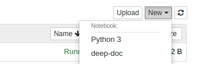

.. figure:: ./pics/dd_logo.png
   :alt: title

   title

Getting started
===============

**deep**\ doctection is a package that can be used to extract text from
complex structured documents. These can be native PDFs but also scans.
In contrast to various text miners, the focus of deepdoctection is that
Deep Learning is also part of the equipment. Neural networks and object
detectors have proven to not only identify objects on photos, but also
to limit structures like titles, tables, figures or lists. Another
advantage is that Deep Learning models can be trained on your own data
to improve accuracy.

This introductory notebook introduces the **deep**\ doctection analyzer.
The analyzer is a built-in pipeline, which offers a rudimentary
framework to identify layout structures in documents and to extract
text. We will start with analyzing a business document.

Before starting, however, we have to say:

All pipeline components of the analyzer were trained on standard data
sets for document layout analysis (Publaynet, Pubtabnet). These datasets
contain document pages and tables from medical research articles. This
means that there is already a bias in the training data set and it is
not to be expected that the layout analysis would deliver results with
the precision as on documents from medical studies. To improve the
results we refer to the **Fine Tuning Tutorial**, where we deal with
improving the parsing results on business reports.

In the future, we hope to train more models that can accurately predict
a wider range of document types.

Choosing the kernel
-------------------

We assume that the installation was carried out using the options
described. If a virtual environment and a kernel have been created using
the make files, the deep-doc kernel can be chosen using the kernel
selection on the notebook.

   title

You can check if the installation was successful by activating the next
cell.

.. code:: ipython3

    import os
    import cv2
    from matplotlib import pyplot as plt
    from IPython.core.display import HTML
    from deepdoctection.utils.systools import get_package_path

Sample
------

Let’s first look at a sample page we want to process.

.. code:: ipython3

    image_path = os.path.join(get_package_path(),"notebooks/pics/samples/sample_2/sample_2.png")
    image = cv2.imread(image_path)
    plt.figure(figsize = (25,17))
    plt.axis('off')
    plt.imshow(image)

.. figure:: ./pics/sample_2.png
   :alt: title

   title

Analyzer
--------

We now start by introducing the **deep**\ doctection analyzer. There is
a factory function ``get_dd_analyzer`` for that outputs a preconfigured
version.

.. code:: ipython3

    from deepdoctection.analyzer import get_dd_analyzer

Knowing the language in advance will increase the text output
significantly. As the document is german, we will pass a customizing:
language=‘deu’.

.. code:: ipython3

    analyzer = get_dd_analyzer(language='deu')

Pipeline components
-------------------

The analyzer is an example of a pipeline that can be built depending on
the problem you want to tackle. The pipeline is made up of the building
blocks as described in the diagram

.. figure:: ./pics/dd_pipeline.png
   :alt: title

   title

The default setting performs layout recognition, table segmentation and
OCR extraction. You can sitch table segmentation and OCR off in order to
get less but quicker results.

Beside detection and OCR tasks, some other components are needed
e.g. text matching and reading order. Text matching for instance tries
to match words to detected layout formats based on the intersection over
area measure. Both components are purely rule based. While this might
give good results for text matching, determining the reading order for
complex components will be not give satisfying results.

Analyze methods
---------------

The ``analyze`` method has various transfer parameters. The ``path``
parameter can be used to transfer a path to a directory to the analyzer
or to a PDF document. If the path points to a directory, all individual
pages can processed successively provided they have a file name suffix
‘.png’ or ‘.jpg’. If you path points to a PDF document with multiple
pages the analyzer will work iteratively work through all document
pages.

.. code:: ipython3

    path = os.path.join(get_package_path(),"notebooks/pics/samples/sample_2")
    df = analyzer.analyze(path=path)

.. parsed-literal::

    [0309 11:59:03 @common.py:558] [JoinData] Size check failed for the list of dataflow to be joined!

You can see when running the cell that not much has happened. Indeed,
the analyze method returns a generator. The generator allows processing
to be started via a for-loop.

We use the iter / next method here. The image is only processed when the
next function is called.

.. code:: ipython3

    doc=iter(df)
    page = next(doc)

.. parsed-literal::

    processing sample_2.png

Page object
-----------

A Page object is returned, which has some handy tools for vizualising a
retrieving the detected results. There are some attributes that store
meta data information.

.. code:: ipython3

    page.height, page.width, page.file_name

.. parsed-literal::

    (2339, 1654, 'sample_2.png')

.. code:: ipython3

    image = page.viz()

The viz method draws the identified layout bounding box components into
the image. These can be output with common visualization tools.

The layout analysis reproduces the title, text and tables. In addition,
lists and figures, if any, are identified. We can see here that a table
with table cells was recognized on the page. In addition, the
segmentations such as rows and columns were framed. The row and column
positions can be seen in the cell names.

.. code:: ipython3

    plt.figure(figsize = (25,17))
    plt.axis('off')
    plt.imshow(image)

.. figure:: https://github.com/deepdoctection/deepdoctection/raw/master/docs/tutorials/pics/output_16_1.png
   :alt: title

   title

The next methods are devoted to the text output.

We can use the get_text method to output the running text only. Table
contents are not included here.

.. code:: ipython3

    print(page.get_text())

.. parsed-literal::

    
    Festlegung der VV und angemessene Risikoadjustierung
    Die VV-Pools der DWS Gruppe werden einer angemessenen Anpassung der Risiken unterzogen, die die Adjustierung ex ante als auch ex post umfasst. Die angewandte robuste Methode soll sicherstellen, dass bei der Festlegung der VV sowohl der risikoadjustierten Leistung als auch der Kapital- und Liquiditätsausstattung der DWS Gruppe Rechnung getragen wird. Die Er- mittlung des Gesamtbetrags der VV orientiert sich primär an (i) der Tragfähigkeit für die DWS Gruppe (das heißt, was „kann” die DWS Gruppe langfristig an VV im Einklang mit regulatorischen ‚Anforderungen gewähren) und (il) der Leistung (das heißt, was „sollte” die DWS Gruppe an VV gewähren, um für eine angemessene leistungsbezogene Vergütung zu sorgen und gleichzeitig den langfristigen Erfolg des Unternehmens zu sichern)
    Die DWS Gruppe hat für die Festlegung der VV auf Ebene der individuellen Mitarbeiter die „Grundsätze für die Festlegung der variablen Vergütung” eingeführt. Diese enthalten Informationen über die Faktoren und Messgrößen, die bei Entscheidungen zur IVV berücksichtigt werden müssen. Dazu zählen beispielsweise Investmentperformance, Kundenbindung, Erwägungen zur Unternehmenskultur sowie Zielvereinbarungen und Leistungsbeurteilung im Rahmen des „Ganzheitliche Leistung“-Ansatzes. Zudem werden Hinweise der Kontrollfunktionen und Diszipli- narmaßnahmen sowie deren Einfluss auf die VV einbezogen
    Bei per Ermessensentscheidung erfolgenden Sub-Pool-Zuteilungen verwendet das DWS DCC die internen (finanziellen und nichtfinanziellen) Balanced Scorecard-Kennzahlen zur Erstellung differenzierter und leistungsbezogener VV-Pools,
    Vergütung für das Jahr 2018
    Nach der hervorragenden Entwicklung im Jahr 2017 hatte die globale Vermögensverwaltungsbranche 2018 mit einigen Schwierigkeiten zu kämpfen. Gründe waren ungünstige Marktbedin- gungen, stärkere geopolitische Spannungen und die negative Stimmung unter den Anlegern, vor allem am europäischen Retail-Miarkt. Auch die DWS Gruppe blieb von dieser Entwicklung nicht verschont.
    Identifi ierung von Risikoträgern
    Gemäß Gesetz vom 17. Dezember 2010 über die Organismen für gemeinsame Anlagen (in seiner jeweils gültigen Fassung) sowie den ESMA-Leitlinien unter Berücksichtigung der OGAW- Richtlinie hat die Gesellschaft Mitarbeiter mit wesentlichem Einfluss auf das Risikoprofil der Gesellschaft ermittelt („Risikoträger"). Das Identifizierungsverfahren basiert auf der Bewertung des Einflusses folgender Kategorien von Mitarbeitern auf das Risikoprofil der Gesellschaft oder einen von ihr verwalteten Fonds: (a) Geschäftsführung/Senior Management, (b) Portfolio-/ Investmentmanager, (c) Kontrollfunktionen, (d) Mitarbeiter mit Leitungsfunktionen in Verwaltung, Marketing und Human Resources, (e) sonstige Mitarbeiter (Risikoträger) mit wesentlichem Einfluss, (f} sonstige Mitarbeiter in der gleichen Vergütungsstufe wie sonstige Risikoträger. Mindestens 40 % der VV für Risikoträger werden aufgeschoben vergeben. Des Weiteren werden für wichtige Anlageexperten mindestens 50 % sowohl des direkt ausgezahlten als auch des aufgeschobenen Teils in Form von aktienbasierten oder fondsbasierten Instrumenten der DWS Gruppe gewährt. Alle aufgeschobenen Komponenten sind bestimmten Leistungs- und Verfallbedingungen unterworfen, um eine angemessene nachträgliche Risikoadjustierung zu gewähr- leisten. Bei einem VV-Betrag von weniger als EUR 50.000 erhalten Risikoträger ihre gesamte \VV in bar und ohne Aufschub.
    Zusammenfassung der Informationen zur Vergütung für die Gesellschaft für 2018 '
    Vergütungsdaten für Delegierte, an die die Gesellschaft Portfolio- oder Risikomanagementaufgaben übertragen hat, sind nicht in der Tabelle erfasst. Unter Berücksichtigung diverser Vergütungsbestandteile entsprechend den Definitionen in den ESMA-Leitlinien, die Geldzahlungen oder leistungen (wie Bargeld, Anteile, Optionsscheine, Rentenbeiträge) oder Nicht-(direkte) Geldleistungen (wie Gehaltsnebenleistungen oder Sondervergütungen für Fahrzeuge, Mobiltelefone, usw.) umfassen „Senior Management” umfasst nur den Vorstand der Gesellschaft. Der Vorstand erfüllt die Definition als Führungskräfte der Gesellschaft. Uber den Vorstand hinaus wurden keine weiteren Führungskräfte identifiziert.

Tables are stored in page.tables which is a python list of table
objects. Obviously, only one table has been detected.

.. code:: ipython3

    len(page.tables)

.. parsed-literal::

    1

.. code:: ipython3

    print(page.tables[0])

.. parsed-literal::

    ______________ row: 1 ______________
    row: 1, col: 1, rs: 1, cs: 1, text: Jahresdurchschnitt der Mitarbeiterzahl 
    row: 1, col: 2, rs: 1, cs: 1, text: 139 
    ______________ row: 2 ______________
    row: 2, col: 1, rs: 1, cs: 1, text: Gesamtvergütung ? 
    row: 2, col: 2, rs: 1, cs: 1, text: EUR 15.315.952 
    ______________ row: 3 ______________
    row: 3, col: 1, rs: 1, cs: 1, text: Fixe Vergütung 
    row: 3, col: 2, rs: 1, cs: 1, text: EUR 13.151.856 
    ______________ row: 4 ______________
    row: 4, col: 1, rs: 1, cs: 1, text: Variable Vergütung 
    row: 4, col: 2, rs: 1, cs: 1, text: EUR 2.164.096 
    ______________ row: 5 ______________
    row: 5, col: 1, rs: 1, cs: 1, text: davon: Carried Interest 
    row: 5, col: 2, rs: 1, cs: 1, text: EURO 
    ______________ row: 6 ______________
    row: 6, col: 1, rs: 1, cs: 1, text: Gesamtvergütung für Senior Management ® 
    row: 6, col: 2, rs: 1, cs: 1, text: EUR 1.468.434 
    ______________ row: 7 ______________
    row: 7, col: 1, rs: 1, cs: 1, text: Gesamtvergütung für sonstige Risikoträger 
    row: 7, col: 2, rs: 1, cs: 1, text: EUR 324.229 
    

The print function can be used to display an output of the table that
includes the segmentation. In addition, an HTML version is generated
that visually reproduces the recognized structure well.

.. code:: ipython3

    HTML(page.tables[0].html)

.. raw:: html

    <table><tr><td>Jahresdurchschnitt der Mitarbeiterzahl</td><td>139</td></tr><tr><td>Gesamtvergütung ?</td><td>EUR 15.315.952</td></tr><tr><td>Fixe Vergütung</td><td>EUR 13.151.856</td></tr><tr><td>Variable Vergütung</td><td>EUR 2.164.096</td></tr><tr><td>davon: Carried Interest</td><td>EURO</td></tr><tr><td>Gesamtvergütung für Senior Management ®</td><td>EUR 1.468.434</td></tr><tr><td>Gesamtvergütung für sonstige Risikoträger</td><td>EUR 324.229</td></tr><tr><td>Gesamtvergütung für Mitarbeiter mit Kontrollfunktionen</td><td>EUR 554.046</td></tr></table>

Finally, you can save the full results to a JSON file.

.. code:: ipython3

    page.save(path)

How to continue
===============

In this notebook we have shown how to use the built-in analyzer for text
extraction from image documents.

We recommend that the next step is to explore the notebook
**Custom_Pipeline**. Here we go into more detail about the composition
of pipelines and explain with an example how you can construct one
yourself.
