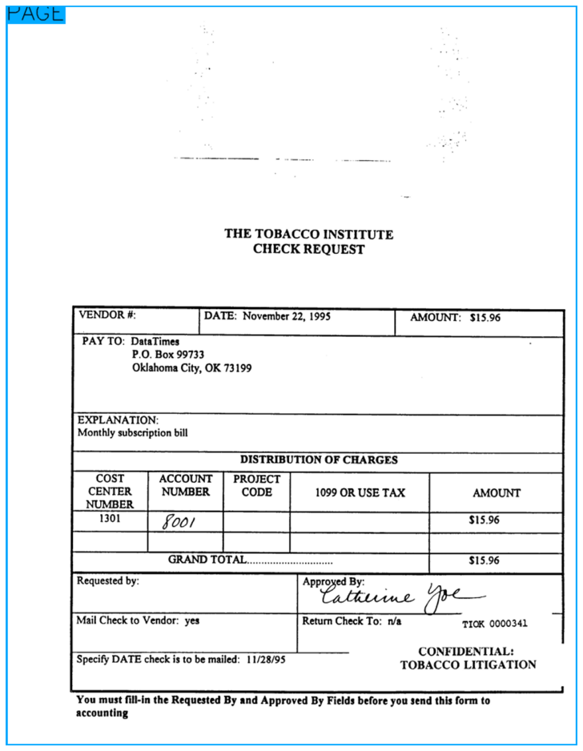
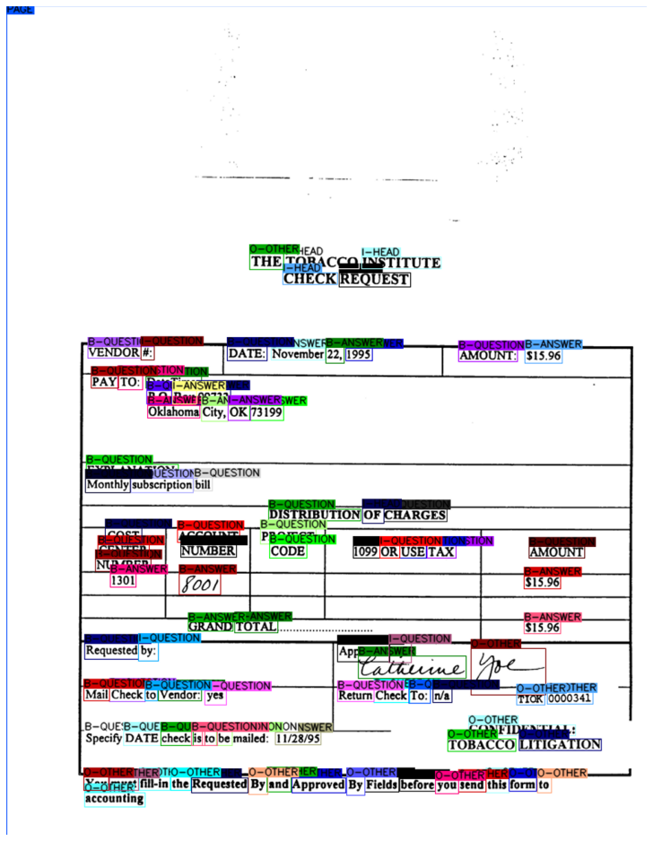
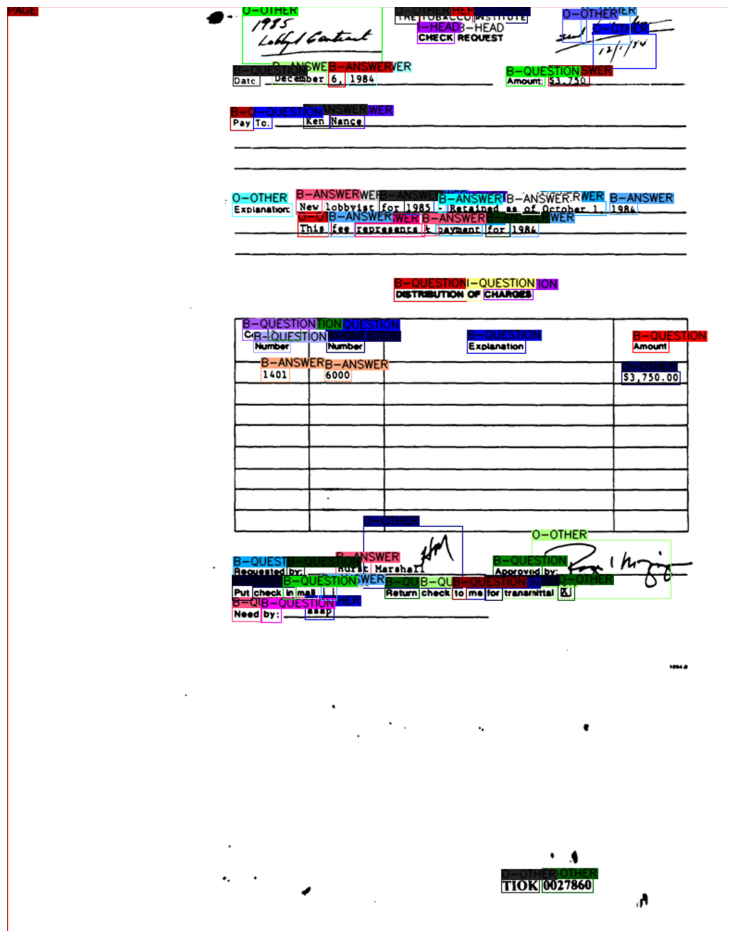

LayoutLM for token classification
=================================

This tutorial is dedicated to training, evaluation and setting up a
pipeline for token classification model with LayoutLM.

The individual steps differ only slightly from the tutorial on `sequence
classification <https://github.com/deepdoctection/deepdoctection/blob/master/notebooks/Using_LayoutLM_for_sequence_classification.ipynb>`__
. Only a few details need to be changed.

We also show how to visualize and display the results.

For training and evaluation we use the Funsd dataset. To demonstrate the
inference pipeline, we use form samples from the RVLCDIP dataset.

.. code:: ipython3

    from transformers import LayoutLMTokenizerFast
    from matplotlib import pyplot as plt
    from tabulate import tabulate
    
    import deepdoctection as dd

.. code:: ipython3

    path_config_json = dd.ModelCatalog.get_full_path_configs("microsoft/layoutlm-base-uncased/pytorch_model.bin")
    path_weights = dd.ModelCatalog.get_full_path_weights("microsoft/layoutlm-base-uncased/pytorch_model.bin")
        
    dataset_train = dd.get_dataset("funsd")
    
    metric = dd.get_metric("f1")
    
    # Token classes are saved for each word as token_tag sub category. Here we let the metric know
    # where to look at when collecting prediction and ground truth.  
    metric.set_categories(sub_category_names={"word": ["token_tag"]})

.. code:: ipython3

    # decreasing batch size while increasing max steps will not change the model performance significantly
    dd.train_hf_layoutlm(path_config_json,
                         dataset_train,
                         path_weights,
                         config_overwrite=["max_steps=300",
                                           "per_device_train_batch_size=8",
                                           "eval_steps=100",
                                           "save_steps=100"],
                         log_dir="/path/to/dir",
                         dataset_val=dataset_train,
                         build_val_config=["split=test"],
                         metric=metric,
                         pipeline_component_name="LMTokenClassifierService")

.. parsed-literal::

    [32m[0903 14:36.53 @maputils.py:205] Ground-Truth category distribution:
     [36m|  category  | #box   |  category  | #box   |  category  | #box   |
    |:----------:|:-------|:----------:|:-------|:----------:|:-------|
    |  B-ANSWER  | 2802   |   B-HEAD   | 441    | B-QUESTION | 3266   |
    |  I-ANSWER  | 6924   |   I-HEAD   | 1044   | I-QUESTION | 4064   |
    |     O      | 3971   |            |        |            |        |
    |   total    | 22512  |            |        |            |        |

    
    You are using a model of type layoutlm to instantiate a model of type . This is not supported for all configurations of models and can yield errors.
    Some weights of the model checkpoint at /path/to/.cache/deepdoctection/weights/microsoft/layoutlm-base-uncased/pytorch_model.bin were not used when initializing LayoutLMForTokenClassification: ['cls.predictions.decoder.bias', 'cls.predictions.transform.LayerNorm.bias', 'cls.predictions.decoder.weight', 'cls.predictions.transform.LayerNorm.weight', 'cls.predictions.transform.dense.weight', 'cls.predictions.transform.dense.bias', 'cls.predictions.bias']
    - This IS expected if you are initializing LayoutLMForTokenClassification from the checkpoint of a model trained on another task or with another architecture (e.g. initializing a BertForSequenceClassification model from a BertForPreTraining model).
    - This IS NOT expected if you are initializing LayoutLMForTokenClassification from the checkpoint of a model that you expect to be exactly identical (initializing a BertForSequenceClassification model from a BertForSequenceClassification model).
    Some weights of LayoutLMForTokenClassification were not initialized from the model checkpoint at /path/to/.cache/deepdoctection/weights/microsoft/layoutlm-base-uncased/pytorch_model.bin and are newly initialized: ['classifier.weight', 'classifier.bias']
    You should probably TRAIN this model on a down-stream task to be able to use it for predictions and inference.
    max_steps is given, it will override any value given in num_train_epochs
    loading configuration file /path/to/.cache/deepdoctection/configs/microsoft/layoutlm-base-uncased/config.json
    You are using a model of type layoutlm to instantiate a model of type . This is not supported for all configurations of models and can yield errors.
    Model config PretrainedConfig {
      "_name_or_path": "microsoft/layoutlm-base-uncased",
      "attention_probs_dropout_prob": 0.1,
      "hidden_act": "gelu",
      "hidden_dropout_prob": 0.1,
      "hidden_size": 768,
      "initializer_range": 0.02,
      "intermediate_size": 3072,
      "layer_norm_eps": 1e-12,
      "max_2d_position_embeddings": 1024,
      "max_position_embeddings": 512,
      "num_attention_heads": 12,
      "num_hidden_layers": 12,
      "output_past": true,
      "pad_token_id": 0,
      "position_embedding_type": "absolute",
      "transformers_version": "4.19.4",
      "type_vocab_size": 2,
      "use_cache": true,
      "vocab_size": 30522
    }
    

    [32m[0903 14:37.28 @accmetric.py:340][0m [32mINF[0m F1 results:
    |    key    | category_id   | val      | num_samples   |
    |:---------:|:--------------|:---------|:--------------|
    | token_tag | 1             | 0.841791 | 821           |
    | token_tag | 2             | 0.528455 | 122           |
    | token_tag | 3             | 0.863985 | 1077          |
    | token_tag | 4             | 0.814785 | 2544          |
    | token_tag | 5             | 0.558923 | 257           |
    | token_tag | 6             | 0.766207 | 1594          |
    | token_tag | 7             | 0.769401 | 2558          |

    Saving model checkpoint to /path/to/Tests/Token_classification/checkpoint-100
    Configuration saved in /path/to/Tests/Token_classification/checkpoint-100/config.json
    Model weights saved in /path/to/Tests/Token_classification/checkpoint-100/pytorch_model.bin

    [32m[0903 14:38.00 @accmetric.py:340] F1 results:
    |    key    | category_id   | val      | num_samples   |
    |:---------:|:--------------|:---------|:--------------|
    | token_tag | 1             | 0.848989 | 821           |
    | token_tag | 2             | 0.616541 | 122           |
    | token_tag | 3             | 0.871966 | 1077          |
    | token_tag | 4             | 0.818508 | 2544          |
    | token_tag | 5             | 0.528363 | 257           |
    | token_tag | 6             | 0.779874 | 1594          |
    | token_tag | 7             | 0.754623 | 2558          |

.. parsed-literal::

    Saving model checkpoint to /path/to/Tests/Token_classification/checkpoint-200
    Configuration saved in /path/to/Tests/Token_classification/checkpoint-200/config.json
    Model weights saved in /path/to/Tests/Token_classification/checkpoint-200/pytorch_model.bin

    [0903 14:38.32 @accmetric.py:340] F1 results:
    |    key    | category_id   | val      | num_samples   |
    |:---------:|:--------------|:---------|:--------------|
    | token_tag | 1             | 0.856124 | 821           |
    | token_tag | 2             | 0.606557 | 122           |
    | token_tag | 3             | 0.87206  | 1077          |
    | token_tag | 4             | 0.812651 | 2544          |
    | token_tag | 5             | 0.543333 | 257           |
    | token_tag | 6             | 0.772786 | 1594          |
    | token_tag | 7             | 0.746672 | 2558          |

.. parsed-literal::

    Saving model checkpoint to /path/to/Tests/Token_classification/checkpoint-300
    Configuration saved in /path/to/Tests/Token_classification/checkpoint-300/config.json
    Model weights saved in /path/to/Tests/Token_classification/checkpoint-300/pytorch_model.bin

    [0903 14:38.40 @accmetric.py:340] F1 results:
    |    key    | category_id   | val      | num_samples   |
    |:---------:|:--------------|:---------|:--------------|
    | token_tag | 1             | 0.856124 | 821           |
    | token_tag | 2             | 0.606557 | 122           |
    | token_tag | 3             | 0.87206  | 1077          |
    | token_tag | 4             | 0.812651 | 2544          |
    | token_tag | 5             | 0.543333 | 257           |
    | token_tag | 6             | 0.772786 | 1594          |
    | token_tag | 7             | 0.746672 | 2558          |

To get more information of the distribution output we evaluate the
trained model by using a confusion matrix.

.. code:: ipython3

    path_config_json = "/path/to/dir/checkpoint-300/config.json"
    path_weights = "/path/to/dir/checkpoint-300/pytorch_model.bin"
    
    
    categories = dataset_train.dataflow.categories.get_sub_categories(categories="word",
                                                                      sub_categories={"word":
                                                                                      ["token_tag"]},
                                                                      keys=False)["word"]["token_tag"]
    
    metric = dd.get_metric("confusion")
    metric.set_categories(sub_category_names={"word": ["token_tag"]})
    layoutlm_classifier = dd.HFLayoutLmTokenClassifier(path_config_json,
                                                       path_weights,
                                                       categories=categories)
    
    tokenizer_fast = LayoutLMTokenizerFast.from_pretrained("microsoft/layoutlm-base-uncased")
    pipe_component = dd.LMTokenClassifierService(tokenizer_fast,
                                                 layoutlm_classifier,
                                                 dd.image_to_layoutlm_features,
                                                 use_other_as_default_category=True)
    
    evaluator = dd.Evaluator(dataset_train, pipe_component, metric)
    _ = evaluator.run(split="test")

.. parsed-literal::

    [0903 14:40.58 @accmetric.py:397] INF Confusion matrix: 
    |    predictions ->  |   1 |   2 |   3 |    4 |   5 |    6 |    7 |
    |     ground truth | |     |     |     |      |     |      |      |
    |                  v |     |     |     |      |     |      |      |
    |-------------------:|----:|----:|----:|-----:|----:|-----:|-----:|
    |                  1 | 720 |   3 |  25 |   33 |   0 |    6 |   34 |
    |                  2 |   2 |  74 |  34 |    0 |   3 |    1 |    8 |
    |                  3 |  37 |  23 | 927 |   14 |  10 |   20 |   46 |
    |                  4 |  55 |   0 |  10 | 2017 |   9 |  102 |  351 |
    |                  5 |   2 |   7 |   1 |   12 | 163 |   29 |   43 |
    |                  6 |   1 |   0 |  22 |   99 |  30 | 1187 |  255 |
    |                  7 |  44 |  15 |  30 |  245 | 128 |  133 | 1963 |

Building a production pipeline
------------------------------

.. code:: ipython3

    def get_layoutlm_pipeline():
        path_config_json = "/path/to/Tests/Token_classification/checkpoint-300/config.json"
        path_weights = "/path/to/Tests/Token_classification/checkpoint-300/pytorch_model.bin"
        text_line_predictor = dd.DoctrTextlineDetector()
        layout_component = dd.ImageLayoutService(text_line_predictor, to_image=True, crop_image=True)
        text_recognizer = dd.DoctrTextRecognizer()
        text_component = dd.TextExtractionService(text_recognizer, extract_from_roi="word")
    
        layoutlm_token_classifier = dd.HFLayoutLmTokenClassifier("layoutlmv1", path_config_json,
                                                              path_weights,
                                                              categories={
                                                                  "1": "B-answer",
                                                                  "2": "B-header",
                                                                  "3": "B-question",
                                                                  "4": "I-answer",
                                                                  "5": "I-header",
                                                                  "6": "I-question",
                                                                  "7": "O"
                                                              })
    
        tokenizer_fast = LayoutLMTokenizerFast.from_pretrained("microsoft/layoutlm-base-uncased")
        layoutlm_component = dd.LMTokenClassifierService(tokenizer_fast,
                                                         layoutlm_token_classifier,
                                                         dd.image_to_layoutlm_features)
        
        # adding a text order service to get an arrangment of words from top to bottom and left to right.
        reading_order = dd.TextOrderService(text_container="word")
    
        return dd.DoctectionPipe(pipeline_component_list=[layout_component, text_component, layoutlm_component, reading_order])

.. code:: ipython3

    path = "/path/to/.cache/deepdoctection/datasets/rvl/image"
    
    layoutlm_pipeline = get_layoutlm_pipeline()
    df = layoutlm_pipeline.analyze(path= path)
    df_iter = iter(df)

.. code:: ipython3

    dp = next(df_iter)

.. parsed-literal::

    [0903 14:56.12 @doctectionpipe.py:101] INF processing 00000341_00000343.png
    [0903 14:56.13 @context.py:131] INF ImageLayoutService finished, 0.8441 sec.
    [0903 14:56.13 @context.py:131] INF TextExtractionService finished, 0.5459 sec.
    [0903 14:56.13 @context.py:131] INF LMTokenClassifierService finished, 0.0309 sec.
    [0903 14:56.13 @context.py:131] INF TextOrderService finished, 0.0023 sec.

.. code:: ipython3

    plt.figure(figsize = (25,17))
    plt.axis('off')
    plt.imshow(dp.viz())

.. code:: ipython3

    plt.figure(figsize = (25,17))
    plt.axis('off')
    plt.imshow(dp.viz(show_words=True))

.. code:: ipython3

    word_list = dp.items[0].words
    word_list.sort(key=lambda x: x.reading_order) 
    output = [["#", "LABEL"]]
    for word in word_list:
        output.append([word.text, word.token_class + "-" + word.tag])
    
    print(tabulate(output, headers="firstrow"))

.. parsed-literal::

    #              LABEL
    -------------  ----------
    INSTITUTE      header-I
    TOBACCO        header-I
    THE            other-O
    REQUEST        header-B
    CHECK          header-I
    $15.96         answer-B
    AMOUNT:        question-B
    1995           answer-B
    22,            answer-B
    November       answer-B
    DATE:          question-B
    VENDOR         question-B
    #:             question-I
    DataTimes      question-I
    TO:            question-B
    PAY            question-B
    99733          answer-I
    Box            answer-I
    P.O.           question-B
    73199          answer-B
    City,          answer-B
    OK             answer-I
    Oklahoma       answer-B
    EXPLANATION:   question-B
    subscription   question-B
    Monthly        question-B
    bill           question-B
    CHARGES        question-B
    DISTRIBUTION   question-B
    OF             header-I
    PROJECT        question-B
    ACCOUNT        question-B
    COST           question-B
    AMOUNT         question-B
    TAX            question-B
    USE            question-B
    OR             question-I
    1099           question-B
    CODE           question-B
    NUMBER         question-B
    CENTER         question-B
    NUMBER         question-B
    $15.96         answer-B
    8001           answer-B
    1301           answer-B
    $15.96         answer-B
    TOTAL.         answer-B
    GRAND          answer-B
    Approyed       question-B
    By:            question-I
    Requested      question-B
    by:            question-I
    tatkuine       answer-B
    ye             other-O
    TIOK           other-O
    0000341        other-O
    yes            question-B
    Return         question-B
    n/a            question-B
    To:            question-B
    Check          question-B
    Vendor:        question-B
    to             question-B
    Check          question-B
    Mail           question-B
    CONFIDENTIAL:  other-O
    11/28/95       answer-B
    LITIGATION     other-O
    TOBACCO        other-O
    Specify        question-B
    mailed:        question-B
    to             question-B
    check          question-B
    DATE           question-B
    be             question-B
    is             question-B
    you            other-O
    send           other-O
    before         other-O
    Approved       other-O
    Requested      other-O
    to             other-O
    form           other-O
    this           other-O
    Fields         other-O
    By             other-O
    By             other-O
    must           other-O
    and            other-O
    the            other-O
    fill-in        other-O
    You            other-O
    accounting     other-O

.. code:: ipython3

    dp = next(df_iter)

.. parsed-literal::

    [0903 14:58.46 @doctectionpipe.py:101] INF processing 00001057.png
    [0903 14:58.46 @context.py:131] INF ImageLayoutService finished, 0.8165 sec.
    [0903 14:58.47 @context.py:131] INF TextExtractionService finished, 0.37 sec.
    [0903 14:58.47 @context.py:131] INF LMTokenClassifierService finished, 0.0289 sec.
    [0903 14:58.47 @context.py:131] INF TextOrderService finished, 0.0018 sec.

.. code:: ipython3

    plt.figure(figsize = (25,17))
    plt.axis('off')
    plt.imshow(dp.viz())

.. image:: ./pics/output_14_1.png

.. code:: ipython3

    plt.figure(figsize = (25,17))
    plt.axis('off')
    plt.imshow(dp.viz(show_words=True))

.. code:: ipython3

    word_list = dp.items[0].words
    word_list.sort(key=lambda x: x.reading_order) 
    output = [["#", "LABEL"]]
    for word in word_list:
        output.append([word.text, word.token_class + "-" + word.tag])
    
    print(tabulate(output, headers="firstrow"))

.. parsed-literal::

    #             LABEL
    ------------  ----------
    ISTITUTE      other-O
    TOBACCO       other-O
    THE           other-O
    w             other-O
    ili           other-O
    r/"           other-O
    REQUEST       header-B
    CHECK         header-I
    Traas         other-O
    Amount:       question-B
    $3.750        answer-B
    Date.         question-B
    1984          answer-B
    6,            answer-B
    December      answer-B
    Pay           question-B
    To:           question-I
    Nance         answer-B
    Ken           answer-B
    Explanation   other-O
    1984          answer-B
    A             answer-B
    -             answer-B
    Ocrohar1.     answer-B
    of            answer-I
    Rerainad      answer-I
    1985          answer-B
    for           answer-B
    lobbyist      answer-I
    Nev           answer-B
    paymant       question-I
    IEPIRNE       answer-B
    198A          answer-B
    for           answer-B
    k             answer-B
    fes           answer-B
    This          other-O
    CHARGES       question-B
    DISTRIBUTION  question-B
    OF            question-I
    Account       question-B
    Center        question-B
    Cost          question-B
    Number        question-B
    Amount        question-B
    Explanation   question-B
    Number        question-B
    $3,750.00     other-O
    6000          answer-B
    1401          answer-B
    Approved      question-B
    by:           question-B
    Requested     question-B
    Hurst         answer-B
    A             other-O
    me            question-B
    tranamittal   question-B
    to            question-B
    check         question-B
    Return        question-B
    mail          question-B
    check         question-B
    for           question-B
    In            question-B
    Put           question-B
    a             other-O
    D             answer-B
    Ehg           other-O
    by:           question-B
    Need          question-B
    asap          other-O
    TIOK          other-O
    0027860       other-O

