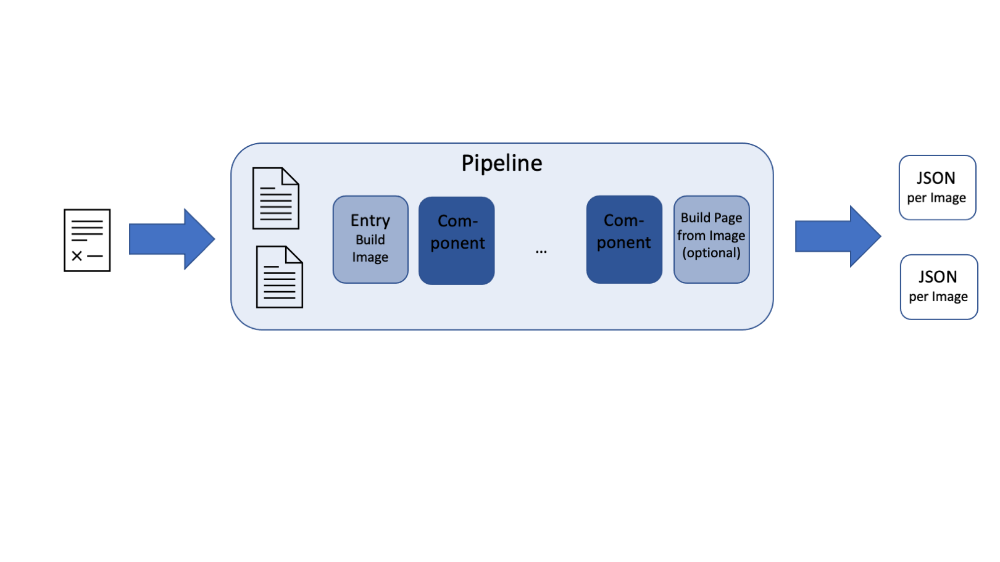

# Pipelines

Let's now take a closer look at pipelines. We will be using the **deep**doctection analyzer as an example. 

A pipeline is built as a sequence of tasks. These tasks are called pipeline components, pipeline backbones or services.



Once a pipeline is defined, images or documents can be processed. These are either pure image files
(like JPG, PNG, TIFF) or PDF files. PDF files are read and processed page by page. Each PDF page is converted into
a numpy array under the hood. 

We do not want to go into detail about the data structure at this point. If you want more information, please refer
to the [data structure notebook](data_structure_notebook.md).


```python
import deepdoctection as dd
```


```python
analyzer = dd.get_dd_analyzer()
```

Let's take a closer look at the **deep**doctection analyzer. 


The default construction consists of several pipeline components: 

- Layout analysis (object detection)
- Cell analysis in table regions (object detection)
- Row and column analysis in table regions (object detection)
- Table segmentation 
- Table segmentation refinement
- OCR with Tesseract
- Assignment of words to layout segments
- Reading order of words within layout segments and reading order of layout segments.

Therefore in total, three object detectors and one OCR are loaded.

## Configuration


We see while initializing a configuration in the logs of the analyzer. The configuration is saved in a `.yaml` file. You can find this file in the .cache dir of **deep**doctection.

You can use the `.yaml` file to replace one model with e.g. a model trained on your own data. 
The tutorial [**Analyzer configuration**](./analyzer_configuration_notebook.md) will show you where you need to pay 
attention when changing the `.yaml` file.

In [this tutorial](./running_pre_trained_models_from_third_party_libraries_notebook.md) we will show you how to add a model to the `ModelCatalog` and change the model in the `.yaml` file so that you can use model from third party libraries, that run layout detection models with Detectron2.

## Pipeline components

Having a pipeline, you can list the components with `get_pipeline_info()`.


```python
analyzer.get_pipeline_info()
```


    {0: 'image_weights_layout_d2_model_0829999_layout_inf_only.pt',
     1: 'sub_image_weights_cell_d2_model_1849999_cell_inf_only.pt',
     2: 'sub_image_weights_item_d2_model_1639999_item_inf_only.pt',
     3: 'table_segment',
     4: 'table_segment_refine',
     5: 'text_extract_tesseract',
     6: 'matching',
     7: 'text_order'}


```python
analyzer.get_pipeline_info(position=3)
```


    'table_segment'


If you do not want to process any text extraction you can set `ocr=False` which gives you a shorter pipeline with fewer backbones.


```python
analyzer = dd.get_dd_analyzer(ocr=False)
```


```python
analyzer.get_pipeline_info()
```


    {0: 'image_weights_layout_d2_model_0829999_layout_inf_only.pt',
     1: 'sub_image_weights_cell_d2_model_1849999_cell_inf_only.pt',
     2: 'sub_image_weights_item_d2_model_1639999_item_inf_only.pt',
     3: 'table_segment',
     4: 'table_segment_refine'}


You have access to pipeline components via `pipe_component_list`.


```python
analyzer.pipe_component_list
```


    [<deepdoctection.pipe.layout.ImageLayoutService at 0x7ff3667d4d60>,
     <deepdoctection.pipe.cell.SubImageLayoutService at 0x7ff35f18ef70>,
     <deepdoctection.pipe.cell.SubImageLayoutService at 0x7ff35f18ea00>,
     <deepdoctection.pipe.segment.TableSegmentationService at 0x7ff35f18ecd0>,
     <deepdoctection.pipe.refine.TableSegmentationRefinementService at 0x7ff35f18e730>]


## Layout detection models

The `ImageLayoutService` is responsible to detect the coarse layout structure over a full image. It has an object
detector, which can be either a Tensorpack or a Detectron2 model.


```python
image_layout_service = analyzer.pipe_component_list[0]
```


```python
image_layout_service.predictor
```


    <deepdoctection.extern.d2detect.D2FrcnnDetector at 0x7ff366874250>


You can get a list of all categories that a model is able to detect. Moreover, you will find a unique description of each model in your pipeline.

```python
image_layout_service.predictor.get_category_names()
```


    [<LayoutType.text>,
     <LayoutType.title>,
     <LayoutType.list>,
     <LayoutType.table>,
     <LayoutType.figure>]


```python
image_layout_service.predictor.name
```


    'weights_layout_d2_model_0829999_layout_inf_only.pt'


```python
cell_service = analyzer.pipe_component_list[1]
```

```python
cell_service.predictor.get_category_names()
```


    [<LayoutType.cell>]


```python
cell_service.predictor.name
```


    'weights_cell_d2_model_1849999_cell_inf_only.pt'


## OCR and matching words to layout segments

Let's re-load the analyzer again, now with OCR.


```python
analyzer = dd.get_dd_analyzer()
```

The matching services maps words to layout segments by overlapping rules.  In order to do so, we need to specify what
layout segments we want to consider. 

In this situation we do not consider `figure` as valid layout section and neglect any overlapping of a word with a 
`figure` segment. Of course, this can be changed by adding `figure` to the list of `parent_categories` or in
`WORD_MATCHING.PARENTAL_CATEGORIES` in the `.yaml` file.

What is going to happen with so called orphan words, e.g. words with no overlapping with any layout segment? They simply
have no anchor and will be ignored unless we force to process them as well. We will come to this point later. 


```python
match_service = analyzer.pipe_component_list[6]
```


```python
print(f"parent_categories: {match_service.parent_categories}, child_categories: {match_service.child_categories}")
```

    parent_categories: ['text', 'title', 'cell', 'list'], child_categories: word


There is a matching rule and a threshold to specifiy. We also need to choose whether we want to assign a word to 
multiple layout sections. When setting `max_parent_only=True` we assign the word to the layout section with the largest
overlapping. Otherwise note, that the word might be considered twice.


```python
print(f"matching_rule: {match_service.matching_rule} \n match_threshold: {match_service.threshold} \n max_parent_only: {match_service.max_parent_only}")
```

    matching_rule: ioa 
     match_threshold: 0.6 
     max_parent_only: False


## Reading order

In the last step, words and layout segments must be arranged to create continuous text. This all takes place in 
the component `TextOrderService`.

Words that are assigned to layout segments are grouped into lines. Lines are read from top to bottom. 
Auxiliary columns are formed to sort the layout segments. These auxiliary columns are then grouped into contiguous
blocks that span vertically across the page. Then the blocks are arranged so that adjacent columns in the contiguous blocks are read from left to right, and the contiguous blocks are read from top to bottom. 


This order is, of course, completely arbitrary and will not result in the expected reading order for many layout compositions. 

An additional difficulty may be that the layout detection is not sufficiently precise and the algorithm returns a questionable reading order. This should always be kept in mind!

`TextOrderService` has four important parameters: `text_container`, `text_block_categories`, `floating_text_block_categories` and `include_residual_text_container`. 

`text_container` must contain the category that contains characters, e.g. `word`. 

`text_block_categories` contains all layout segments to which words have been added and which must be ordered.

`floating_text_block_categories` contains the text blocks to be included in the floating text. For example, it can be discussed whether tables should be included in the body text. In this configuration they are not included in the text. 

Let's get back to the orphan words: If we set `include_residual_text_container = False`, these words will not receive a `reading_order` and will be ignored in text output.

If, on the other hand, we set `include_residual_text_container = True`, they will be grouped and combined into lines and included to the text output. Thus no words are lost.

We refer to [this page](layout_parsing_structure.md) for more detailed information about layout parsing and text
ordering.


```python
text_order_service = analyzer.pipe_component_list[7]
```


```python
print(f"text_container: {text_order_service.text_container} \n floating_text_block_categories: {text_order_service.floating_text_block_categories} \n text_block_categories: {text_order_service.text_block_categories} \n include_residual_text_container: {text_order_service.include_residual_text_container}")
```

    text_container: word 
     floating_text_block_categories: [<LayoutType.title>, <LayoutType.text>, <LayoutType.list>] 
     text_block_categories: [<LayoutType.title>, <LayoutType.text>, <LayoutType.list>, <LayoutType.cell>] 
     include_residual_text_container: False


## Output structure

There is a last step in a pipeline that prepares all information gathered from the different into a consumable class,
the `Page` class. The `PageParsingService` is optional and should only be processed if you want to analyze the output.

For a deeper understanding of the connection between `Page` and `Image`, we refer to the
[data structure notebook](data_structure_notebook.md).


```python
df = analyzer.analyze(path="path/to/doc.pdf", output="image")  # output = "image" will skip PageParsingService. But
# default value is "page"
```

Note, that the `PageParsingService` is saved in a separate attribute and not part of `analyzer.pipe_component_list`.
The `PageParsingService` shares some common parameters with the `TextOrderService`
and it is recommended to use the same configurations. 


```python
page_parser = analyzer.page_parser
```


```python
print(f"text_container: {page_parser.text_container} \n floating_text_block_categories: {page_parser.floating_text_block_categories} \n include_residual_text_container: {page_parser.include_residual_text_container}")
```

    text_container: word 
     floating_text_block_categories: [] 
     include_residual_text_container: True

